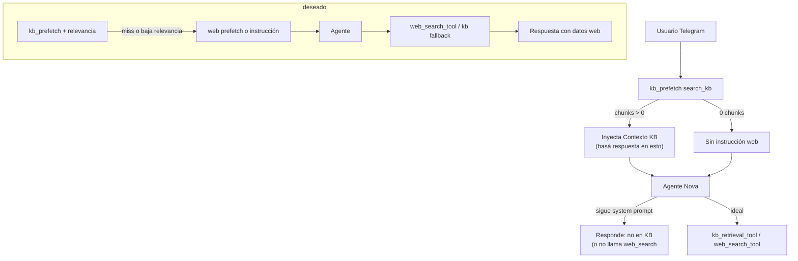

# ISSUE-2026-024 — KB miss no dispara web search (comparativas, tendencias, stats)

| Campo | Valor |
|-------|--------|
| **Tipo** | Bug / comportamiento incorrecto del agente |
| **Severidad** | Alta (respuestas “no tengo en la KB” cuando hay herramienta de web) |
| **Afecta** | Consultas comparativas (jugadores, selecciones), análisis de tendencias, estadísticas agregadas, contexto no indexado en pgvector |
| **Relacionado** | SPEC-2026-017 (KB + `web_search_tool`), SPEC-2026-023 (fallback + enriquecimiento), `agent/main.py`, `kb_prefetch.py` |
| **Estado** | Implementado (código + tests; sin deploy) |

---

## Síntoma reportado

El usuario pregunta, por ejemplo:

- Comparación entre dos jugadores o selecciones  
- Tendencias / forma reciente de selecciones  
- Análisis que requiere datos no presentes en los documentos curados de la KB  

El agente responde que **no tiene esa información en la Knowledge Base**, en lugar de buscar en la web con `web_search_tool` o usar el fallback ya implementado dentro de `kb_retrieval_tool`.

---

## Comportamiento esperado

1. **Primero** intentar KB (RAG pgvector / `kb_retrieval_tool` o prefetch).  
2. Si el resultado es **insuficiente, irrelevante o vacío** para la pregunta concreta → **buscar en la web** (`web_search_tool` o fallback interno de `kb_retrieval_tool`).  
3. Responder al usuario con lo encontrado en web (citando que es información externa si aplica), **sin** decir solo “no está en la KB”.  
4. Opcional (SPEC-023): encolar enriquecimiento histórico/cache en background.

---

## Análisis de causas raíz

### Causa 1 — System prompt contradice SPEC-017 / SPEC-023 (principal)

En `agent/main.py` el prompt dice explícitamente:

```text
Usá kb_retrieval_tool SOLO para: reglas, historia de mundiales, trivia cultural, tácticas, canciones.
Usá web_search_tool SOLO para noticias del día o resultados en vivo (nunca para fixture estático).
```

Eso **prohíbe** al modelo usar `web_search_tool` para:

- comparativas jugador vs jugador  
- estadísticas / tendencias de selecciones  
- análisis semántico que no sea “noticia del día” ni “resultado en vivo”  

Aunque `kb_retrieval_tool` tenga fallback a Tavily por código, el LLM **prioriza** las instrucciones del system prompt y suele:

- no invocar `web_search_tool`, o  
- responder en lenguaje natural “no tengo en la KB” tras un prefetch o una llamada a KB.

**Evidencia:** `agent/main.py` líneas ~56-57 vs `.cursor/rules/13-web-search-kb-enrichment.mdc` (fallback automático en KB miss).

---

### Causa 2 — `kb_prefetch` acorta el circuito de herramientas

`infrastructure/lambdas/telegram_webhook/kb_prefetch.py`:

- Si `search_kb` devuelve **cualquier** chunk → inyecta  
  `[Contexto Knowledge Base — basá la respuesta en esto]`  
  en el prompt **antes** de invocar AgentCore.
- Si devuelve **0 chunks** → devuelve el prompt **sin** fallback web ni instrucción de usar `web_search_tool`.

Efectos:

| Escenario | Qué ve el modelo | Qué hace |
|-----------|------------------|----------|
| Chunks irrelevantes pero presentes | “Basá la respuesta en esto” + texto tangencial | Responde desde contexto débil o dice que la KB no alcanza **sin** llamar web |
| 0 chunks | Prompt original, sin guía | Puede no invocar tools (Nova) o solo `kb_retrieval_tool` una vez |
| Pregunta comparativa | Mismo prefetch | No hay señal “si no alcanza → web” |

El prefetch fue añadido porque *“Nova a veces no invoca kb_retrieval_tool”*, pero **no replica** el fallback a web de `kb_retrieval_tool` ni evalúa relevancia (solo `len(rows) > 0`).

**Evidencia:** `kb_prefetch.py` líneas 35-44; comentario línea 1.

---

### Causa 3 — Umbral de fallback en `kb_retrieval_tool` es solo longitud

`KB_RESULT_MIN_CHARS = 200` en `src/kb/kb_enrichment_service.py`.

Si la KB devuelve **≥200 caracteres** de contenido **poco relacionado** con la pregunta (ej. párrafo genérico del Mundial 2026), el tool **no** llama a `perform_web_search`.

El usuario pregunta por comparativa Messi vs Haaland; la KB devuelve texto sobre sedes 2026 → el agente cree que “ya consultó la KB” y no hay fallback.

---

### Causa 4 — Dos herramientas, una política incoherente

| Ruta | Fallback web |
|------|----------------|
| Usuario → Telegram → **prefetch KB** → agente | **No** |
| Agente invoca **`kb_retrieval_tool`** | **Sí** (si resultado corto + dominio fútbol + Tavily OK) |
| Agente invoca **`web_search_tool`** directo | **Sí**, pero el prompt lo desaconseja salvo noticias/live |

En la práctica Telegram usa **prefetch + agente**, por lo que el fallback interno de `kb_retrieval_tool` **no se ejecuta** si el modelo no vuelve a invocar esa tool.

---

### Causa 5 — Tavily no configurado o fallo silencioso

`perform_web_search` devuelve `None` si falta `TAVILY_API_KEY` / `TAVILY_SECRET_ARN` (log warning).

`kb_retrieval_tool` entonces responde:

```text
No encontré información sobre eso en la Knowledge Base ni en la web.
```

El usuario percibe un mensaje centrado en la **KB**, no en “falta configurar búsqueda web”.

**Verificar en dev:** `infrastructure/terraform/agent_runtime.tf` → `TAVILY_SECRET_ARN`; `dev.tfvars` / Secrets Manager.

---

### Causa 6 — Docstrings de tools no alineados con el producto

- `kb_retrieval_tool`: “Para resultados en vivo del día, el agente puede usar web_search_tool **directo**” (no dice que **kb** ya hace fallback).  
- `web_search_tool`: “información **actualizada**” + `search_type` incluye `stats`, pero el system prompt limita su uso a noticias/live.

El modelo recibe señales contradictorias entre prompt, prefetch y descripciones `@tool`.

---

## Flujo actual vs deseado (diagrama)



---

## Propuesta de solución

### Fase A — Política única (rápida, alto impacto)

1. **Reescribir** el bloque KB/web en `agent/main.py`:

   - **KB:** historia, reglas, tácticas, cultura, datos ya indexados.  
   - **Web:** todo lo que la KB no cubra: comparativas, stats, tendencias, jugadores actuales, noticias, resultados recientes (excepto fixture → `match_tool`).  
   - **Regla explícita:** prohibido responder solo “no está en la KB” sin haber intentado búsqueda web (salvo error técnico documentado).

2. **Alinear** docstrings de `kb_retrieval_tool` y `web_search_tool` con esa política.

3. **Actualizar** `.cursor/rules/02-features.mdc` FEATURE-009 (US-027) para que coincida con el código.

### Fase B — Prefetch con fallback (Telegram)

4. Extender `enrich_prompt_with_kb`:

   - Si `rows` vacío **o** `max(score) < UMBRAL_RELEVANCIA` (ej. 0.75) → llamar `perform_web_search` (o delegar a función compartida `resolve_kb_then_web(query)`).  
   - Si web útil → inyectar `[Contexto web — …]` **o** instrucción: “Usá web_search_tool si necesitás ampliar”.  
   - Si web falla → instrucción: “KB sin datos; informá al usuario si la búsqueda web no está disponible”.

5. Cambiar el texto de prefetch cuando hay chunks:

   - De: “basá la respuesta en esto”  
   - A: “Usá esto si es relevante; si **no** responde la pregunta, llamá `web_search_tool` con la misma consulta”.

### Fase C — Calidad del fallback en `kb_retrieval_tool`

6. Además de `len(kb_result) > 200`, considerar:

   - `max(score) < umbral`, o  
   - detector de intención: `comparative | stats | trends` → forzar web (con `search_type=stats`).  
   - Reutilizar o extender `src/services/match_query_intent.py` o nuevo `src/kb/query_intent.py`.

7. Mensajes de error diferenciados:

   - KB miss + web miss + Tavily no configurado → mensaje operativo para admin, no solo “no en KB”.

### Fase D — Tests y observabilidad

8. Tests unitarios:

   - Prefetch: 0 chunks → se intenta web (mock).  
   - Prefetch: chunks irrelevantes (score bajo) → web.  
   - Pregunta comparativa + system prompt nuevo → mock verifica llamada a `web_search_tool` o texto web en respuesta.

9. Logs estructurados (sin PII):

   - `kb_prefetch_chunks`, `kb_max_score`, `web_fallback_used`, `tavily_configured`.

---

## Criterios de aceptación (Gherkin)

```gherkin
Feature: Fallback KB → Web para consultas analíticas

  Background:
    Given Tavily configurado en el runtime del agente
    And la KB no contiene un documento específico sobre "comparativa X vs Y"

  Scenario SC-01 — Comparativa jugadores sin dato en KB
    When el usuario pregunta "Compará a Messi y Haaland en goles por partido en selecciones"
    Then el agente invoca búsqueda web O recibe contexto web vía prefetch
    And la respuesta incluye información factual obtenida de la web
    And la respuesta NO dice únicamente que "no está en la Knowledge Base"

  Scenario SC-02 — Tendencias de selección
    When el usuario pregunta "¿Qué tendencia tiene la selección de Brasil en los últimos amistosos?"
    Then se usa web_search_tool con search_type adecuado (stats o news)
    And se responde con contenido de la búsqueda o un mensaje claro de indisponibilidad técnica

  Scenario SC-03 — KB suficiente → sin web
    Given la KB devuelve chunks con score >= 0.8 sobre "reglas del fuera de juego"
    When el usuario pregunta sobre esa regla
    Then NO se invoca web_search_tool
    And la respuesta se basa en los pasajes de la KB

  Scenario SC-04 — Prefetch con 0 chunks
    Given kb_prefetch no encuentra chunks
    When se enriquece el prompt antes de AgentCore
    Then se intenta búsqueda web o se añade instrucción explícita de usar web_search_tool

  Scenario SC-05 — Tavily no configurado
    Given TAVILY_SECRET_ARN vacío
    When KB miss en consulta comparativa
    Then el usuario recibe mensaje honesto (no disponible búsqueda web)
    And el log registra tavily_configured=false

  Scenario SC-06 — Fixture sigue en match_tool
    When el usuario pregunta "¿Cuándo juega Argentina?"
    Then NO se usa web_search_tool ni KB para horarios
    And se usa match_tool
```

---

## Tareas sugeridas

| ID | Descripción | Archivos | Est. |
|----|-------------|----------|------|
| ISSUE-024-A | Reescribir política KB/web en system prompt | `agent/main.py` | 1h |
| ISSUE-024-B | Prefetch: fallback web + instrucción si miss/baja relevancia | `kb_prefetch.py`, posible `src/kb/resolve.py` | 3h |
| ISSUE-024-C | Umbral de relevancia en `kb_retrieval_tool` + intención comparativa/stats | `kb_retrieval_tool.py`, `src/kb/` | 4h |
| ISSUE-024-D | Docstrings + rules 02-features / 13-web-search | `.cursor/rules/`, tools | 1h |
| ISSUE-024-E | Tests SC-01 a SC-06 | `tests/unit/test_kb/`, `test_kb_prefetch.py` | 3h |
| ISSUE-024-F | Verificar `tavily_secret_arn` en dev/staging AgentCore | Terraform, runbook | 1h |

---

## Checklist de verificación manual (dev)

1. Confirmar secreto Tavily en AgentCore runtime (`terraform output` / consola).  
2. Pregunta en Telegram: *"Compará las estadísticas de Messi y Cristiano en mundiales"* → debe haber respuesta con datos o error técnico claro, no solo “no en KB”.  
3. Revisar logs CloudWatch del webhook: `kb_prefetch`, `web_fallback_used`.  
4. Pregunta de fixture → sigue respondiendo con `match_tool` / prefetch fixture, sin web.

---

## Notas

- **DDL / Aurora:** no aplica a este issue.  
- **Lambda sync:** no crea conocimiento para RAG; es independiente.  
- El fix debe mantener la regla **fixture → `match_tool` únicamente** (no regresión TASK fixture).

---

## Referencias de código

| Archivo | Rol |
|---------|-----|
| `agent/main.py` | System prompt restrictivo hacia web |
| `agent/tools/kb_retrieval_tool.py` | Fallback web por longitud, no por relevancia |
| `agent/tools/web_search_tool.py` | Tavily + cache DynamoDB |
| `infrastructure/lambdas/telegram_webhook/kb_prefetch.py` | Prefetch sin web |
| `infrastructure/lambdas/telegram_webhook/handler.py` | Orden: fixture_prefetch → kb_prefetch → agente |
| `src/kb/kb_enrichment_service.py` | `KB_RESULT_MIN_CHARS`, clasificación histórico/volátil |
| `.cursor/rules/13-web-search-kb-enrichment.mdc` | Diseño objetivo (fallback) |
