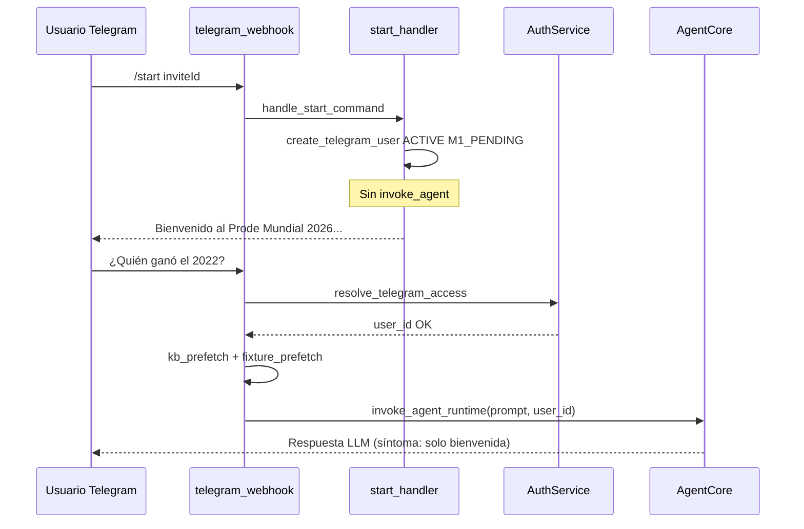

# ISSUE-2026-025 — Usuarios invitados atascados en bienvenida; admin sí usa KB/web

| Campo | Valor |
|-------|--------|
| **Tipo** | Bug / regresión de experiencia post-invitación |
| **Severidad** | Alta (usuarios invitados no pueden usar el producto; solo el admin) |
| **Afecta** | Usuarios que entran por deep link `t.me/ProdeBot?start=<invite_id>` (SPEC-020) |
| **No afecta (reportado)** | Admin global (`is_admin=True`, `onboarding_stage=M3_COMPLETE`) |
| **Relacionado** | SPEC-2026-020 (invitaciones), SPEC-2026-019 (onboarding), SPEC-2026-018 (auth gate), ISSUE-2026-024 (KB/web), `start_handler.py`, `handler.py`, `agent/main.py` |
| **Estado** | Fase A implementada (código + tests); pendiente deploy y validación manual |

---

## Síntoma reportado

1. Un **admin** invita usuarios con link de Telegram.
2. El invitado abre el link, recibe el mensaje de alta (bienvenida al grupo).
3. En mensajes siguientes, el bot **siempre** responde con una variante de bienvenida genérica, por ejemplo:
   > «Hola soy ProdeBot bienvenido al mundo de la diversión»
4. **No importa la pregunta** (historia, comparativas, fixture, etc.): no hay uso visible de KB ni web.
5. El **mismo entorno** con el usuario **admin** sí obtiene respuestas enriquecidas con Knowledge Base y `web_search_tool`.

---

## Comportamiento esperado

| Paso | Esperado |
|------|----------|
| Deep link válido | `/start <invite_id>` crea usuario `status=ACTIVE`, membresías, mensaje fijo de bienvenida **una sola vez** (sin LLM). |
| Mensaje posterior | Webhook pasa `AuthService.resolve_telegram_access` → `invoke_agent_runtime` con `user_id` real. |
| Consulta de conocimiento | `kb_prefetch` (Lambda Telegram) + `kb_retrieval_tool` / `web_search_tool` (agente) según ISSUE-024. |
| Onboarding M1 | Máximo 1–2 turnos pidiendo alias; **no** reemplazar todas las respuestas por bienvenida. |
| Paridad admin vs invitado | Mismas herramientas y mismo prefetch; diferencias solo por permisos (`invitation_tool`, grupos). |

---

## Arquitectura actual (flujo real)



Archivos clave:

- `infrastructure/lambdas/telegram_webhook/handler.py` — gate auth líneas 280–340
- `infrastructure/lambdas/telegram_webhook/start_handler.py` — alta por invitación
- `src/dao/dynamo/user_dao.py` — `create_telegram_user(..., onboarding_stage="M1_PENDING")`
- `agent/main.py` — system prompt y tools; **no lee perfil DynamoDB**
- `agent/tools/echo_tool.py` — aún declara `knowledge_base` en `features_pending`

---

## Análisis de causas raíz

### Causa 1 — Agente sin contexto de perfil ni onboarding (principal)

Tras el `/start` con invitación:

- DynamoDB: `status=ACTIVE`, `onboarding_stage=M1_PENDING`, `alias="Jugador"`.
- El agente **no recibe** `onboarding_stage`, alias ni señal de “M1 pendiente”.
- SPEC-019 define onboarding progresivo y `onboarding_tool`, pero **no están implementados** en `agent/main.py` (solo regla en `.cursor/rules/09-onboarding.mdc`).

Efecto: el LLM (Nova) improvisa una bienvenida de persona “ProdeBot” en cada turno, en lugar de ejecutar herramientas. El admin, con `onboarding_stage=M3_COMPLETE` por `bootstrap_admin.py`, no entra en ese patrón conversacional.

**Evidencia:** `agent/main.py` solo añade `[Sesión: usuario autenticado...]`; no hay `onboarding_tool` ni lectura de `UserDAO`.

---

### Causa 2 — `echo_tool` desactualizado refuerza “MVP sin KB”

```python
# agent/tools/echo_tool.py
"features_pending": [..., "knowledge_base"],
```

El system prompt indica MVP con fixture en `match_tool`, pero `echo_tool` sigue listando `knowledge_base` como pendiente. El modelo puede invocar `echo_tool`, ver que la KB “no está habilitada” y responder con mensaje genérico de bienvenida/estado MVP en lugar de `kb_retrieval_tool`.

**Hipótesis fuerte** para el texto reportado (“ProdeBot”, “diversión”): paráfrasis del estado MVP + nombre del bot (`TELEGRAM_BOT_USERNAME=ProdeBot`), no texto hardcodeado en el repo.

**Evidencia:** grep no encuentra la frase exacta en código; `echo_tool` + `ProdeBot` en `variables.tf` / `invitation_service.py`.

---

### Causa 3 — Sesión AgentCore sin rotación por onboarding

`session_id = f"tg-{platform_id_hash[:32]}-v{AGENT_RUNTIME_VERSION}"` (`handler.py`).

- Misma sesión para todos los mensajes del chat hasta cambiar `AGENT_RUNTIME_VERSION`.
- Si los primeros turnos del invitado son bienvenidas del modelo, el historial **refuerza** el patrón en turnos siguientes.
- El admin puede tener sesión “madura” con tool calls exitosos previos.

**Mitigación propuesta:** rotar sesión al completar M1 o al pasar de `/start` al primer mensaje “real” (ver solución 3).

---

### Causa 4 — Desacople SPEC-020 vs SPEC-019 en `/start`

`start_handler.py` (líneas 70–73) devuelve mensaje fijo y **no** dispara onboarding estructurado:

```python
return (
    f"¡Bienvenido al Prode Mundial 2026! "
    f"Te uniste al grupo {result['group_name']}."
)
```

La spec 020 dice: *“onboarding M1 arranca en la siguiente invocación”*, pero no hay wiring que:

1. Inyecte en el primer prompt post-alta la instrucción M1 (“¿cómo querés que te llamemos?”), o
2. Complete M1 en el webhook sin LLM (alias desde `message.from.first_name` de Telegram).

Hoy el invitado queda en `M1_PENDING` indefinidamente sin que el runtime lo sepa.

---

### Causa 5 — Caminos alternativos (verificar en prod)

| Escenario | Síntoma | Mensaje esperado si fuera este caso |
|-----------|---------|-------------------------------------|
| Invitado escribe **sin** haber abierto el link (`/start` sin payload) | No hay `USER#` | `INACTIVE_USER_MESSAGE` / pedir invitación — **no** coincide con “ProdeBot diversión” |
| Lookup `PLATFORM#` / GSI-1 falla tras alta | Auth bloquea | Mismo mensaje genérico de no registrado |
| `KB_QUERY_LAMBDA_NAME` vacío en Lambda | Sin prefetch; agente depende 100% tools | Afectaría **también** al admin en el mismo deploy |
| Guardrail bloquea | Mensaje fijo SPEC-015 | Texto distinto (“Solo puedo ayudarte con temas de fútbol…”) |

**Conclusión:** el reporte encaja mejor con **Causas 1–4** (comportamiento del LLM + onboarding incompleto), no con el gate de auth ni guardrail.

---

## Diferencias admin vs usuario invitado (tabla)

| Atributo | Admin (`bootstrap_admin`) | Invitado (link) |
|----------|---------------------------|-----------------|
| `is_admin` | `true` | `false` |
| `onboarding_stage` | `M3_COMPLETE` | `M1_PENDING` (default `create_telegram_user`) |
| Alta | Script / manual | `start_handler` + `validate_and_use` |
| Primera respuesta LLM | Suele ser consulta útil (pruebas) | Primera tras mensaje fijo de bienvenida |
| `echo_tool` / sesión | Historial sin bucle de bienvenida | Riesgo de bucle de bienvenida |

No hay rama en código que deshabilite `kb_prefetch` o tools por `is_admin=False`.

---

## Comportamiento esperado tras el fix

1. Invitado con invitación válida: **un** mensaje fijo de alta; desde el **primer mensaje libre**, respuestas con KB/web/fixture según la pregunta.
2. Onboarding M1: como máximo 1 pregunta de alias; `/listo` → alias temporal; luego `M1_COMPLETE` y **sin** repetir bienvenida.
3. `echo_tool` refleja features reales (`knowledge_base` en `features_enabled` si KB está desplegada).
4. Tests de integración: usuario invitado simulado pregunta “historia mundial 1978” → prompt con prefetch o tool call a KB.

---

## Plan de solución propuesto

### Fase A — Corrección mínima (Sprint 1, paridad funcional)

| # | Cambio | Archivos |
|---|--------|----------|
| A1 | Cargar perfil al invocar agente: `onboarding_stage`, `alias`, `is_admin` en el prompt (o `onboarding_service.get_context_for_prompt`) | `agent/main.py`, nuevo `src/services/onboarding_service.py` |
| A2 | Regla en system prompt: si `M1_PENDING`, **una** pregunta de alias; si el usuario hace otra consulta, **responder la consulta primero** (SPEC-019) y luego alias | `agent/main.py` |
| A3 | Actualizar `echo_tool`: `features_enabled` incluye `knowledge_base`, `web_search`; quitar de `features_pending` lo ya desplegado | `agent/tools/echo_tool.py` |
| A4 | Prohibir respuesta que sea solo presentación/bienvenida si el mensaje del usuario es una pregunta concreta | `agent/main.py` |
| A5 | Tras `/start` exitoso con invitación, opcional: flag en Dynamo `pending_first_agent_turn=true` y primer prompt con `[Instrucción: usuario recién registrado; no repitas bienvenida del /start]` | `start_handler.py`, `user_dao.py`, `handler.py` |

### Fase B — Onboarding completo (SPEC-019)

| # | Cambio |
|---|--------|
| B1 | `onboarding_tool` + `onboarding_service.should_trigger_moment()` |
| B2 | Persistir alias y avanzar `onboarding_stage` |
| B3 | Rotar `runtimeSessionId` al pasar a `M1_COMPLETE` (sufijo `-m1` o UUID) |

### Fase C — Observabilidad

| # | Cambio |
|---|--------|
| C1 | Log estructurado en webhook: `user_prefix`, `onboarding_stage`, `kb_prefetch chunks`, `has_fixture` |
| C2 | Métrica CloudWatch: `InvitedUserAgentInvoke` vs `KbPrefetchChunks>0` |

---

## Criterios de aceptación (Gherkin)

```gherkin
Feature: Paridad invitado vs admin después del alta por link

  Background:
    Given existe INVITE#valid con status=ACTIVE y cupo disponible
    And el admin ya está registrado con is_admin=true

  Scenario SC-01 — Alta por link no usa LLM
    When un usuario nuevo abre t.me/ProdeBot?start=valid
    Then recibe mensaje fijo que incluye "Bienvenido al Prode Mundial 2026"
    And NO se invoca AgentCore en ese update

  Scenario SC-02 — Primera pregunta post-alta usa conocimiento
    Given el invitado completó SC-01
    When envía "¿Quién ganó el Mundial 2014?"
    Then resolve_telegram_access retorna user_id con status=ACTIVE
    And la respuesta menciona a Alemania o el resultado correcto
    And la respuesta NO es únicamente una bienvenida genérica al bot
    And kb_prefetch o kb_retrieval_tool participó (log o mock)

  Scenario SC-03 — Paridad con admin en la misma pregunta
  Given el invitado y el admin están ACTIVE
  When ambos envían "Compará Messi y Cristiano en mundiales"
  Then ambos reciben respuesta con contenido factual (KB o web)
  And ninguno recibe solo "Hola soy ProdeBot..."

  Scenario SC-04 — Onboarding M1 no bloquea consultas
  Given invitado con onboarding_stage=M1_PENDING
  When pregunta "¿Cuántos equipos hay en el Mundial 2026?"
  Then el agente responde la pregunta (match_tool o KB)
  And puede agregar a lo sumo una línea pidiendo alias

  Scenario SC-05 — Usuario sin invitación no entra al agente
  Given usuario sin PROFILE
  When envía "hola" sin /start con código
  Then recibe INACTIVE_USER_MESSAGE
  And NO se invoca AgentCore

  Scenario SC-06 — echo_tool no deshabilita KB
  When el agente invoca echo_tool en runtime con KB desplegada
  Then features_enabled incluye knowledge_base
    And features_pending no lista knowledge_base como pendiente
```

---

## Plan de pruebas

| ID | Tipo | Descripción |
|----|------|-------------|
| T1 | Unit | `onboarding_service` — contexto prompt para `M1_PENDING` vs `M3_COMPLETE` |
| T2 | Unit | `handler` mock: usuario ACTIVE post-invite → `_invoke_agent` llamado con `user_id` UUID |
| T3 | Unit | Tras `handle_start_command` con invite, `get_by_platform_hash` encuentra usuario (PLATFORM# lookup) |
| T4 | Integration | Mock AgentCore: prompt enriquecido contiene instrucción anti-bienvenida-repetida |
| T5 | Manual | Admin crea invitación → cuenta Telegram secundaria → link → 3 preguntas KB/fixture/comparativa |

---

## Checklist de diagnóstico en AWS (antes del fix)

Ejecutar con el `platform_id_hash` del invitado (SHA-256 del `chat_id`):

1. `USER#` / `PROFILE`: ¿`status=ACTIVE`? ¿`onboarding_stage`?
2. `PLATFORM#TELEGRAM#<hash>` / `USER`: ¿existe y apunta al mismo `user_id`?
3. Logs Lambda `prode-telegram-webhook-dev`: ¿`auth_ok` vs `auth_blocked` en mensajes post-/start?
4. Mismo log: ¿`kb_prefetch chunks=N` con N>0 en preguntas históricas?
5. ¿`KB_QUERY_LAMBDA_NAME` en variables de entorno de la Lambda? (si vacío, afecta a todos)
6. CloudWatch AgentCore: ¿tool calls `kb_retrieval_tool` / `web_search_tool` para el `user_id` invitado?

---

## Tasks sugeridas

| TASK-ID | Descripción | Modo | Est. |
|---------|-------------|------|------|
| TASK-025-001 | `onboarding_service.get_agent_context(user_id)` + inyección en `agent/main.py` | IA-Assisted | 3h |
| TASK-025-002 | Reglas anti-bienvenida-repetida y prioridad consulta > M1 en system prompt | IA-Assisted | 2h |
| TASK-025-003 | Actualizar `echo_tool` features_enabled/pending | IA-Autonomous | 0.5h |
| TASK-025-004 | Flag `pending_first_agent_turn` o rotación sesión post-/start | IA-Assisted | 2h |
| TASK-025-005 | Tests SC-01 a SC-06 | IA-Assisted | 4h |
| TASK-025-006 | Logs/métricas webhook (onboarding_stage, kb_chunks) | IA-Autonomous | 1h |

---

## Constraints

- No eliminar el gate `resolve_telegram_access` (SPEC-020 SC-10).
- El mensaje fijo de `/start` con invitación **sigue sin LLM** (ahorro de tokens).
- No hardcodear `chat_id`; solo `platform_id_hash`.
- Mantener paridad de herramientas: invitado y admin usan el mismo set salvo permisos en `invitation_tool`.
- Onboarding: cumplir SPEC-019 (consulta primero, una pregunta por turno, `/listo` salteable).

---

## Referencias

- `docs/issues/ISSUE-2026-024-kb-miss-web-search-fallback.md`
- `.cursor/rules/10-invitations.mdc` — gate usuario activo
- `.cursor/rules/09-onboarding.mdc` — M1/M2/M3
- `infrastructure/lambdas/telegram_webhook/start_handler.py`
- `src/dao/dynamo/user_dao.py` — `create_telegram_user`
