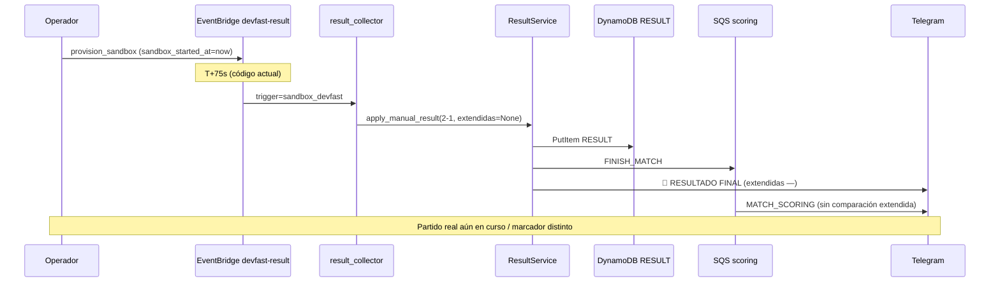

# ISSUE-2026-050 — Resultado prematuro, marcador incorrecto y extendidas ausentes (MEX vs RSA)

| Campo | Valor |
|-------|--------|
| **Tipo** | Bug / incidente operativo |
| **Severidad** | Crítica (resultado falso, scoring incorrecto, confianza del producto) |
| **Partido referencia** | MEX vs RSA — `match_id` `7ec4c6ec-f11b-5a24-8fd8-7ba47082508b` |
| **Entorno afectado** | `dev` (reportado en vivo durante partido de prueba / sandbox) |
| **Relacionado** | SPEC-2026-031 (resultados), SPEC-2026-032 (schedules prod), SPEC-2026-041 (sandbox DEV_FAST), SPEC-2026-022 (scoring), `result_collector`, `result_service`, `result_parser`, `prediction_result_report` |
| **Estado** | Abierto — spec de remediación |

---

## Síntomas reportados

1. **El scheduler de resultado disparó antes de que el partido terminara** (MEX vs RSA aún en curso).
2. **Se informó un marcador incorrecto** y **no se mostraron las predicciones extendidas** (ni en el mensaje de resultado ni en el desglose de puntos).
3. Tras corregir (1) y (2), **hay que recalcular el puntaje de todos los usuarios** que predijeron ese partido.

---

## Comportamiento esperado

| Fase | Esperado |
|------|----------|
| Antes de fin estimado (`kickoff_utc + 130 min`) | Ningún schedule ni poller debe **persistir** RESULT, **notificar** Telegram ni **encolar** scoring. |
| Sandbox DEV_FAST | Puede comprimir tiempos para *pruebas*, pero debe usar **marcador y extendidas explícitas** acordadas al provisionar; no defaults silenciosos 2-1. |
| Al finalizar (oficial) | Marcador correcto + eventos extendidos conocidos (o `—` solo si la fuente no los tiene). |
| Notificación 🏁 RESULTADO FINAL | Incluye marcador y líneas extendidas con Sí/No/— (`format_match_events_lines`). |
| Desglose MATCH_SCORING | Muestra marcador, puntos base, **comparación extendida predicción vs real** y total (incl. `+1` por acierto). |
| Reproceso | Operador puede corregir RESULT, resetear scoring y re-puntuar **todos** los usuarios sin duplicar puntos ni omitir notificaciones. |

---

## Análisis de causas raíz

### RC-1 — Resultado sandbox sin guard de kickoff real (principal para síntoma 1)

El schedule `devfast-result` dispara `result_collector` con `trigger=sandbox_devfast` **~75 s** después de `sandbox_started_at` (intervalos de 15 s en código; la SPEC-041 documenta +240 s — **drift doc/código**).

```44:76:infrastructure/lambdas/result_collector/handler.py
    elif trigger in ("match_ended", "sandbox_devfast"):
        ...
        if trigger == "sandbox_devfast" or event.get("sandbox"):
            ...
            result = svc.apply_manual_result(
                match_id,
                home,
                away,
                ...
                replace=True,
            )
```

`apply_manual_result` **no valida** `kickoff_utc + 130 min` ni `status=LIVE`. Si el partido real sigue jugándose (o el operador provisionó sandbox mientras miraba el partido en TV), el bot anuncia resultado igual.

**Archivos:** `src/services/match_schedule_sandbox.py`, `infrastructure/lambdas/result_collector/handler.py`, `src/services/result_service.py`.

---

### RC-2 — Defaults silenciosos en sandbox (principal para síntoma 2 — marcador)

Sin `sandbox_result` en el payload ni flags CLI, el handler usa:

- `SANDBOX_RESULT_HOME_GOALS` / `SANDBOX_RESULT_AWAY_GOALS` → default **2-1**
- MVP → `"Sandbox MVP"`
- **Todas las extendidas** → `None` (env vacío)

El mock de referencia para MEX vs RSA es **2-0** con extendidas explícitas (`data/fixtures/mock_web_search_results.json`), pero el sandbox **no lo usa** salvo que se pase en `provision_sandbox_schedules(sandbox_result=...)`.

---

### RC-3 — Parseo web sin extendidas en runtime Lambda (síntoma 2 — prod / collect)

`_fetch_via_web_search` solo corre si pasó `kickoff + 130 min` (salvo `RESULT_SKIP_KICKOFF_CHECK=true`; hoy el código usa 110 — ver A-1). Pero:

1. **`_heuristic_parse`** extrae solo marcador + MVP; deja `goal_before_5min`, `var_used`, etc. en `None`.
2. **`RESULT_PARSE_USE_BEDROCK`** probablemente desactivado en Lambda → no se extraen extendidas del texto Tavily.
3. Si la web devuelve un marcador **parcial o erróneo** antes del pitido final, el heurístico toma el **primer** patrón `N-N` del snippet.

```52:96:src/services/result_parser.py
def _heuristic_parse(raw: str, match: dict[str, Any]) -> dict[str, Any] | None:
    ...
    data: dict[str, Any] = {
        "found": True,
        "home_goals": h,
        "away_goals": a,
        ...
        "red_cards": 0,
        "mvp_name": None,
    }
    # sin goal_before_5min, var_used, etc.
```

`scoring_extended.extended_points` **ignora** cada variable si `actual_val is None` → **0 pts extendidos** aunque el usuario haya predicho.

---

### RC-4 — Desglose Telegram no muestra extendidas reales ni aciertos (síntoma 2 — UX)

`format_finished_match_report` lista la **predicción** extendida del usuario pero **no** el valor real ni el desglose de aciertos:

```169:177:src/services/prediction_result_report.py
    extras = extended_lines_from_prediction(prediction)
    if extras:
        lines.append("")
        lines.append("── Extendida (predicción) ──")
        lines.extend(extras)
        lines.append(
            f"\nCada variable Sí/No acertada suma +{PTS_EXTENDED_BOOL} pt "
            "(cuando el resultado oficial incluya esos datos)."
        )
```

`ScoringService` calcula `extended_points` y lo guarda en `scoring_detail`, pero **no** lo refleja en el mensaje. El usuario percibe que «no puso ninguna extendida».

`format_match_result_message` sí tiene `format_match_events_lines`, pero con extendidas `None` imprime `—` en todas las líneas.

---

### RC-5 — `match_ended` sin guard centralizado en el handler

`trigger=match_ended` (SPEC-032, hoy `kickoff+110`; objetivo de este issue: `kickoff+130`) llama `collect_result`. El guard de tiempo está **solo** dentro de `_fetch_via_web_search`, no en el handler. Caminos alternativos (`apply_manual_result`, RESULT parcial con re-notify) pueden saltarse la validación.

---

### RC-6 — Reproceso incompleto para recálculo masivo (síntoma 3)

`reset_match_scoring()` revierte puntos y `result_processed=false`, pero **no** limpia `scoring_breakdown_notified`. Tras re-puntuar, `notify_scoring_breakdowns` puede **no reenviar** desglose.

No existe script único «corregir partido + reset + re-score + re-notify» documentado para operadores.

---

## Diagrama del incidente (sandbox + scoring)



---

## Solución propuesta

### Fase A — Guards y validación (evitar recurrencia)

| ID | Cambio | Archivo(s) |
|----|--------|--------------|
| A-1 | Función compartida `assert_match_finished_for_result(match, *, allow_sandbox: bool)` — rechaza si `now < kickoff+130` salvo override explícito `FORCE_RESULT=1` o sandbox con `sandbox_result` completo. Actualizar `ESTIMATED_MATCH_MINUTES` y offset del schedule `result-{match_id}` (SPEC-032) de 110 → **130**. | `src/services/result_service.py`, `src/services/scheduler_manager.py` |
| A-2 | Invocar guard en **todos** los entrypoints: `collect_result`, `apply_manual_result`, `result_collector` handler (`match_ended`, `sandbox_devfast`, `manual`) | handler + service |
| A-3 | Sandbox: **obligar** `sandbox_result` con marcador + extendidas al provisionar, o leer fixture `mock_web_search_results.json` por equipos; eliminar default 2-1 en prod-like dev | `match_schedule_sandbox.py`, `result_collector/handler.py`, `scripts/provision_match_sandbox.py` |
| A-4 | Tras guard, validar `match.status != LIVE` (cuando exista) antes de persistir | `MatchDAO`, `result_service` |
| A-5 | Web: activar `RESULT_PARSE_USE_BEDROCK=true` en Lambda `result_collector` **o** extender `_heuristic_parse` con regex para extendidas (como el mock MEX_RSA) | `result_parser.py`, Terraform env |
| A-6 | Rechazar persistencia si el texto web contiene señales de partido en curso (`en vivo`, `minuto \d+`, `parcial`, etc.) — reintento en próximo poller | `result_service.py` |

### Fase B — UX y scoring transparente

| ID | Cambio | Archivo(s) |
|----|--------|--------------|
| B-1 | En `format_finished_match_report`: sección **── Extendida (resultado vs predicción) ──** usando `extended_points()` hits (predicho, real, +1/0) | `prediction_result_report.py` |
| B-2 | Incluir línea `Extendidas: +N pts` en total cuando `extended_points > 0` | idem |
| B-3 | En 🏁 RESULTADO FINAL: si todas las extendidas son `None`, agregar nota «Eventos extendidos pendientes de confirmación» (opcional, solo dev) | `result_notification.py` |

### Fase C — Herramientas de remediación (síntoma 3)

| ID | Cambio | Archivo(s) |
|----|--------|--------------|
| C-1 | `ResultDAO.clear_scoring_state(match_id)` — `result_processed=false`, `scoring_breakdown_notified=false` | `result_dao.py` |
| C-2 | `reset_match_scoring` usa `clear_scoring_state` | `scoring_service.py` |
| C-3 | Script `scripts/remediate_match_result.py`: `--match-id` / `--teams`, `--inject SCORE`, flags extendidas, `--reset-scoring`, `--force-score`, `--telegram-direct`, `--dry-run` | nuevo script |
| C-4 | Documentar runbook en §8 de esta issue | este doc |

### Fase D — Alineación SPEC-041

Actualizar offsets reales (15 s × 7 = 90 s ciclo; result en índice 5 = **+75 s**) o cambiar código a +240 s si se prefiere la SPEC original. **Decisión:** código y doc deben coincidir; para pruebas «pre-partido real» el result sandbox **no** debe disparar antes que `kickoff+130` si `sandbox_mode=DEV_FAST` y el kickoff del fixture es futuro/pasado según escenario.

---

## Runbook — remediación MEX vs RSA (dev)

**Prerrequisitos:** perfil `asap_dev`, tabla `ProdeTable-dev`, partido finalizado con marcador oficial conocido.

### 1. Auditoría

```bash
# Ver RESULT actual y flags
aws dynamodb get-item \
  --table-name ProdeTable-dev \
  --key '{"partition_key":{"S":"MATCH#7ec4c6ec-f11b-5a24-8fd8-7ba47082508b"},"sort_key":{"S":"RESULT"}}' \
  --profile asap_dev

# Cancelar schedules sandbox residuales (evita re-disparo)
python scripts/provision_match_sandbox.py \
  --teams MEX RSA --action cancel --profile asap_dev
```

### 2. Corregir resultado oficial

Usar marcador y extendidas reales (ejemplo mock de referencia 2-0, VAR sí, sin gol antes del 5'):

```bash
python scripts/collect_result.py \
  --teams MEX RSA \
  --inject 2-0 \
  --mvp "Hirving Lozano" \
  --goal-before-5min false \
  --var-used true \
  --free-kick-goal false \
  --penalty-saved false \
  --penalty-scored false \
  --profile asap_dev \
  --env dev
```

> Si `collect_result.py` aún no expone flags extendidas, usar `remediate_match_result.py` (C-3) o invocar Lambda con payload manual hasta implementar CLI.

### 3. Reset scoring + re-puntuar todos los usuarios

```bash
python scripts/run_scoring_local.py \
  --teams MEX RSA \
  --reset \
  --force \
  --profile asap_dev \
  --env dev
```

### 4. Reenviar desglose Telegram

```bash
python scripts/run_scoring_local.py \
  --teams MEX RSA \
  --telegram-direct \
  --profile asap_dev \
  --env dev
```

Si `scoring_breakdown_notified=true` bloquea reenvío (RC-6), hasta C-1:

```bash
# Limpiar flag manualmente o borrar RESULT y repetir pasos 2–4
aws dynamodb update-item \
  --table-name ProdeTable-dev \
  --key '{"partition_key":{"S":"MATCH#7ec4c6ec-f11b-5a24-8fd8-7ba47082508b"},"sort_key":{"S":"RESULT"}}' \
  --update-expression "REMOVE scoring_breakdown_notified SET result_processed = :f" \
  --expression-attribute-values '{":f":{"BOOL":false}}' \
  --profile asap_dev
```

### 5. Verificación

- [ ] `RESULT` tiene marcador correcto y extendidas no-`null` donde aplique.
- [ ] `result_processed=true` en RESULT.
- [ ] Predicciones del partido en `SCORED` con `points_earned` coherentes.
- [ ] `total_points` de usuarios = suma esperada (auditar muestra con `scripts/run_scoring_local.py` JSON).
- [ ] Telegram: mensaje 🏁 con extendidas Sí/No; desglose con comparación extendida.

---

## Criterios de aceptación

| ID | Criterio |
|----|----------|
| AC-01 | Con `kickoff_utc` futuro + `now < kickoff+130`, `result_collector` con `trigger=match_ended` retorna sin escribir RESULT |
| AC-02 | Con `trigger=sandbox_devfast` sin `sandbox_result` completo → error explícito o uso de fixture por equipos (no 2-1 silencioso) |
| AC-03 | Texto web con «en vivo» / minuto < 90 no persiste RESULT |
| AC-04 | Parser (Bedrock o heurístico) extrae al menos `goal_before_5min` y `var_used` del mock `MEX_RSA` |
| AC-05 | `format_finished_match_report` muestra aciertos/fallos extendidos y suma `+N pts` |
| AC-06 | `reset_match_scoring` + `process_finish_match(force=True)` no duplica puntos en `USER#/PROFILE` |
| AC-07 | Tras remediate, **todos** los usuarios con predicción SCORED en el partido reciben desglose actualizado |
| AC-08 | SPEC-041 actualizada con offsets reales o código alineado a +240 s documentado |

---

## Plan de pruebas

### Unit

- `test_result_service_kickoff_guard` — rechaza antes de +130 min en collect y manual.
- `test_sandbox_devfast_requires_sandbox_result` — handler sin payload extendido falla o usa fixture.
- `test_heuristic_parse_extended_mex_rsa` — mock JSON → todas las extendidas parseadas.
- `test_format_finished_match_report_extended_hits` — líneas pred vs real.
- `test_reset_clears_breakdown_notified` — tras C-1/C-2.

### Integración (dev)

1. Partido con kickoff en +2 h → provision sandbox → **no** RESULT hasta guard satisfecho.
2. Partido terminado (mock web 2-0 MEX_RSA) → collect → scoring → Telegram con extendidas.
3. Inyectar resultado erróneo → remediate runbook → puntos corregidos en 3+ usuarios de prueba.

---

## Tareas de implementación

| Task | Descripción | Estimación |
|------|-------------|------------|
| TASK-050-001 | Guard `kickoff+130` centralizado + tests (+ alinear SPEC-032 schedule) | 3h |
| TASK-050-002 | Sandbox: fixture/CLI extendidas obligatorias | 2h |
| TASK-050-003 | Parser extendidas (heurístico + flag Bedrock en TF) | 4h |
| TASK-050-004 | Desglose extendido en `prediction_result_report` | 2h |
| TASK-050-005 | `clear_scoring_state` + `remediate_match_result.py` | 3h |
| TASK-050-006 | Alinear SPEC-041 offsets; actualizar `provision_match_sandbox.py` help | 1h |
| TASK-050-007 | Ejecutar runbook MEX vs RSA en dev + checklist AC | 1h |

**Total estimado:** ~16 h

---

## Notas

- **Fin estimado = `kickoff_utc + 130 min`:** 90' reglamentarios + descanso + margen por tiempo añadido, revisiones VAR y posible tiempo extra (el valor anterior de 110 min resultó insuficiente en el incidente MEX vs RSA).
- El fixture JSON local puede listar otro rival en `match_id` `7ec4c6ec…` (histórico MEX-CAN); en dev el partido ancla de docs es **MEX vs RSA** — verificar `home_team`/`away_team` en Dynamo antes del runbook.
- No reprocesar scoring en prod sin `force` y auditoría; `result_processed` existe precisamente para idempotencia (SPEC-032 §4.4).
- Tras el fix, considerar métrica CloudWatch `ResultCollectedBeforeKickoffEnd` = 0.
