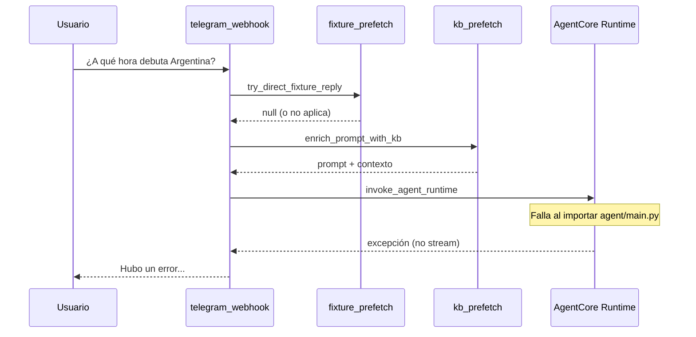

# SPEC-2026-027 — Regresión: match_tool, KB y web_search rotos tras onboarding/trivias

| Campo | Valor |
|-------|--------|
| **Tipo** | Bug / regresión de runtime |
| **Severidad** | Crítica — el bot responde solo errores genéricos en consultas normales |
| **Síntoma** | `Hubo un error. Por favor intentá de nuevo en unos segundos.` en preguntas de historia, fixture, etc. |
| **Afecta** | Todos los usuarios en `onboarding_stage=M3_COMPLETE` (incl. admin) cuando el flujo llega al agente |
| **Relacionado** | SPEC-019 (onboarding), SPEC-025 (trivias), ISSUE-025 (invitados), ISSUE-024 (KB/web), `agent/main.py`, `build-agent-zip.sh` |
| **Estado** | Implementado en código — pendiente deploy AgentCore + Telegram |

---

## Síntoma reportado

Tras implementar onboarding (y trivias en el mismo ciclo), el bot deja de responder contenido útil:

| Pregunta del usuario | Respuesta observada |
|----------------------|---------------------|
| Historia de trofeos del Mundial (KB) | `Hubo un error. Por favor intentá de nuevo en unos segundos.` |
| (reintento) | Mismo error |
| ¿A qué hora debuta Argentina? (fixture) | Mismo error |

Ese texto **no** viene de `match_tool`, `kb_retrieval_tool` ni `web_search_tool`: viene del `except` de `_invoke_agent` en el webhook de Telegram cuando **`invoke_agent_runtime` falla por completo**.

```165:165:infrastructure/lambdas/telegram_webhook/handler.py
        return "Hubo un error. Por favor intentá de nuevo en unos segundos."
```

---

## Comportamiento esperado

| Tipo de pregunta | Canal esperado |
|------------------|----------------|
| Historia, reglas, cultura | `try_direct_knowledge_reply` (Lambda) o agente → `kb_retrieval_tool` / `web_search_tool` |
| Fixture, horarios, debut | `try_direct_fixture_reply` (Lambda) o agente → `match_tool` |
| Usuario M3 completo | No bloqueo por onboarding; agente con todas las tools |

---

## Arquitectura actual (flujo que falla)



---

## Causa raíz (confirmada en código)

### RC-1 — **AgentCore no empaqueta `src/jobs`; `agent/main.py` importa `trivia_service` al arranque**

`agent/main.py` importa en **nivel de módulo**:

```python
from src.services.trivia_service import TRIVIA_SECTION
```

`src/services/trivia_service.py` importa en **nivel de módulo**:

```python
from src.jobs.daily_trivia_schedule import (
    compute_daily_trivia_schedule,
    local_today_iso,
    should_publish_daily_trivia,
)
```

El script de empaquetado del agente **no copia** `src/jobs`:

```24:24:infrastructure/terraform/bin/build-agent-zip.sh
cp -R "${REPO_ROOT}/src/kb" "${REPO_ROOT}/src/dao" "${REPO_ROOT}/src/services" "${REPO_ROOT}/src/fixtures" "${BUILD_DIR}/src/"
```

La Lambda de Telegram **sí** incluye `src/jobs` (fix previo en `build-telegram-lambda.sh`), pero el **runtime del agente no**. Cualquier invocación a AgentCore termina en:

`ModuleNotFoundError: No module named 'src.jobs'` (o equivalente) al cargar `agent/main.py`.

**Por qué se asocia a “onboarding”:** en el mismo sprint se añadieron `onboarding_tool`, `TRIVIA_SECTION` en el system prompt y deploy del agente; el fallo visible coincide con ese deploy, aunque el trigger técnico es la cadena **trivia → jobs**, no el onboarding en sí (`ONBOARDING_SECTION` solo importa `user_dao` + fixtures, que sí están en el ZIP).

### RC-2 — Prefetch directo no siempre evita el agente

Aunque la Lambda tenga KB y fixture:

- `try_direct_knowledge_reply` / `try_direct_fixture_reply` devuelven `None` si no hay datos suficientes, query analítica, o excepción silenciosa.
- Entonces **siempre** se llama al agente → se dispara RC-1 → error genérico.

### RC-3 — Contribuyentes menores (no bloquean solos)

| ID | Detalle |
|----|---------|
| RC-3a | `echo_tool` sigue listando `knowledge_base` en `features_pending` — confunde al LLM cuando el agente sí arranca. |
| RC-3b | System prompt muy largo (onboarding + trivias + guardrails) — más carga al modelo, no explica el `except` del webhook. |
| RC-3c | Solo Lambda redeployada sin **rebuild AgentCore** — código agente viejo o roto en runtime. |

---

## Qué **no** es la causa principal

| Hipótesis | Veredicto |
|-----------|-----------|
| Onboarding M1 bloquea el mensaje | No para admin/M3: solo intercepta `onboarding_stage=M1_PENDING` en Telegram. |
| `kb_prefetch` roto en Lambda | Puede fallar en silencio, pero el usuario vería respuesta del agente o “No pude generar…”, no el `except` de `_invoke_agent` salvo que se invoque AgentCore. |
| Tools desregistradas en Strands | `agent/main.py` sigue registrando `match_tool`, `kb_retrieval_tool`, `web_search_tool`. |

---

## Plan de corrección

### Fase A — Desbloqueo inmediato (obligatorio)

**A1. Romper el import pesado en el entrypoint del agente**

Mover constantes de prompt a un módulo liviano sin dependencias de jobs:

```
agent/prompt_sections.py   ← TRIVIA_SECTION, (opcional) re-export ONBOARDING_SECTION
```

O definir `TRIVIA_SECTION` inline en `agent/main.py` / `agent/prompt_sections.py` sin importar `TriviaService`.

`agent/main.py` debe poder cargarse con solo: `agent/`, `src/kb`, `src/dao`, `src/services` (sin ejecutar imports de `src.jobs`).

**A2. Alternativa complementaria (defensa en profundidad)**

Incluir `src/jobs` en `build-agent-zip.sh` (misma línea que en `build-telegram-lambda.sh`):

```bash
cp -R ... "${REPO_ROOT}/src/jobs" "${BUILD_DIR}/src/"
```

Recomendación: **A1 + A2** (A1 evita arrastrar lógica de scheduler al agente; A2 evita futuros `ModuleNotFoundError` si otro servicio importa jobs).

**A3. Lazy import en tools (opcional, buena práctica)**

En `trivia_tool.py` ya se lazy-importa `TriviaService`; mantener y no importar `trivia_service` desde `main.py` salvo por constantes movidas a A1.

**A4. Redeploy**

1. `build-agent-zip.sh` + `terraform apply` → `aws_bedrockagentcore_agent_runtime.prode`
2. Bump `AGENT_RUNTIME_VERSION` en Lambda Telegram (ya existe) para invalidar sesiones cacheadas.
3. Verificar logs CloudWatch del runtime: arranque sin `ModuleNotFoundError`.

### Fase B — Robustez del webhook (recomendado)

**B1. Log explícito del error de AgentCore**

En `_invoke_agent`, loguear `repr(exc)` / tipo antes del mensaje genérico (sin PII) para distinguir import vs timeout vs guardrail.

**B2. Métrica / alarma**

Contador `agent_invoke_failed` en logs estructurados cuando cae el `except`.

**B3. Test de humo del paquete agente**

Script CI que importa `agent.main` usando solo el árbol copiado por `build-agent-zip.sh` (sin `src/jobs` hasta A2, o con jobs tras A2).

```python
# tests/smoke/test_agent_package_imports.py
import importlib
importlib.import_module("agent.main")  # debe no lanzar
```

### Fase C — Alineación onboarding (ya parcialmente hecho)

| Item | Acción |
|------|--------|
| C1 | Mantener M1 solo en `onboarding_handler` (Telegram); agente con `build_session_context` — OK. |
| C2 | Actualizar `echo_tool`: quitar `knowledge_base` de `features_pending`. |
| C3 | Documentar en README: deploy agente ≠ deploy Lambda Telegram. |

---

## Criterios de aceptación

### CA-1 — Agente arranca

- [ ] `import agent.main` en entorno empaquetado como AgentCore **sin excepción**.
- [ ] CloudWatch del runtime sin `ModuleNotFoundError` en cold start.

### CA-2 — Paridad de tools

Usuario admin, `M3_COMPLETE`, mensaje de prueba:

| Mensaje | Evidencia |
|---------|-----------|
| «¿Quién ganó el Mundial 2022?» | Respuesta con contenido (KB o web), no error genérico. |
| «¿A qué hora debuta Argentina en el Mundial 2026?» | Horario/rivals desde fixture o mensaje claro “sin dato en fixture”. |
| «Compará Messi y Ronaldo en mundiales» | Uso de web o KB, no bienvenida repetida. |

### CA-3 — Invitado post-/start

- [ ] Tras completar M1 en Telegram, primera pregunta de conocimiento usa tools (ISSUE-025 cerrado en conjunto).

### CA-4 — Regresión trivias

- [ ] `/trivia` y comandos Telegram de trivia siguen funcionando (Lambda con `src/jobs`).
- [ ] `trivia_tool` en agente sigue disponible sin romper el import del entrypoint.

---

## Plan de pruebas

| # | Paso |
|---|------|
| 1 | `pytest tests/smoke/test_agent_package_imports.py` (nuevo) |
| 2 | Deploy dev AgentCore + Telegram |
| 3 | Admin: 3 mensajes (KB, fixture, comparativa) |
| 4 | Invitado nuevo: `/start` + invitación → M1 → pregunta historia |
| 5 | Revisar logs: `invoke_agent_runtime error` = 0 en flujo feliz |

---

## Estimación

| Fase | Esfuerzo |
|------|----------|
| A (import + zip + deploy) | 1–2 h |
| B (logs + smoke test CI) | 1 h |
| C (echo_tool + docs) | 30 min |

---

## Referencias de código

| Archivo | Rol |
|---------|-----|
| `agent/main.py` | Import roto de `TRIVIA_SECTION` |
| `src/services/trivia_service.py` | Import `src.jobs.daily_trivia_schedule` |
| `infrastructure/terraform/bin/build-agent-zip.sh` | Falta `src/jobs` |
| `infrastructure/terraform/bin/build-telegram-lambda.sh` | Incluye `src/jobs` (correcto) |
| `infrastructure/lambdas/telegram_webhook/handler.py` | `_invoke_agent` → mensaje de error |
| `infrastructure/lambdas/telegram_webhook/kb_prefetch.py` | Prefetch KB/web en Lambda |
| `infrastructure/lambdas/telegram_webhook/fixture_prefetch.py` | Prefetch fixture en Lambda |
| `docs/issues/ISSUE-2026-025-invited-users-stuck-welcome-no-kb.md` | Síntomas previos parciales |

---

## Nota para el equipo

El onboarding en Telegram **no sustituye** al agente para preguntas libres; solo debe capturar M1. El producto depende de que **AgentCore cargue** y de que match/KB/web estén registrados. Hasta corregir RC-1, cualquier pregunta que no resuelva el prefetch directo en Lambda terminará en el error genérico aunque DynamoDB y la KB estén sanos.
