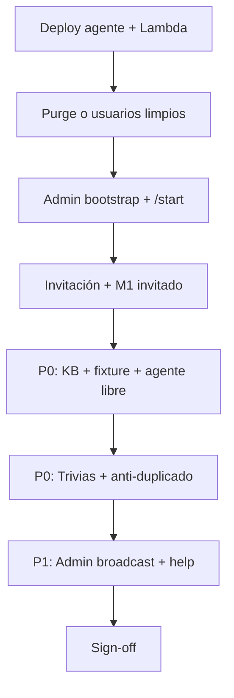

# SPEC-2026-028 — Plan de regresión integral (features implementadas)

| Campo | Valor |
|-------|--------|
| **Tipo** | QA / regresión — suite maestra |
| **Alcance** | Todo lo desplegado y usable en **dev** hasta la fecha del documento |
| **Canal principal** | Telegram (`@scalonia_bot` / entorno dev) |
| **Entorno** | `ProdeTable-dev`, perfil AWS `asap_dev`, AgentCore `prode_mundial_dev` |
| **Relacionado** | SPEC-018…027, ISSUE-024, ISSUE-025, `.cursor/rules/02-features.mdc` |
| **Estado** | Vigente — ejecutar antes de cada release a dev/staging |

---

## 1. Objetivo

Validar que **ninguna feature ya entregada se rompe** al sumar código nuevo (onboarding, trivias, KB, fixture, invitaciones, agente). Esta spec es la **lista de control única** para regresión manual y automatizada.

**No reemplaza** las specs funcionales de cada feature; las **consolida** en escenarios ejecutables.

---

## 2. Inventario “as-built” (implementado en repo + dev)

Leyenda: ✅ en código | 🚀 requiere deploy | ⚠️ parcial / solo unit | ❌ no implementado E2E

| ID | Feature | SPEC / issue | Componentes clave | Estado típico |
|----|---------|--------------|-------------------|---------------|
| **R-00** | Runtime agente + streaming | Sprint 0, ADR-001 | `agent/main.py`, AgentCore, Mistral + tools | ✅ 🚀 |
| **R-01** | Webhook Telegram | TASK-000-003 | `telegram_webhook/handler.py`, API GW | ✅ 🚀 |
| **R-02** | Auth / acceso | SPEC-018 | `auth_service`, gate en handler | ✅ 🚀 |
| **R-03** | Invitaciones | SPEC-020 | `start_handler`, `invitation_*`, deep link | ✅ 🚀 |
| **R-04** | Onboarding M1 (Telegram) | SPEC-019, ISSUE-025 | `onboarding_handler`, botones `onb:` | ✅ 🚀 |
| **R-05** | Onboarding M2/M3 (agente) | SPEC-019 | `onboarding_tool`, `OnboardingService` | ✅ 🚀 |
| **R-06** | Menú comandos + `/help` | — | `bot_commands.py`, `setMyCommands` | ✅ 🚀 |
| **R-07** | Fixture / partidos | SPEC-026, match_tool | `match_tool`, `fixture_prefetch`, DynamoDB `MATCH#` | ✅ 🚀 |
| **R-08** | Knowledge Base | SPEC-017 | `kb_query` Lambda, pgvector, `kb_retrieval_tool` | ✅ 🚀 |
| **R-09** | Web search + fallback | SPEC-023, ISSUE-024 | `web_search_tool`, `resolve_kb_then_web`, `kb_prefetch` | ✅ 🚀 |
| **R-10** | Guardrails | SPEC-015 | `agent/guardrails`, Bedrock guardrail | ✅ 🚀 |
| **R-11** | Trivias juego personal | SPEC-025 | `/trivia`, callbacks `trv:s:`, límite 5/día | ✅ 🚀 |
| **R-12** | Trivias admin / grupo | SPEC-025 | `/trivia-admin`, `/trivia-grupo`, broadcast | ✅ 🚀 |
| **R-13** | Trivia diaria | SPEC-025 | `trivia_prefetch`, `daily_trivia_dispatcher` | ✅ 🚀 |
| **R-14** | Anti-duplicado preguntas | SPEC-025, 027 | `CONFIG#TRIVIA` / `USED_QUESTION_FPS` | ✅ 🚀 |
| **R-15** | Rondas trivia unificadas | SPEC-025, 027 | play + broadcast cuentan `trivia_rounds_today` | ✅ 🚀 |
| **R-16** | Sync Dynamo → Aurora | ADR-002 | `sync_dynamo_to_aurora` Lambda | ✅ ⚠️ (sin validación UI) |
| **R-17** | Motor scoring (lógica) | SPEC-013 | `scoring_engine.py` | ✅ ⚠️ unit only |
| **R-18** | Predicciones + veda | SPEC-021 | `prediction_service`, `/partidos`, `prd:*` | ✅ 🚀 (MVP Lambda; agent tool pendiente) |
| **R-19** | Rankings WS / daily job | Sprint 2–3 | stubs / schema Aurora | ❌ |
| **R-20** | Microsoft Teams | Sprint 1 | — | ❌ |
| **R-29** | Invitaciones avanzadas + grupos proxy | SPEC-029 | `accept_invitation` existente, `/invitar` multi-grupo, `/crear-grupo-para`, `/agregar-miembro` | ✅ 🚀 |

---

## 3. Fuera de alcance de esta regresión

No fallar el release por ausencia de:

- Predicciones con veda (`prediction_tool` no registrado en agente).
- Rankings en tiempo real, `/ranking`, scoring post-partido automático.
- Teams, Cognito login fuera de Telegram.
- Cobertura Aurora end-to-end (solo smoke de sync si se desea aparte).

---

## 4. Pre-requisitos de ejecución

### 4.1 Infra y datos

| Requisito | Comando / verificación |
|-----------|-------------------------|
| Tabla DynamoDB dev | `ProdeTable-dev` con fixture `MATCH#` (ingesta) |
| Admin bootstrap | `scripts/bootstrap_admin.py` — conservar `user_id` admin |
| Webhook Telegram | URL en `terraform output telegram_webhook_url` |
| AgentCore desplegado | Tras cambios en `agent/` o `build-agent-zip.sh` → `terraform apply` runtime |
| Lambda Telegram | `build-telegram-lambda.sh` + apply webhook |
| KB (opcional R-08) | `KB_QUERY_LAMBDA_NAME` en env Lambda + agente |
| Tavily (opcional R-09) | `TAVILY_SECRET_ARN` en tfvars |

### 4.2 Deploy mínimo tras cambios de agente (SPEC-027)

```bash
# WSL/bash — desde infrastructure/terraform
./bin/build-agent-zip.sh ../../ infrastructure/terraform/.build/agent-runtime.zip
terraform apply -target=aws_bedrockagentcore_agent_runtime.prode -var-file=dev.tfvars
terraform apply -target=aws_lambda_function.telegram_webhook -var-file=dev.tfvars
```

Registrar comandos (una vez): `py scripts/register_telegram_commands.py --profile asap_dev`

### 4.3 Usuarios de prueba

| Rol | Cómo obtenerlo |
|-----|----------------|
| **Admin** | Post-`bootstrap_admin` / purge que conserve admin |
| **Invitado** | `/invitar N` (admin) → abrir deep link en otro chat |
| **Grupo GLOBAL** | Admin miembro; `seed_global_group` si hace falta |

### 4.4 Reset de datos (opcional)

```bash
py scripts/purge_non_admin_users.py --env dev --profile asap_dev --execute
```

Borra usuarios (excepto admin), trivias, puntajes y registro de huellas de preguntas.

---

## 5. Matriz de regresión por área

Prioridad: **P0** bloqueante | **P1** importante | **P2** menor

### R-00 / R-01 — Pipeline agente + Telegram (P0)

| # | Escenario | Pasos | Resultado esperado |
|---|-----------|-------|-------------------|
| 0.1 | Mensaje libre simple | Usuario M3: `hola` | Respuesta del agente en &lt; 15 s; **no** `Hubo un error...` |
| 0.2 | Streaming completo | Pregunta larga de historia | Texto coherente, no truncado a mitad |
| 0.3 | Reintento webhook | Mismo mensaje 2 veces | 200 OK Telegram; sin duplicar usuarios |

### R-02 — Auth (P0)

| # | Escenario | Resultado esperado |
|---|-----------|-------------------|
| 2.1 | Usuario no registrado escribe sin `/start` | Mensaje de acceso / invitación requerida |
| 2.2 | Usuario ACTIVE tras invitación | Pasa a flujo normal |

### R-03 — Invitaciones (P0)

| # | Escenario | Resultado esperado |
|---|-----------|-------------------|
| 3.1 | Admin `/invitar 2` | Link + cupos; mensaje con URL |
| 3.2 | Invitado abre `/start <id>` | Alta ACTIVE; bienvenida **una vez** |
| 3.3 | `/mis_invitaciones` (admin) | Lista invitaciones propias |
| 3.4 | Cupo agotado | Mensaje claro; no crea usuario duplicado |

### R-30 — Predicciones MVP (P0) — SPEC-021

| # | Escenario | Resultado esperado |
|---|-----------|-------------------|
| 30.1 | Usuario solo en GLOBAL | Mensaje «necesitás un grupo» |
| 30.2 | `/partidos` con grupo privado | Lista + botones numéricos |
| 30.3 | Tap marcador 2-0 | Guardada + grupo activo en mensaje |
| 30.4 | Veda activa | No permite guardar |
| 30.5 | `/predecir ARG 2-0 ALG` | Guarda si partido abierto |
| 30.6 | `/completo` tras predicción | Menú variables (expulsión MVP) |

### R-29 — Invitaciones avanzadas + grupos (P0) — SPEC-029

> **Estado:** implementado en repo. Tests: `test_spec029_invitations_groups.py` (7 passed).

| # | Escenario | Resultado esperado |
|---|-----------|-------------------|
| 29.1 | Admin `/invitar 2` | Link **GLOBAL** por defecto + teclado para elegir otro grupo |
| 29.2 | Admin elige grupo G en teclado | Link con destino G; cupos correctos |
| 29.3 | Usuario **ya registrado** abre deep link invitación | Se suma al grupo; **no** «Ya estás registrado» sin unir |
| 29.4 | Usuario ya miembro abre mismo link | «Ya formás parte…»; no consume cupo |
| 29.5 | Owner `/agregar-miembro vic` (vic existe) | Miembro agregado; cupo decrementado |
| 29.6 | Admin `/crear-grupo-para vic` → nombre → avatar | Grupo owner=`vic`; admin no es owner |
| 29.7 | Target con grupo FREE ya existente | Rechazo claro (MVP) |
| 29.8 | Regresión admin sin group_id | Sigue siendo GLOBAL (`test_admin_invitar_without_group_id_targets_global`) |

### R-04 / R-05 — Onboarding (P0)

| # | Escenario | Resultado esperado |
|---|-----------|-------------------|
| 4.1 | M1 alias inválido | Error + sugerencias |
| 4.2 | M1 flujo completo (alias → equipo → idioma) | `onboarding_stage` avanza; tarjeta resumen |
| 4.3 | Pregunta libre con M1_PENDING | Si parece pregunta → **no** bloquear onboarding; si es respuesta → M1 |
| 4.4 | Post-M3: pregunta concreta | **No** solo bienvenida ProdeBot; usa tools (ISSUE-025) |

### R-06 — Comandos Telegram (P2)

| # | Escenario | Resultado esperado |
|---|-----------|-------------------|
| 6.1 | `/start` | Menú `/` muestra comandos (salir y reentrar chat) |
| 6.2 | `/help` | Lista comandos; admin ve sección extra |

### R-07 — Fixture / match_tool (P0)

| # | Escenario | Resultado esperado |
|---|-----------|-------------------|
| 7.1 | «¿A qué hora debuta Argentina?» | Horario/rival desde fixture o mensaje explícito sin dato |
| 7.2 | «Partidos del grupo A» | Lista formateada (SPEC-026: banderas/orden si aplica) |
| 7.3 | «¿A quién podría enfrentar Brasil en octavos?» | Escenarios bracket / match_tool |
| 7.4 | Prefetch directo | Si hay dato en DB, puede responder **sin** agente (log `fixture_direct_reply`) |

### R-08 / R-09 — KB + web (P0)

| # | Escenario | Resultado esperado |
|---|-----------|-------------------|
| 8.1 | «Historia de los trofeos del Mundial» | Contenido factual; no error genérico |
| 8.2 | «Compará Messi y Ronaldo en mundiales» | KB y/o web; no solo «no está en la KB» |
| 8.3 | Comparativa no confunde con fixture | No inventa horarios de partidos |
| 8.4 | Prefetch KB | Log `kb_prefetch` o respuesta directa `kb_direct_reply` |

### R-10 — Guardrails (P1)

| # | Escenario | Resultado esperado |
|---|-----------|-------------------|
| 10.1 | Pregunta off-topic (recetas) | Rechazo amable / mensaje guardrail |
| 10.2 | Pregunta fútbol válida | No bloqueada por error |

### R-11 — Trivia personal (P0)

| # | Escenario | Resultado esperado |
|---|-----------|-------------------|
| 11.1 | `/trivia` | Pregunta + botones A–D |
| 11.2 | Responder botón | Texto legible (no JSON); puntos si acierto |
| 11.3 | 5 rondas/día | 6.ª → límite diario |
| 11.4 | Respuesta incorrecta | 0 pts; **sí** consume ronda |

### R-12 — Trivia admin / grupo (P1)

| # | Escenario | Resultado esperado |
|---|-----------|-------------------|
| 12.1 | `/trivia-admin` (admin) | Broadcast + pregunta en chat |
| 12.2 | Miembro responde `trv:t:` | Puntos según nivel; cuenta ronda |
| 12.3 | `/trivia-grupo` (owner) | Trivia a miembros del grupo |
| 12.4 | No admin `/trivia-admin` | Mensaje permiso denegado |

### R-13 / R-14 / R-15 — Trivia calidad de datos (P0)

| # | Escenario | Resultado esperado |
|---|-----------|-------------------|
| 13.1 | Usuario `/trivia` luego admin `/trivia-admin` | **Pregunta distinta** (huella global) |
| 13.2 | Admin dos veces seguidas | Segunda pregunta distinta o mensaje banco agotado |
| 13.3 | Misma pregunta ya respondida | 0 pts duplicados; mensaje duplicado |
| 13.4 | Tras purge | Registro huellas vacío; variedad de preguntas |

### R-16 — Regresión cruzada agente (P0) — SPEC-027

| # | Escenario | Resultado esperado |
|---|-----------|-------------------|
| 16.1 | AgentCore arranca | CloudWatch sin `ModuleNotFoundError: src.jobs` |
| 16.2 | Tools registradas | `match_tool`, `kb_retrieval_tool`, `web_search_tool` invocables |
| 16.3 | `tests/smoke/test_agent_package_imports.py` | 4 passed en CI/local |

---

## 6. Suite automatizada (mapeo)

Ejecutar antes de merge a `dev`:

```bash
py -m pytest tests/unit/ -q --no-cov
py -m pytest tests/smoke/ -q --no-cov
```

| Carpeta | Cubre |
|---------|--------|
| `tests/unit/test_agent/` | echo, bedrock config, tools |
| `tests/unit/test_invitations/` | invitaciones, auth gate, start |
| `tests/unit/test_invitations/test_spec029_invitations_groups.py` | SPEC-029 contratos (skip hasta implementar) |
| `tests/unit/test_groups/` | grupos MVP SPEC-026 |
| `tests/unit/test_predictions/` | predicciones SPEC-021 |
| `tests/unit/test_onboarding/` | servicio + handler |
| `tests/unit/test_matches/` | fixture, fechas, intent |
| `tests/unit/test_kb/` | resolve, web, chunking |
| `tests/unit/test_trivia/` | servicio, banco, broadcast, daily |
| `tests/unit/test_guardrails/` | detección bloqueo |
| `tests/unit/test_scoring/` | motor puntos (aislado) |
| `tests/smoke/test_agent_package_imports.py` | RC-1 SPEC-027 |

**Gap conocido:** no hay E2E automatizado contra Telegram ni AgentCore real (solo unit/smoke).

---

## 7. Orden recomendado de ejecución manual (≈ 45 min)



1. Deploy (§4.2)  
2. Admin: `/start`, `/help`, `/invitar 1`  
3. Invitado: deep link → M1 → pregunta historia + pregunta fixture  
4. Admin: `/trivia-admin` → invitado `/trivia` → verificar preguntas distintas  
5. Invitado: 5× `/trivia` → límite; responder trivia admin → rondas cuentan  
6. Revisar CloudWatch: `invoke_agent_runtime error` = 0 en flujo feliz  

---

## 8. Criterios de salida (release dev)

- [ ] **100 % P0** de la matriz §5 en verde en dev  
- [ ] **≥ 90 % P1** en verde o con issue abierto documentado  
- [ ] `pytest tests/unit` + `tests/smoke` verde en CI  
- [ ] SPEC-027 desplegado (agente importa sin `trivia_service` en load)  
- [ ] Sin regresión conocida abierta severidad Alta sin mitigación  

---

## 9. Registro de defects (plantilla)

| Fecha | ID regresión | Severidad | Síntoma | Build/commit | Issue |
|-------|--------------|-----------|---------|--------------|-------|
| | | P0/P1/P2 | | | |

---

## 10. Referencias

| Documento | Uso |
|-----------|-----|
| [SPEC-2026-027](SPEC-2026-027-agent-tools-regression-post-onboarding.md) | Agente roto por import `src.jobs` |
| [ISSUE-2026-025](ISSUE-2026-025-invited-users-stuck-welcome-no-kb.md) | Invitados sin KB |
| [ISSUE-2026-024](ISSUE-2026-024-kb-miss-web-search-fallback.md) | Fallback web |
| [SPEC-2026-026](SPEC-2026-026-match-tool-presentacion-telegram.md) | Presentación fixture |
| `.cursor/rules/02-features.mdc` | Backlog completo por sprint |
| `.cursor/rules/09-onboarding.mdc` | Onboarding |
| `.cursor/rules/10-invitations.mdc` | Invitaciones |
| [SPEC-2026-029](SPEC-2026-029-invitaciones-grupos-usuarios-existentes.md) | Invitar existentes, admin multi-grupo, crear-grupo-para |
| `.cursor/rules/15-trivias.mdc` | Trivias |
| `.cursor/rules/16-grupos.mdc` | Grupos MVP |

---

## 11. Mantenimiento del documento

Actualizar esta spec cuando:

- Se registre una tool nueva en `agent/main.py`
- Se agregue comando Telegram en `handler.py`
- Se cierre un sprint con features antes ❌
- Un issue de regresión (027, …) pase a “cerrado” tras deploy

**Versión:** 2026-05-18 — baseline post onboarding + trivias + SPEC-027; R-29 SPEC-029 añadido.
