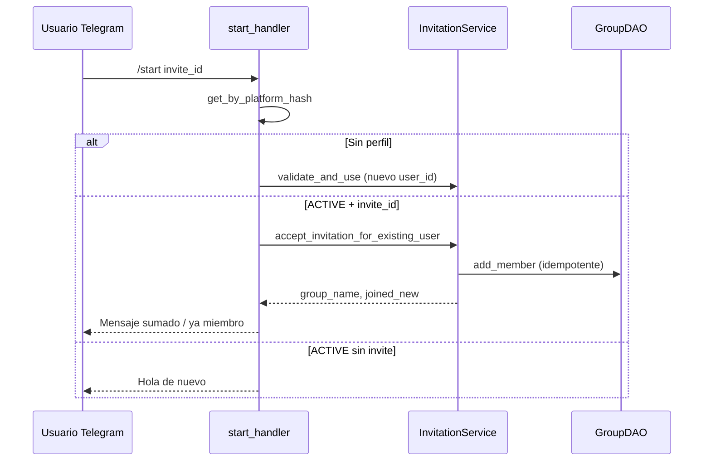

# SPEC-2026-029 — Invitaciones avanzadas, grupos en nombre de terceros y miembros existentes

| Campo | Valor |
|-------|--------|
| **Tipo** | Feature — invitaciones + grupos |
| **Sprint** | Post SPEC-026 / SPEC-020 |
| **Estado** | **Implementado** en repo — pendiente deploy Lambda Telegram |
| **Depende de** | SPEC-020 (invitaciones), SPEC-026 (grupos), SPEC-018 (auth) |
| **Regresión** | [SPEC-2026-028](SPEC-2026-028-regression-suite-features-implementadas.md) § R-29 |
| **Componentes** | `invitation_service`, `start_handler`, `invitation_commands`, `group_service`, `group_commands`, `invitation_tool`, `group_tool` |

---

## 1. Problema (as-built)

| # | Comportamiento actual | Impacto |
|---|----------------------|---------|
| P1 | Admin `/invitar` sin `group_id` → solo GLOBAL (correcto por defecto) pero **sin UI** para elegir otro grupo | No puede invitar a un grupo concreto sin callback `grp:inv` en menú edición |
| P2 | Usuario **ya registrado** abre deep link `/start <invite_id>` | `start_handler` responde «Ya estás registrado» y **no** agrega al grupo destino |
| P3 | Owner genera link para amigo que **ya tiene cuenta** | El amigo no entra al grupo; parece bug |
| P4 | Admin no puede **crear grupo** con owner distinto (ej. alias `vic`) | Solo el propio usuario completa `/crear-grupo` |
| P5 | Owner no puede **agregar por alias** a usuario ACTIVE existente | Solo deep link (alta de usuarios nuevos) |

---

## 2. Objetivos

1. **Admin invitar:** destino por defecto **GLOBAL** + selector inline de otro grupo (propios o todos si admin global).
2. **Invitación deep link:** usuarios **nuevos** (flujo actual) **y existentes** (unirse al grupo sin duplicar `USER#`).
3. **Admin crear grupo en nombre de:** alias o `user_id` de un usuario ACTIVE (ej. `vic` → owner del grupo).
4. **Owner (y admin):** agregar miembro existente de la plataforma por **alias** (respetando cupo y permisos).

---

## 3. User stories

| ID | Como | Quiero | Para |
|----|------|--------|------|
| US-29-01 | Admin global | `/invitar` con GLOBAL por defecto y botones para otro grupo | Invitar al torneo general o a un grupo puntual |
| US-29-02 | Usuario ACTIVE existente | Abrir link de invitación | Unirme al grupo sin volver a registrarme |
| US-29-03 | Owner de grupo | Invitar por alias a quien ya usa el bot | Sumar amigos sin depender de Telegram nuevo |
| US-29-04 | Admin global | `crear grupo "Futbol Total" en nombre de vic` | Onboarding de grupos para usuarios que no administran |
| US-29-05 | Invitado existente | Ver mensaje claro si ya soy miembro | No confusión ni error silencioso |

---

## 4. Criterios de aceptación

### 4.1 Admin — `/invitar` con destino GLOBAL + otro grupo (US-29-01)

| AC | Dado | Cuando | Entonces |
|----|------|--------|----------|
| AC-01 | Admin ACTIVE | Envía `/invitar` o `/invitar 3` | Respuesta con link a **GLOBAL** y teclado inline: «🌍 General (GLOBAL)», «📋 Elegir otro grupo…», opcional «Cancelar» |
| AC-02 | Admin toca «Elegir otro grupo» | Callback `inv:pick` | Lista paginada de grupos (admin: todos ACTIVE; máx 10 + «Más») |
| AC-03 | Admin elige grupo G | Callback `inv:grp:<gid>:<max_uses>` | `create_invitation(..., group_id=G, max_uses=N)` + mensaje con link |
| AC-04 | Admin toca GLOBAL explícito | Callback `inv:grp:GLOBAL:<n>` | Mismo que hoy sin `group_id` explícito |
| AC-05 | No admin | `/invitar` | Destino = grupo propio (owner); si no tiene grupo → mensaje «Creá un grupo con /crear-grupo» |

**Compatibilidad:** `/invitar 5` sin teclado puede seguir creando invitación inmediata al destino por defecto (GLOBAL admin / grupo propio owner) **o** mostrar teclado post-creación con opción «Crear otra para otro grupo» — decisión implementación: **teclado primero** si admin y `max_uses` en comando; link directo solo con flag `--rapido` o segundo mensaje.

**Recomendación MVP:** Tras parsear `max_uses`, admin siempre ve teclado destino (GLOBAL preseleccionado como primer botón que confirma en un tap).

### 4.2 Usuario existente — deep link (US-29-02, US-29-05)

| AC | Dado | Cuando | Entonces |
|----|------|--------|----------|
| AC-10 | Usuario ACTIVE, no miembro del grupo destino | `/start <invite_id>` válido | `accept_invitation_for_existing_user(user_id, invite_id)`; mensaje «Te sumamos a \<grupo\>»; **no** `create_telegram_user` |
| AC-11 | Ya miembro del grupo (y GLOBAL si aplica) | `/start <invite_id>` | Mensaje «Ya formás parte de \<grupo\>»; **no** consume cupo de invitación |
| AC-12 | Invitación EXPIRED / REVOKED / EXHAUSTED | `/start <invite_id>` | Mensajes actuales SPEC-020 (sin cambio) |
| AC-13 | Usuario M1_PENDING | `/start <invite_id>` | Prioridad onboarding M1; tras M3 puede reintentar link o comando `/unirme <id>` |
| AC-14 | Cupo grupo lleno | Aceptar invitación | `LIMIT_REACHED_INVITES` mensaje claro |

**Servicio nuevo:**

```python
def accept_invitation_for_existing_user(
    self, user_id: str, invite_id: str, *, consume_slot: bool = True
) -> dict:
    """
    - Valida invitación ACTIVE, no expirada, cupo.
    - add_member(destino); add_member(GLOBAL) si destino != GLOBAL y no era miembro.
    - increment_uses + record_use si consume_slot y no era miembro.
    - Idempotente si ya era miembro (no consume slot).
    """
```

**`start_handler`:** si `existing` y `invite_id` → llamar `accept_invitation_for_existing_user` en lugar de retorno «Ya estás registrado».

### 4.3 Owner — agregar miembro existente por alias (US-29-03)

| AC | Dado | Cuando | Entonces |
|----|------|--------|----------|
| AC-20 | Owner ACTIVE, grupo con cupo | `/agregar-miembro vic` o menú «➕ Agregar por alias» | Busca alias único (case-insensitive); `add_member`; confirma «\<alias\> sumado a \<grupo\>» |
| AC-21 | Alias inexistente / ambiguo | Comando | Error + sugerencias (máx 3 coincidencias parciales) |
| AC-22 | Target ya miembro | Comando | «Ya está en el grupo» |
| AC-23 | No owner ni admin | Comando | Permiso denegado |
| AC-24 | Admin global | `/agregar-miembro vic` en contexto | Pide elegir grupo (mismo patrón `inv:pick`) o `/agregar-miembro <gid> vic` |

**Alternativa agente:** `group_tool` action `add_member` con `alias` + `group_id` opcional.

### 4.4 Admin — crear grupo en nombre de (US-29-04)

| AC | Dado | Cuando | Entonces |
|----|------|--------|----------|
| AC-30 | Admin global | `/crear-grupo-para vic` | Flujo: validar alias `vic` → ACTIVE → sin grupo propio (o política: permitir si admin confirma reemplazo) → nombre → avatar → `create_group(owner_id=vic_user_id)` |
| AC-31 | Alias no encontrado | Comando | «No encontré usuario con alias vic» |
| AC-32 | Usuario inactivo | Comando | Mensaje INACTIVE |
| AC-33 | Tras crear | Respuesta | Notifica admin con link invitación; opcional mensaje proactivo a `vic` si `tg_chat_id` conocido |
| AC-34 | Límite FREE del target | Ya tiene grupo | Admin puede forzar (flag) o pedir confirmación «Reemplazar grupo existente» — **MVP:** rechazar con mensaje y sugerir editar grupo existente |

**Datos:** `GROUP#/DETAILS.owner_id` = usuario objetivo; `groups_owned=1` en PROFILE del target; admin no es owner salvo que también se agregue como invitador.

**Comando Telegram:**

```
/crear-grupo-para <alias>
/crear_grupo_para <alias>   # alias con guión bajo
```

**Agente (opcional):**

```
crear grupo "Futbol Total" en nombre de vic
→ group_tool action=create_for_user, target_alias=vic, name=...
```

---

## 5. Diseño técnico

### 5.1 Flujo — usuario existente + deep link



### 5.2 Callbacks Telegram (prefijo `inv:`)

| callback_data | Acción |
|---------------|--------|
| `inv:grp:GLOBAL:3` | Crear invitación GLOBAL, 3 usos |
| `inv:grp:<uuid>:1` | Crear invitación grupo uuid |
| `inv:pick` | Lista grupos (admin / owner) |
| `inv:cancel` | Cancelar flujo |

No colisionar con `grp:` (grupos SPEC-026) ni `onb:` / `trv:`.

### 5.3 DynamoDB

| Entidad | Cambio |
|---------|--------|
| `INVITE_USE#` | Registrar uso con `user_id` existente (ya soportado) |
| `USER#` | Sin duplicado; solo membresías nuevas |
| `GROUP#` | `member_count` vía `add_member` existente |
| Auditoría (opcional P2) | `GROUP#/AUDIT#<ts>` admin creó grupo para alias X |

### 5.4 Auth / permisos

| Acción | Quién |
|--------|-------|
| Invitar a GLOBAL por defecto | `is_admin_global` |
| Invitar a grupo G | Owner de G o admin global |
| Crear grupo para alias | Solo `is_admin_global` |
| Agregar miembro por alias | Owner de G o admin global |
| Aceptar invitación | Cualquier ACTIVE (o M1 tras completar) |

### 5.5 Mensajes UX (español)

```
✅ Te sumamos a "Los Pibes". Usá /grupos para ver tus grupos.
ℹ️ Ya formás parte de "Mundial 2026 — General".
❌ El grupo ya no tiene cupo. Pedile al admin que amplíe el límite.
```

---

## 6. Tareas de implementación

| Task | Archivo | Prioridad |
|------|---------|-----------|
| T-01 | `InvitationService.accept_invitation_for_existing_user` | P0 |
| T-02 | `start_handler` rama existente + invite_id | P0 |
| T-03 | `invitation_commands` + `invitation_telegram_ui.py` teclado admin | P0 |
| T-04 | `handler.py` callbacks `inv:` | P0 |
| T-05 | `GroupService.add_member_by_alias` | P0 |
| T-06 | Comando `/agregar-miembro` + menú editar grupo | P1 |
| T-07 | `GroupService.create_group_for_user` (admin) | P0 |
| T-08 | `/crear-grupo-para` en `group_commands.py` | P0 |
| T-09 | `agent/tools/invitation_tool.py` + `group_tool.py` | P2 |
| T-10 | Tests: des-skip `tests/unit/test_invitations/test_spec029_*.py` | P0 |

---

## 7. Tests automatizados (contrato)

Archivo: `tests/unit/test_invitations/test_spec029_invitations_groups.py`

| Test | AC | Estado inicial |
|------|-----|----------------|
| `test_admin_invitar_without_group_id_targets_global` | AC-04 | ✅ (ya en test_invitation_service) |
| `test_existing_user_accept_invite_joins_group` | AC-10 | ⏸ skip SPEC-029 |
| `test_existing_user_already_member_idempotent` | AC-11 | ⏸ skip |
| `test_start_handler_existing_with_invite_calls_accept` | AC-10 | ⏸ skip |
| `test_add_member_by_alias_owner` | AC-20 | ⏸ skip |
| `test_admin_create_group_for_alias` | AC-30 | ⏸ skip |
| `test_create_group_for_user_rejects_second_group_free` | AC-34 | ⏸ skip |

Ejecutar con regresión:

```bash
py -m pytest tests/unit/test_invitations/test_spec029_invitations_groups.py -q --no-cov
```

---

## 8. Regresión manual (SPEC-028 § R-29)

Ver matriz añadida en `SPEC-2026-028-regression-suite-features-implementadas.md`.

---

## 9. Fuera de alcance (esta spec)

- Invitar por `platform_id` / teléfono sin alias.
- Transferir ownership de grupo entre usuarios.
- Invitaciones con TTL distinto de 24 h.
- Aurora: sync de membresías vía stream existente (sin cambio de contrato).

---

## 10. Referencias

| Doc | Uso |
|-----|-----|
| `.cursor/rules/10-invitations.mdc` | SPEC-020 base |
| `.cursor/rules/16-grupos.mdc` | Grupos MVP |
| `infrastructure/lambdas/telegram_webhook/start_handler.py` | Bug P2 actual líneas 43–56 |
| `src/services/invitation_service.py` | `validate_and_use` solo nuevos |

**Versión:** 2026-05-18 — borrador inicial.
