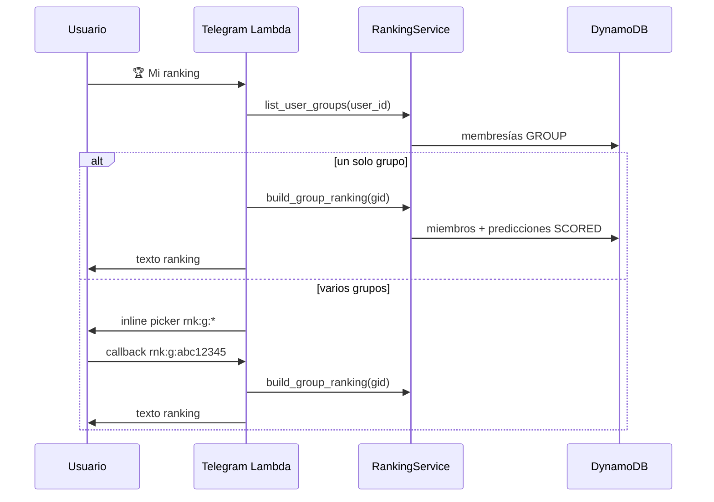

# SPEC-2026-042 — Mi Ranking (Telegram): selector de grupo + tabla de posiciones

| Campo | Valor |
|-------|--------|
| **Tipo** | Feature — UX Telegram + lectura de ranking |
| **Sprint** | Post SPEC-021 (predicciones) / paralelo a FEATURE-007 |
| **Estado** | **Especificado** — pendiente implementación |
| **Depende de** | SPEC-021 (predicciones por grupo), SPEC-026 (grupos), SPEC-013 (scoring), sync Dynamo→Aurora |
| **Reemplaza** | Atajo `/mi_puntuacion` y botón «📊 Mi puntaje» |
| **Regresión** | [SPEC-2026-028](SPEC-2026-028-regression-suite-features-implementadas.md) — actualizar R-18 / plan manual §7A |
| **Componentes** | `telegram_keyboards`, `bot_commands`, `shortcut_commands`, nuevo `ranking_commands` o `ranking_service`, `ranking_repo` (Aurora), `scoring_service` (hook opcional) |

---

## 1. Problema (as-built)

| # | Comportamiento actual | Impacto |
|---|----------------------|---------|
| P1 | Botón **«📊 Mi puntaje»** y `/mi_puntuacion` muestran totales del **perfil** (partidos + trivia) | No responde «¿cómo voy en *mi grupo*?» |
| P2 | Mensaje incluye «Ranking detallado del grupo: próximamente en /grupos» | Expectativa incumplida |
| P3 | `v_group_ranking` en Aurora ordena por `users.total_points` **global** | En un grupo privado, el orden no refleja solo predicciones de ese grupo si el usuario compite en varios |
| P4 | `predictions` en Aurora **no tiene** `group_id`; el espejo Dynamo sí (`PRED#<match>#GROUP#<gid>`) | JOIN relacional por grupo incompleto |
| P5 | `ranking_repo.get_group_ranking` está **sin implementar** (`NotImplementedError`) | Agente y Lambda no leen Aurora aún |
| P6 | Tras scoring post-partido no hay flujo Telegram de «ranking actualizado» | El usuario debe reentrar manualmente (aceptable en MVP si la lectura es en tiempo real) |

---

## 2. Objetivos

1. **Reemplazar** el atajo «Mi puntaje» por **«Mi ranking»** (teclado fijo, menú `/`, comando `/mi_ranking`).
2. Al activarlo, **listar todos los grupos** en los que el usuario es miembro (excluir `GLOBAL` del selector salvo producto futuro).
3. Al elegir un grupo, mostrar **ranking descendente**: posición, **alias** del participante, **puntos del torneo en ese grupo**.
4. Los puntos deben **reflejar el scoring** tras cada partido finalizado (misma fuente que `points_earned` + política de trivia definida abajo).
5. Mantener `/mi_puntuacion` como **alias deprecado** (redirige a Mi ranking o muestra un mensaje de migración) durante una versión.

---

## 3. User stories

| ID | Como | Quiero | Para |
|----|------|--------|------|
| US-42-01 | Jugador | Tocar «🏆 Mi ranking» | Ver en qué lugar estoy respecto a mis amigos |
| US-42-02 | Jugador en 2+ grupos | Elegir el grupo en una lista | Compararme en el contexto correcto |
| US-42-03 | Jugador | Ver alias y puntos de todos los miembros ordenados | Saber quién lidera sin abrir el agente |
| US-42-04 | Jugador | Que el ranking cambie después de cada partido puntuado | Ver el impacto de mis aciertos al día siguiente o al reabrir |
| US-42-05 | Usuario sin grupos privados | Tocar Mi ranking | Mensaje claro (mismo criterio que predecir: necesitás un grupo no global) |

---

## 4. Criterios de aceptación

### 4.1 UI — teclado y menú (US-42-01)

| AC | Dado | Cuando | Entonces |
|----|------|--------|----------|
| AC-01 | Usuario en chat con el bot | Ve el teclado fijo | El botón dice **«🏆 Mi ranking»** (ya no «📊 Mi puntaje») |
| AC-02 | Menú `/` (setMyCommands v6+) | Lista comandos | Aparece `mi_ranking` con descripción «Ranking por grupo»; **no** aparece `mi_puntuacion` |
| AC-03 | Usuario envía `/mi_puntuacion` | Handler de atajos | Redirige al flujo Mi ranking **o** responde «Usá /mi_ranking o el botón 🏆 Mi ranking» y ejecuta el mismo flujo |
| AC-04 | Texto del botón | `normalize_reply_button` | `"🏆 mi ranking"` → `/mi_ranking` |

### 4.2 Selector de grupos (US-42-02, US-42-05)

| AC | Dado | Cuando | Entonces |
|----|------|--------|----------|
| AC-10 | Usuario ACTIVE, miembro de ≥1 grupo no global | `/mi_ranking` o botón | Mensaje «Elegí el grupo:» + teclado **inline** con un botón por grupo (`nombre`, truncado 64 chars) |
| AC-11 | Usuario miembro de un solo grupo privado | Mi ranking | Se puede **omitir** el picker y mostrar directamente el ranking de ese grupo (optimización UX) |
| AC-12 | Usuario solo en GLOBAL o sin membresía privada | Mi ranking | Mismo mensaje que `PredictionService.no_group_message()` / «Necesitás unirte a un grupo…» |
| AC-13 | Grupo `DELETED` o inactivo | Lista | No aparece en el selector |
| AC-14 | Callback `rnk:g:<grp8>` | Tap en grupo | Muestra ranking de ese `group_id` (resolver `grp8` como en predicciones) |

### 4.3 Tabla de ranking (US-42-03)

| AC | Dado | Cuando | Entonces |
|----|------|--------|----------|
| AC-20 | Grupo G con N miembros | Tras elegir G | Mensaje con encabezado `🏆 Ranking — <nombre grupo>` y líneas ordenadas **desc** por puntos |
| AC-21 | Cada fila | Render | `#{pos} <alias> — <pts> pts` (ej. `#1 toti — 47 pts`) |
| AC-22 | Usuario solicitante en la lista | Vista | Su fila marcada con emoji destacado (ej. `👉 #3 vos — 12 pts`) o negrita si el cliente lo permite (texto plano: prefijo `👉`) |
| AC-23 | Empate en puntos | Orden | Desempate estable: `joined_at` ascendente (quien entró antes, mejor posición) o `alias` alfabético — **elegir uno y documentar** |
| AC-24 | Miembro sin puntos | Fila | `0 pts` (no ocultar miembro) |
| AC-25 | Grupo con >30 miembros | Lista | Paginación inline `rnk:pg:<page>:<grp8>` o truncar a top 25 + «… y X más» — **MVP: top 25 + posición propia si está fuera del top** |

### 4.4 Actualización post-scoring (US-42-04)

| AC | Dado | Cuando | Entonces |
|----|------|--------|----------|
| AC-30 | Partido finalizado y scoring OK | `ScoringService.process_finish_match` terminó | Cada predicción del partido tiene `points_earned` y `status=SCORED` en Dynamo |
| AC-31 | Usuario abre Mi ranking del grupo G | Después del scoring | La suma de puntos por miembro incluye los puntos del partido recién puntuado |
| AC-32 | Latencia | Lectura inmediata post-scoring | **Fuente MVP: DynamoDB** (agregación en Lambda); Aurora puede ir **≤30 s** detrás por sync |
| AC-33 | (Opcional P2) | Tras scoring | Notificación Telegram «📊 Se actualizó el ranking de \<grupo\>» con botón «Ver ranking» — **fuera de MVP** salvo esfuerzo bajo |

---

## 5. Regla de puntos por grupo (decisión de producto)

### 5.1 Definición oficial para esta feature

**Puntos de ranking de grupo** = suma de:

| Fuente | Incluida | Notas |
|--------|----------|--------|
| `points_earned` de predicciones `SCORED` con `group_id = G` | **Sí** | Marcador + extendidas ya incluidas en `points_earned` |
| Trivia | **No** en MVP | Trivia suma a perfil global; evitar doble contabilidad hasta SPEC de trivia por grupo |
| Puntos «globales» del perfil `users.total_points` | **No** para ordenar grupo G | Solo para vista global futura `/ranking` |

### 5.2 Implicación en datos

Hoy `UserDAO.add_match_points` incrementa **perfil global**. Para ranking por grupo **correcto**, la lectura debe agregar desde **predicciones por `group_id`**, no desde `profile.total_points`.

**No requiere** cambiar el scoring en MVP si la agregación lee `points_earned` por grupo.

### 5.3 Vista Aurora (fase 2)

Migración Alembic (solo CI/CD):

```sql
ALTER TABLE predictions ADD COLUMN group_id UUID REFERENCES groups(id);
CREATE INDEX idx_predictions_group ON predictions (group_id);

CREATE OR REPLACE VIEW v_group_ranking AS
SELECT
    p.group_id,
    g.name AS group_name,
    u.id AS user_id,
    u.alias,
    COALESCE(SUM(p.points_earned) FILTER (WHERE p.status = 'SCORED'), 0) AS total_points,
    RANK() OVER (
        PARTITION BY p.group_id
        ORDER BY COALESCE(SUM(p.points_earned) FILTER (WHERE p.status = 'SCORED'), 0) DESC,
                 MIN(gm.joined_at) ASC
    ) AS position
FROM group_members gm
JOIN groups g ON g.id = gm.group_id
JOIN users u ON u.id = gm.user_id
LEFT JOIN predictions p ON p.user_id = u.id AND p.group_id = gm.group_id
WHERE g.active = TRUE
GROUP BY p.group_id, g.name, u.id, u.alias, gm.group_id;
```

Sync: extender `sync_dynamo_to_aurora` en upsert de predicciones para persistir `group_id` desde el ítem Dynamo.

---

## 6. Diseño técnico — Telegram

### 6.1 Archivos a modificar

| Archivo | Cambio |
|---------|--------|
| `infrastructure/lambdas/telegram_webhook/telegram_keyboards.py` | Botón «🏆 Mi ranking» → `/mi_ranking` |
| `infrastructure/lambdas/telegram_webhook/bot_commands.py` | `mi_ranking` en `MENU_COMMANDS`; actualizar `HELP_USER` |
| `infrastructure/lambdas/telegram_webhook/shortcut_commands.py` | Reemplazar `format_mi_puntuacion` por flujo ranking; deprecar `/mi_puntuacion` |
| `infrastructure/lambdas/telegram_webhook/handler.py` | Rama `rnk:*` en callbacks (junto a `prd:`, `grp:`) |
| **Nuevo** `ranking_telegram_ui.py` | `group_picker_keyboard`, `format_ranking_message` |
| **Nuevo** `src/services/ranking_service.py` | `list_user_groups_for_ranking`, `build_group_ranking` (Dynamo) |

### 6.2 Flujo de mensajes



### 6.3 Callbacks

| Callback | Acción |
|----------|--------|
| `rnk:g:<grp8>` | Mostrar ranking del grupo |
| `rnk:pg:<n>:<grp8>` | (Opcional) página N del ranking |
| `rnk:back` | Volver al picker de grupos |

Prefijo `rnk:` para no colisionar con `prd:`, `grp:`, `inv:`.

### 6.4 Ejemplo de mensaje

```
🏆 Ranking — Scaloneta

#1 Ana — 23 pts
#2 Luis — 19 pts
👉 #3 vos — 12 pts
#4 Pedro — 8 pts

Actualizado tras cada partido puntuado.
```

---

## 7. Implementación MVP (Dynamo, sin Aurora)

```python
# src/services/ranking_service.py (borrador)

def build_group_ranking(self, group_id: str, *, viewer_user_id: str) -> str:
    members = self._groups.list_member_user_ids(group_id)
    rows: list[tuple[str, str, int]] = []  # user_id, alias, points
    for uid in members:
        profile = self._users.get_profile(uid) or {}
        alias = profile.get("alias") or uid[:8]
        pts = self._sum_scored_points(uid, group_id)
        rows.append((uid, alias, pts))
    rows.sort(key=lambda r: (-r[2], r[1].lower()))
    # formatear líneas + marcar viewer
```

```python
def _sum_scored_points(self, user_id: str, group_id: str) -> int:
    preds = self._preds.list_user_predictions_for_group(user_id, group_id, statuses=("SCORED",))
    return sum(int(p.get("points_earned") or 0) for p in preds)
```

Si no existe `list_user_predictions_for_group`, añadir en `PredictionDAO` (query por PK `USER#` + filter `group_id` + `status`).

**Performance:** grupos ≤50 miembros × scan predicciones por usuario es aceptable en Lambda (<100 ms en dev).

---

## 8. Integración con scoring

| Evento | Responsable | Efecto en ranking |
|--------|-------------|-------------------|
| `MATCH_SCORING` / `process_finish_match` | `scoring_service` | `prediction_dao.mark_scored` → `points_earned` |
| Lectura Mi ranking | `ranking_service` | Lee `points_earned` agregados — **sin job extra** |
| Sync stream | `sync_dynamo_to_aurora` | Aurora al día para agente `ranking_tool` (fase 2) |
| Job 3:00 UTC | `daily_ranking_job` | Snapshots históricos; **no** bloquea Mi ranking en tiempo real |

**Idempotencia:** si `mark_scored` no corre dos veces, el ranking no duplica puntos.

---

## 9. Fuera de alcance (MVP)

- Ranking **GLOBAL** desde este botón (solo grupos privados).
- Push automático de ranking post-partido (AC-33 opcional).
- WebSocket tiempo real (FEATURE-007 completo).
- Gráficos, historial «cómo subí/bajé» (US-024 delta).
- Agente `@tool ranking_tool` — puede reutilizar `RankingService` en tarea aparte.

---

## 10. Plan de tareas

| ID | Tarea | Est. |
|----|--------|------|
| T-42-01 | `PredictionDAO.list_scored_points_by_group(group_id)` o equivalente | 2h |
| T-42-02 | `RankingService` + tests unitarios orden/empates/0 pts | 3h |
| T-42-03 | `ranking_telegram_ui` + `ranking_callbacks` + handler | 3h |
| T-42-04 | Reemplazo teclado / menú / help / deprecación `mi_puntuacion` | 1h |
| T-42-05 | Tests Telegram (`test_telegram_keyboards`, `test_ranking_commands`) | 2h |
| T-42-06 | (Fase 2) `group_id` en Aurora + sync + `ranking_repo` async | 5h |

---

## 11. Pruebas manuales (checklist)

1. Usuario en grupo «Scaloneta» con 2 miembros y predicciones puntuadas → Mi ranking muestra orden correcto.
2. Usuario en 2 grupos → picker → cada grupo muestra ranking distinto.
3. Tras sandbox/scoring de un partido → reabrir Mi ranking → puntos incrementados.
4. Usuario sin grupo privado → mensaje de error amigable.
5. `/mi_puntuacion` legacy → redirección o mensaje de migración.
6. Menú `/` sin `mi_puntuacion`; con `mi_ranking`.

---

## 12. Referencias

- Steering: lectura ranking grupo → Aurora `v_group_ranking` (ajustar vista según §5.3).
- `infrastructure/lambdas/telegram_webhook/shortcut_commands.py` — `format_mi_puntuacion` actual.
- `src/services/scoring_service.py` — `process_finish_match`, `mark_scored`.
- FEATURE-007 — `agent/tools/ranking_tool.py`, `ranking_repo.py`.

---

## 13. Versión de comandos

Incrementar `BOT_COMMANDS_VERSION` a **6** al desplegar (reemplazo `mi_puntuacion` → `mi_ranking` en menú global).
