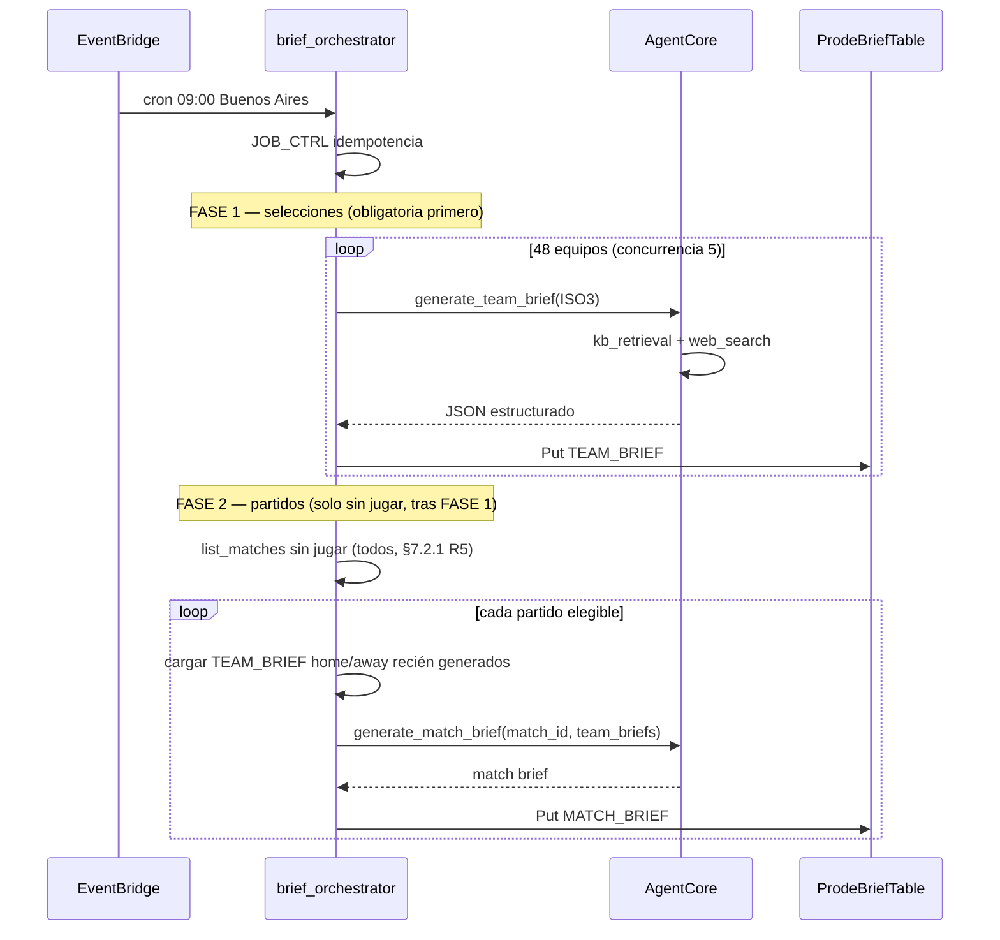

# SPEC-2026-045 — Briefs diarios de selecciones y partidos (IA + DynamoDB TTL)

| Campo | Valor |
|-------|--------|
| **SPEC-ID** | SPEC-2026-045 |
| **Estado** | **Especificado** — pendiente implementación |
| **Sprint** | Sprint 3–4 (IA operativa + predicciones) |
| **Depende de** | AgentCore + `kb_retrieval_tool` / `web_search_tool`, fixture (`MATCH#`), SPEC-021 (wizard predicción) |
| **Disparador único** | EventBridge **diario 09:00 Buenos Aires** — **sin** jobs post-partido ni hooks en scoring |
| **Referencia editorial** | `knowledge-base/equipos-2026/informe_48_selecciones_mundial_2026_actualizado.md` |
| **Partido ancla sandbox** | MEX vs RSA (`7ec4c6ec-f11b-5a24-8fd8-7ba47082508b`) |

---

## 1. Problema

Hoy el usuario abre la predicción de un partido sin contexto táctico ni de plantel generado por el sistema. La KB estática del informe de 48 selecciones no se actualiza sola tras cada fecha, y no hay síntesis «quién llega mejor» antes de predecir.

Se necesita un pipeline **automático diario** que:

1. Regenere un **brief por selección** (48 equipos) con datos KB + web (FIFA como fuente principal).
2. Incorpore **nómina** y **estado médico/disciplinario** por jugador.
3. Incorpore en el run diario novedades (incl. último partido vía web/KB) — **sin** job adicional al terminar un partido.
4. Genere un **brief de partido** derivado de los briefs de ambos equipos — **solo después** de regenerar los briefs de selección involucrados y **solo para partidos sin jugar**.
5. Exponga el brief de partido en la **UI de predicción** como ítem **🤖 IA Prediction**.
6. Los partidos **finalizados** conservan el **último** `MATCH_BRIEF` cargado (sin sobrescritura en jobs posteriores).

Los briefs son **efímeros**: TTL **48 h** en DynamoDB (si falla el job, expiran y la UI deja de mostrarlos hasta el próximo run).

---

## 2. Objetivos

| # | Objetivo |
|---|----------|
| O1 | **Un solo** job diario **09:00 Buenos Aires (GMT-2)** vía **Amazon EventBridge** — nada más |
| O2 | Agente con **`kb_retrieval_tool`** + **`web_search_tool`** como únicas fuentes de generación |
| O3 | Formato de brief de selección alineado al informe KB (6 bloques + nómina + §7 último partido vía noticias del día) |
| O4 | Brief de partido en **entidad separada** (tabla lógica distinta; ver §5) |
| O5 | Integrar **IA Prediction** en el brief al abrir `/partidos` → wizard de predicción |
| O6 | **No** predecir marcador exacto; solo inclinación cualitativa con motivos |
| O7 | **Orden estricto:** primero todos los `TEAM_BRIEF` del run → después `MATCH_BRIEF` de **todos** los partidos **sin jugar** (cada día, sin ventana 72 h); finalizados **congelados** |

---

## 3. Alcance y fuera de alcance

**Incluye**

- Orquestación Lambda + invocación AgentCore (o Bedrock Agent) por lote.
- Tabla DynamoDB dedicada `ProdeBriefTable-{env}` (recomendado; ver §5).
- Lectura en Telegram/Lambda (sin pasar por Aurora).

**No incluye (MVP)**

- **Jobs post-partido**, hooks en `scoring_processor` / `result_collector` ni invocaciones extra al cargar `RESULT`.
- Sincronizar briefs a Aurora (solo DynamoDB operativo).
- Mostrar brief completo de selección en Telegram (solo consumo interno + match brief en predicción).
- OCR de convocatorias PDF.
- Traducción multi-idioma del brief.

---

## 4. Fuentes y herramientas del agente

### 4.1 Orden obligatorio (igual que `agent/main.py`)

1. **`kb_retrieval_tool`** — query: `"{nombre país} selección Mundial 2026 DT táctica plantel {ISO3}"`, `max_results=8` si hace falta nómina amplia.
2. **`web_search_tool`** — complemento y datos posteriores al corte del informe KB.

### 4.2 Web — FIFA como fuente principal

Plantillas de búsqueda (Tavily; priorizar dominio FIFA):

| Propósito | `search_type` | Query ejemplo |
|-----------|---------------|---------------|
| Plantel / convocatoria | `news` | `site:fifa.com {country} squad World Cup 2026` |
| Lesiones / bajas | `news` | `site:fifa.com {country} injury World Cup 2026` |
| Resultado reciente | `result` | `site:fifa.com {ISO3} match result 2026` |
| DT / staff | `general` | `site:fifa.com {country} coach national team 2026` |

Si `site:fifa.com` no devuelve hits útiles → ampliar sin `site:` a: CONMEBOL/UEFA, Reuters, AP, medios locales federación (misma restricción fútbol que `web_search_tool`).

### 4.3 Informe base

- Semilla estructural: `knowledge-base/equipos-2026/informe_48_selecciones_mundial_2026_actualizado.md`.
- El agente **no copia** el archivo entero: usa KB retrieval y **fusiona** con web; marca `source_cutoff_date` del informe cuando no hay dato más nuevo.

### 4.4 Catálogo de equipos

Lista canónica = unión de `GROUP_TEAMS` en `src/fixtures/mundial2026_groups.py` (**48 códigos ISO3**). El scheduler itera esa lista, no inventa equipos.

---

## 5. Almacenamiento DynamoDB

### 5.1 Tabla física recomendada: `ProdeBriefTable-{env}`

Motivo: TTL masivo, volumen de texto largo y separación del single-table operativo (`ProdeTable`). El usuario pide «otra tabla» para el brief de partido; **ambas entidades** viven en `ProdeBriefTable` con prefijos distintos.

| Parámetro | Valor |
|-----------|--------|
| Billing | On-Demand |
| TTL attribute | `ttl_expiry` (epoch seconds) |
| TTL valor | `now + 48h` en cada escritura exitosa |
| PK/SK | Ver abajo |

**Alternativa aceptada:** mismos patrones en `ProdeTable` si se prefiere una sola tabla; no recomendado por tamaño de ítems.

### 5.2 Entidad — Brief de selección

| Campo | Valor |
|-------|--------|
| **PK** | `TEAM_BRIEF#<ISO3>` |
| **SK** | `CURRENT` |
| **GSI opcional** | `GSI-1-brief-date` — PK `BRIEF_DAY#YYYY-MM-DD`, SK `TEAM#<ISO3>` (auditoría / reprocess) |

**Atributos principales**

| Atributo | Tipo | Descripción |
|----------|------|-------------|
| `team_code` | S | ISO3 (ARG, MEX, …) |
| `team_name` | S | Nombre display (español) |
| `generated_at` | S | ISO-8601 UTC |
| `generation_mode` | S | Siempre `DAILY` |
| `brief_markdown` | S | Texto completo (§6.1) |
| `brief_sections` | M | Mapa con las 7 secciones parseadas (opcional, para UI) |
| `roster` | L | Lista de jugadores (§6.2) |
| `recent_record` | S | Ej. `15G-3E-2P` (últimos ~15–20) |
| `kb_chunks_used` | N | Auditoría |
| `web_queries_used` | L | Auditoría (sin PII) |
| `ttl_expiry` | N | now + 172800 |

### 5.3 Entidad — Brief de partido (tabla lógica separada = PK distinto)

| Campo | Valor |
|-------|--------|
| **PK** | `MATCH_BRIEF#<match_uuid>` |
| **SK** | `CURRENT` |

| Atributo | Tipo | Descripción |
|----------|------|-------------|
| `match_id` | S | UUID partido |
| `home_team` / `away_team` | S | ISO3 |
| `kickoff_utc` | S | Copia del fixture |
| `generated_at` | S | ISO-8601 |
| `home_strengths` | L\<S\> | Bullets |
| `home_weaknesses` | L\<S\> | Bullets |
| `away_strengths` | L\<S\> | Bullets |
| `away_weaknesses` | L\<S\> | Bullets |
| `ia_prediction_line` | S | Una línea obligatoria (§6.4) |
| `ia_prediction_rationale` | S | 2–4 oraciones de motivos |
| `brief_markdown` | S | Render completo para Telegram |
| `team_brief_refs` | M | `{home: TEAM_BRIEF#..., away: ...}` + `generated_at` usados |
| `brief_frozen` | BOOL | `true` si el partido ya finalizó — **prohibido** regenerar en jobs |
| `frozen_at` | S? | ISO-8601 cuando pasó a `FINISHED` |
| `match_status_at_generation` | S | Copia de `MATCH#/DETAILS.status` al generar |
| `ttl_expiry` | N? | `now + 172800` en partidos activos; **omitir** si `brief_frozen=true` (persistir histórico) |

### 5.4 Control de jobs

| PK | SK | Uso |
|----|-----|-----|
| `JOB_CTRL#daily_team_brief` | `YYYY-MM-DD` | Idempotencia del run diario |
| `JOB_CTRL#daily_match_brief` | `YYYY-MM-DD` | Idempotencia match briefs del día |

---

## 6. Contenido generado

### 6.1 Brief de selección — plantilla (markdown)

Estructura obligatoria (espejo del informe + extensiones):

```markdown
## {Nombre selección} ({ISO3})
**Generado:** {fecha} · **Modo:** DAILY

**1. Director técnico:** …

**2. Camino al Mundial y estado de llegada:** …

**3. Récord reciente:** Aprox. últimos 15–20: …

**4. Mejores jugadores:** … (figuras actuales, no solo históricos)

**5. Táctica habitual:** …

**6. Presencia en ligas importantes:** …

**7. Último partido y tendencia:** …
   *(Último amistoso/fecha FIFA o partido del Mundial ya jugado — según web/KB del día, o "Sin partido reciente registrado")*

### Nómina y estado
| Jugador | Pos | Club | Estado | Nota |
|---------|-----|------|--------|------|
| … | FW | … | DISPONIBLE | … |
```

**Reglas editoriales**

- Tono informativo, español rioplatense neutro, sin spam emojis.
- Si un dato no está verificado: «sin confirmar» / «aprox.» (como el informe base).
- Máximo **~2.500 caracteres** en `brief_markdown` (truncar en orchestrator si el agente excede).

### 6.2 Nómina — `roster[]`

Cada ítem:

```json
{
  "name": "Lionel Messi",
  "position": "FW",
  "club": "Inter Miami",
  "league": "MLS",
  "status": "DISPONIBLE",
  "status_note": "Entrenamiento completo",
  "source": "fifa.com|kb|web_other"
}
```

**`status` (enum cerrado)**

| Valor | Significado |
|-------|-------------|
| `DISPONIBLE` | Convocable / sin restricción conocida |
| `LESIONADO` | Baja médica o recuperación |
| `SUSPENDIDO` | Sanción disciplinaria (tarjetas, tribunal) |

- Incluir **mínimo 18** y **máximo 26** jugadores si hay datos; si no hay lista oficial, listar **figuras confirmadas** del informe KB + web y marcar `roster_completeness: "PARTIAL"`.
- Lesiones/suspensiones recientes se reflejan en el **run diario** (web/KB), no en un job aparte al finalizar un partido.

### 6.3 Brief de partido — plantilla

```markdown
## Brief — {Home nombre} vs {Away nombre}
**Partido #{n}** · Grupo {X} · {kickoff ARG}

### {Home} — Fortalezas
- …

### {Home} — Debilidades
- …

### {Away} — Fortalezas
- …

### {Away} — Debilidades
- …

### 🤖 IA Prediction
Dado el análisis previo me inclino por **{HOME|AWAY|EMPATE técnico}** como favorito para ganar el partido en los 90 minutos.
{2–4 oraciones de motivos cruzando fortalezas/debilidades y nómina}
```

**Restricciones IA Prediction (AC legales/producto)**

| Permitido | Prohibido |
|-----------|-----------|
| «Me inclino por MEX como ganador» | «MEX gana 2-1» |
| «Favorito en 90 min» | Cuotas, apuestas, % exactos inventados |
| Mencionar bajas clave de la nómina | Afirmar convocatoria oficial FIFA si no está publicada |

`EMPATE técnico` solo si el análisis es equilibrado; nunca como marcador predictivo.

### 6.4 Línea canónica `ia_prediction_line`

Formato fijo para parseo en UI:

```text
Dado el análisis previo me inclino por {TEAM_DISPLAY} como ganador del partido.
```

`TEAM_DISPLAY` = nombre completo desde `team_flags.resolve_team_display_name`.

---

## 7. Scheduler — EventBridge (único disparador)

> **Regla de producto:** todo el pipeline corre **una vez por día a las 09:00 GMT-2 (Buenos Aires)**. No existe pipeline post-partido.

### 7.1 Regla diaria

| Parámetro | Valor |
|-----------|--------|
| Servicio | **EventBridge Rule** (cron; no EventBridge Scheduler one-shot por partido) |
| Hora local | **09:00 Buenos Aires (GMT-2)** |
| Zona IANA (implementación) | `America/Argentina/Buenos_Aires` |
| Expresión cron | `cron(0 9 * * ? *)` |
| `schedule_expression_timezone` | `America/Argentina/Buenos_Aires` |

EventBridge evalúa el cron en la zona indicada → siempre **09:00 hora de Buenos Aires**, sin convertir manualmente a UTC.

| Target | Lambda `prode-daily-brief-orchestrator-{env}` |
| Payload | `{"job":"daily_brief"}` |

Terraform: patrón igual a `aws_cloudwatch_event_rule.result_collector` en `infrastructure/terraform/result_collector.tf`, añadiendo `schedule_expression_timezone`.

Variable: `enable_daily_briefs = true` (dev/prod).

**Prohibido en MVP:** `BriefOrchestrator.enqueue_post_match`, listeners en `scoring_processor`, schedules extra por `match_id`.

### 7.2 Secuencia del job diario (09:00 Buenos Aires)

El run tiene **dos fases secuenciales**. La fase 2 **no arranca** hasta que la fase 1 terminó (éxito o fallo registrado por equipo).



#### 7.2.1 Reglas de orden y elegibilidad del brief de partido

| Regla | Descripción |
|-------|-------------|
| **R1 — Orden** | `MATCH_BRIEF` se genera **solo después** de haber escrito (en el mismo run) los `TEAM_BRIEF` de `home_team` y `away_team`. El agente recibe ambos briefs como contexto de entrada. |
| **R2 — Solo sin jugar** | Regenerar únicamente partidos con `status` **no** finalizado: `SCHEDULED`, `VEDA`, `LIVE` (si aplica). **Excluir** `FINISHED` y cualquier estado con resultado definitivo cargado. |
| **R3 — Partidos finalizados congelados** | Si `status == FINISHED` (o `brief_frozen == true`): **no** `PutItem` / **no** `UpdateItem` del contenido del brief. Se conserva el **último** `MATCH_BRIEF` ya persistido (típicamente el generado antes del partido o el último previo a `FINISHED`). |
| **R4 — Congelar en el run diario** | Si en el job de las 09:00 el partido ya está `FINISHED` y existe `MATCH_BRIEF`: **no** regenerar contenido; si aún no tiene `brief_frozen`, ejecutar `freeze_match_brief` (`brief_frozen=true`, `frozen_at=now`, quitar `ttl_expiry`). Si está `FINISHED` y **nunca** hubo brief, **no** crear uno. |
| **R5 — Todos los días, todos los partidos sin jugar** | Cada mañana se regenera el `MATCH_BRIEF` de **cada** partido que cumpla **R2** (noticias/lesiones pueden cambiar día a día). |
| **R6 — Kickoff futuro (opcional)** | Excluir solo partidos cuyo `kickoff_utc` ya pasó y no están `FINISHED` (estado intermedio); el criterio principal es **R2** (sin jugar / no congelado). |

**Elegibilidad fase 2 (job diario):** cumplen **R2 + R5** (y **R6** si aplica). Los finalizados (**R3**) nunca entran. Un partido de fase de grupos dentro de 2 semanas recibe el mismo refresh diario que uno de mañana.

**Dependencia explícita en código:**

```python
def should_regenerate_match_brief(match: dict) -> bool:
    if match.get("brief_frozen") or (match.get("status") or "").upper() == "FINISHED":
        return False
    if (match.get("status") or "").upper() not in ("SCHEDULED", "VEDA", "LIVE"):
        return False
    return is_unplayed_match(match)  # sin FINISHED, sin brief_frozen
```

---

## 8. Orquestación y agente

### 8.1 Lambda `daily_brief_orchestrator`

- Runtime Python 3.12, timeout **15 min** (48 equipos × ~15s).
- Env: `BRIEF_TABLE`, `AGENTCORE_AGENT_ID` / alias, `DYNAMODB_TABLE` (fixture), `ENABLE_DAILY_BRIEFS`.
- Concurrencia interna: **5** invocaciones paralelas al agente (semáforo).
- Fallo por equipo: log + continuar; no abortar los 47 restantes.
- Al final: métrica CloudWatch `BriefsGenerated`, `BriefsFailed`.

### 8.2 Prompt de sistema (fragmento — `brief_generation`)

Añadir sección en AgentCore o prompt one-shot en orchestrator:

```text
Modo BRIEF_GENERATION (solo cuando job=daily_brief — 09:00 Buenos Aires):
- Generá JSON válido según schema SPEC-2026-045.
- Usá kb_retrieval_tool primero; web_search_tool con site:fifa.com cuando falte nómina o lesiones.
- No inventes jugadores no mencionados en KB/web.
- ia_prediction_line debe respetar formato exacto.
- Prohibido marcador exacto.
```

### 8.3 Schema de respuesta del agente (JSON)

```json
{
  "team_code": "ARG",
  "brief_markdown": "...",
  "brief_sections": { "dt": "...", "path_to_world_cup": "...", ... },
  "roster": [{ "name": "...", "position": "FW", "club": "...", "status": "DISPONIBLE", "status_note": "" }],
  "recent_record": "15G-3E-2P"
}
```

Match brief:

```json
{
  "match_id": "uuid",
  "home_strengths": ["..."],
  "home_weaknesses": ["..."],
  "away_strengths": ["..."],
  "away_weaknesses": ["..."],
  "ia_prediction_line": "Dado el análisis previo me inclino por ...",
  "ia_prediction_rationale": "...",
  "brief_markdown": "..."
}
```

Orchestrator valida JSON (pydantic) antes de `PutItem`.

### 8.4 Servicio de lectura

`src/services/match_brief_service.py`:

```python
get_team_brief(iso3: str) -> dict | None
get_match_brief(match_id: str) -> dict | None  # incluye congelados (sin TTL)
should_regenerate_match_brief(match: dict) -> bool
freeze_match_brief(match_id: str) -> None
format_ia_prediction_for_ui(match_brief: dict) -> str  # bloque Telegram
```

`TeamBriefDao` / `MatchBriefDao` en `src/dao/dynamo/brief_dao.py`.

---

## 9. Integración UI — predicción

### 9.1 Dónde se muestra

| Pantalla | Comportamiento |
|----------|----------------|
| Wizard al elegir partido (`prediction_wizard._header`) | Insertar bloque **después** del encabezado de partido, **antes** del paso de marcador |
| `format_prediction_brief` (predicción ya guardada) | Misma sección si TTL vigente |
| Sin brief / TTL expirado | Omitir sección (no error) |

### 9.2 Formato en Telegram

```text
── Contexto IA ──
🤖 IA Prediction: Dado el análisis previo me inclino por México como ganador del partido.
• Fortalezas MEX: …
• Debilidades MEX: …
• Fortalezas RSA: …
• Debilidades RSA: …
_(Análisis informativo; no es recomendación de apuesta ni marcador exacto.)_
```

Implementación: función `append_match_brief_context(lines, match_id)` llamada desde `_header` y `format_prediction_brief`.

**No** agregar IA Prediction como 7.º ítem Sí/No de la predicción extendida; es **contexto informativo**, no variable puntuada.

### 9.3 Criterios de aceptación UI

| AC | Dado | Cuando | Entonces |
|----|------|--------|----------|
| AC-UI-01 | Existe `MATCH_BRIEF#id` con TTL válido | Usuario abre predicción MEX-RSA | Ve sección «🤖 IA Prediction» |
| AC-UI-02 | TTL expirado | Abre predicción | Wizard normal sin sección IA |
| AC-UI-03 | Brief dice inclinación MEX | Usuario lee | No aparece marcador tipo 2-1 |
| AC-UI-04 | Tras un partido jugado | Hasta el próximo job 09:00 | Brief de selección en UI de predicción sigue el del **último** run diario (sin refresh intra-día) |
| AC-UI-05 | Partido `FINISHED` con brief previo | Usuario abre vista finalizada | Sigue viendo el **último** IA Prediction congelado |
| AC-UI-06 | Partido `FINISHED` | Job diario 09:00 | **No** sobrescribe contenido; solo `freeze` si aplica (R4) |

---

## 10. Criterios de aceptación — pipeline

| AC | Dado | Cuando | Entonces |
|----|------|--------|----------|
| AC-01 | `enable_daily_briefs=true` | 09:00 Buenos Aires | Se intentan 48 `TEAM_BRIEF` |
| AC-02 | Partido sin jugar en el fixture | Mismo run diario, **después** de FASE 1 | `MATCH_BRIEF` creado/actualizado con `team_brief_refs` del mismo run |
| AC-03 | Put en partido activo | — | `ttl_expiry ≈ now+48h` |
| AC-03b | Partido `FINISHED` en run 09:00 | Job diario | `freeze_match_brief` si corresponde (R4); contenido previo intacto |
| AC-04 | Agente genera equipo | — | Usó KB antes que web (auditoría en logs) |
| AC-05 | Web lesiones | — | Query incluye `site:fifa.com` o fallback documentado |
| AC-09 | FASE 1 incompleta (fallo masivo) | Inicio FASE 2 | No generar match brief de equipos cuyo `TEAM_BRIEF` falló en ese run |
| AC-10 | Partido `FINISHED` | Job diario 09:00 | `MATCH_BRIEF` existente sin cambios de texto |
| AC-11 | Resultado cargado a las 15:00 | Mismo día | **No** hay invocación de brief hasta las 09:00 del día siguiente |
| AC-07 | `JOB_CTRL` mismo día | Segundo cron | Segundo run skipped o overwrite atómico (config: `overwrite=true`) |
| AC-08 | Fallo agente en 1 equipo | — | Otros 47 continúan; alarm si `failed > 5` |

---

## 11. Terraform (resumen)

Nuevo archivo `infrastructure/terraform/daily_briefs.tf`:

- `aws_dynamodb_table.prode_brief` con TTL `ttl_expiry`
- `aws_lambda_function.daily_brief_orchestrator` + IAM (DynamoDB brief + read matches + `bedrock:InvokeAgent` / AgentCore)
- `aws_cloudwatch_event_rule.daily_brief` — `cron(0 9 * * ? *)` + `schedule_expression_timezone = "America/Argentina/Buenos_Aires"`
- `aws_lambda_permission` EventBridge
- Outputs: nombre tabla, ARN lambda

**No** añadir permisos ni env vars de brief en `scoring_processor` / `result_collector`.

---

## 12. Plan de tareas

| ID | Tarea | Est. |
|----|--------|------|
| T-45-01 | `ProdeBriefTable` + DAOs | 3h |
| T-45-02 | `BriefOrchestrator` + prompts JSON | 6h |
| T-45-03 | Lambda + EventBridge 09:00 Buenos Aires | 3h |
| T-45-05 | `match_brief_service` + UI predicción | 4h |
| T-45-06 | Tests unit (dao, format, idempotencia JOB_CTRL) + dry-run script | 4h |

Script dev: `scripts/run_daily_briefs.py --env dev --team MEX --match <uuid> --force`.

---

## 13. Pruebas manuales

1. `run_daily_briefs --team ARG --force` → ítem en Dynamo con TTL ~48h y 7 secciones.
2. Verificar roster con al menos un `LESIONADO` o `SUSPENDIDO` en equipo con noticias recientes (web mock en test).
3. Generar match brief MEX-RSA → abrir wizard → aparece IA Prediction.
4. Simular TTL vencido → sección ausente.
5. Cargar resultado a mitad del día → verificar que **no** se invoca orchestrator hasta las 09:00 siguientes.
6. Partido `FINISHED` con brief previo → job 09:00 no cambia texto; aplica `freeze` si falta.

---

## 14. Riesgos y mitigaciones

| Riesgo | Mitigación |
|--------|------------|
| Costo Bedrock (48+ invocaciones/día) | Concurrencia 5, prompt compacto, cache web existente |
| Alucinación de plantel | JSON schema + mínimo source tag; partial roster |
| Latencia > 15 min | Escalar a Step Functions en v2 |
| FIFA sin datos Tavily | Fallback federaciones; no bloquear job |
| Muchos partidos sin jugar × 1 run/día | Job diario secuencial o concurrencia baja (p. ej. 3); alarm si duración > 14 min |
| TTL 48h en ítem activo | El cron **diario** renueva `ttl_expiry` al regenerar; partido lejano sigue con brief fresco cada mañana |
| Brief finalizado borrado por TTL | Al congelar, quitar `ttl_expiry` (R4) |
| Match brief sin team brief del run | FASE 2 skip si falta `TEAM_BRIEF` fresco de home o away (AC-09) |

---

## 15. Referencias

- Informe base: `knowledge-base/equipos-2026/informe_48_selecciones_mundial_2026_actualizado.md`
- Tools: `agent/tools/kb_retrieval_tool.py`, `agent/tools/web_search_tool.py`
- Predicción: `src/services/prediction_wizard.py`, `src/services/prediction_rules.py`
- Equipos: `src/fixtures/mundial2026_groups.py`
- Cron ejemplo: `infrastructure/terraform/result_collector.tf`
