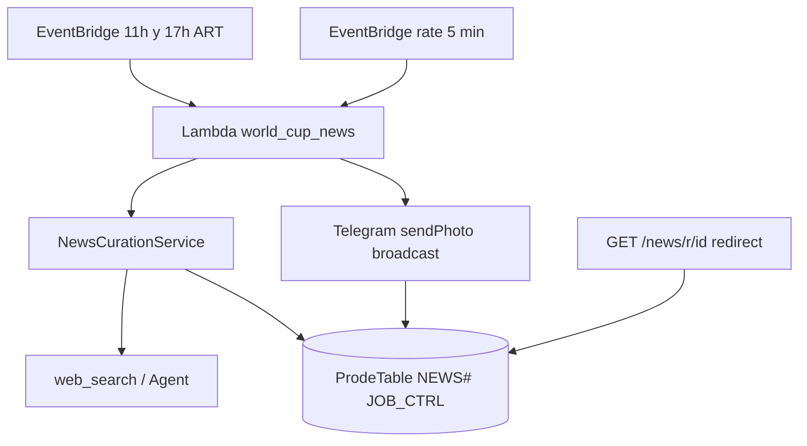

# SPEC-2026-046 — World Cup News (noticias Telegram, estilo Pulso IA)

| Campo | Valor |
|-------|--------|
| **SPEC-ID** | SPEC-2026-046 |
| **Estado** | **Implementado** |
| **Sprint** | Sprint 3–4 |
| **Depende de** | SPEC-011 (Telegram), SPEC-018 (usuarios ACTIVE), grupo `GLOBAL`, fixture `MATCH#`, `web_search_tool` / AgentCore (curación) |
| **Referencia UX** | Canal tipo **Pulso IA** (imagen + titular + resumen + metadatos + hashtags + botones inline) |
| **Zona horaria** | **GMT-3 (Argentina)** — `America/Argentina/Buenos_Aires` |

---

## 1. Problema

Los usuarios no reciben noticias curadas del Mundial fuera de lo que buscan en el agente. Hace falta un **canal proactivo** confiable, con horarios predecibles, sin duplicar historias, y con señales de engagement (like / lectura).

---

## 2. Objetivos

| # | Objetivo |
|---|----------|
| O1 | Enviar **2 noticias por día** en fase **previa** (11:00 y 17:00 ART) desde fuentes confiables |
| O2 | En fase **durante el Mundial**, enviar en **2 ventanas por día de partido**: 2 h antes del primer partido y 1 h después del fin del último |
| O3 | Formato Telegram alineado a la referencia Pulso IA (§6) |
| O4 | **Admin** puede publicar noticias manuales, **distintas** del pipeline automático |
| O5 | Alcance: **todos los usuarios ACTIVE** con Telegram (equivalente al universo del grupo GLOBAL) |
| O6 | Persistencia + **idempotencia** (no repetir noticia ni slot del día) |
| O7 | Callbacks: **like** y **lectura** al abrir el enlace |

---

## 3. Alcance

**Incluye**

- Curación automática (web + reglas) y publicación admin.
- Broadcast `sendPhoto` + caption HTML + teclado inline.
- DynamoDB noticias + engagement + `JOB_CTRL`.
- Redirect HTTP para contabilizar lecturas (API Gateway o Lambda URL).

**No incluye (MVP)**

- Canal Telegram público separado (solo DMs al bot).
- Comentarios / threads.
- Noticias por grupo privado (solo universo global).
- Traducción automática de medios extranjeros.

---

## 4. Audiencia y alcance de envío

| Regla | Detalle |
|-------|---------|
| **Marca** | Pie de mensaje: `🌐 Mundial 2026 — General` (mismo nombre que `GROUP#GLOBAL`) |
| **Destinatarios** | Todos los `USER#/PROFILE` con `status=ACTIVE`, `tg_chat_id` definido y `notifications_enabled != false` |
| **Justificación** | En MVP todo usuario activo se auto-une a GLOBAL; el mensaje es el “noticiero” del torneo general |
| **Exclusiones** | Sin chat Telegram, notificaciones desactivadas, usuarios `SUSPENDED` / no ACTIVE |

Implementación: `UserDAO.list_news_delivery_targets()` (scan MVP; GSI `status=ACTIVE` en v2).

Reutilizar patrón `broadcast_trivia_message` → `broadcast_news_message` con `sendPhoto`.

---

## 5. Fases y horarios

### 5.1 Detección de fase

```python
MUNDIAL_FIRST_KICKOFF = primer kickoff_utc del fixture oficial  # o fecha fija 2026-06-11 ART

def news_phase(now_art: datetime, matches: list) -> Literal["PRE", "LIVE"]:
    if now_art.date() < first_mundial_local_date(matches):
        return "PRE"
    return "LIVE"
```

### 5.2 Fase PREVIA (antes del inicio del Mundial)

| Slot | Hora local (GMT-3 / Buenos Aires) | Noticias |
|------|-------------------------------------|----------|
| `MORNING` | **11:00** | **1** noticia curada |
| `EVENING` | **17:00** (5 PM) | **1** noticia curada |

**Total: 2 noticias/día** (una por slot).

**EventBridge (fase PRE):**

| Regla | Cron (con `schedule_expression_timezone`) |
|-------|---------------------------------------------|
| `wc-news-pre-morning` | `cron(0 11 * * ? *)` |
| `wc-news-pre-evening` | `cron(0 17 * * ? *)` |

Target: Lambda `prode-world-cup-news-{env}` con payload `{"phase":"PRE","slot":"MORNING"|"EVENING"}`.

Si la fecha ya está en fase `LIVE`, el handler hace **SKIPPED** (no envía slots PRE).

### 5.3 Fase DURANTE el Mundial (días con partidos)

Solo en días calendario ART con **al menos un partido** `SCHEDULED` / `VEDA` / `LIVE` / recién `FINISHED` ese día.

| Slot | Hora efectiva | Noticias |
|------|---------------|----------|
| `PRE_MATCHDAY` | **2 h antes** del **primer** `kickoff_utc` del día (convertido a ART) | **1** noticia |
| `POST_MATCHDAY` | **1 h después del fin estimado** del **último** partido del día | **1** noticia |

**Fin estimado del último partido:** `last_kickoff_utc + 110 min` (misma convención que `result_collector` / SPEC-032).  
**Post:** `last_kickoff_utc + 110 min + 60 min`.

**Ejemplo:** primer partido 18:00 ART → noticia PRE a las 16:00; último kickoff 22:00 → fin ~23:50 → POST ~00:50 del día siguiente (cambio de fecha ART: el slot POST usa la **fecha del calendario del último kickoff** para idempotencia).

**Disparador (fase LIVE):**

- Regla EventBridge `rate(5 minutes)` → misma Lambda evalúa `should_publish_pre_matchday()` / `should_publish_post_matchday()` e idempotencia `JOB_CTRL`.
- Alternativa v2: schedules one-shot por día generados a las 00:05 ART.

**Días sin partidos:** no se envían slots PRE/POST (SKIPPED).

---

## 6. Formato del mensaje (referencia Pulso IA)

### 6.1 Envío Telegram

- Método: **`sendPhoto`** (`photo` = URL o `file_id` de imagen OG del artículo; fallback imagen genérica Mundial 2026 en S3).
- `parse_mode`: **HTML** (escapar entidades en título/cuerpo).
- `caption` ≤ 1024 caracteres; si excede, truncar resumen.

### 6.2 Plantilla caption

```html
<b>📰 {emoji} {headline}</b>

{summary_paragraph}

<b>Categoría:</b> {category}
<b>Subcategoría:</b> {subcategory}
<b>Fuente de datos:</b> {source_label}
<b>Relevancia:</b> {relevance_score}/100

{hashtags_line}
```

| Campo | Ejemplo |
|-------|---------|
| `emoji` | 📊 ⚽ 🏆 🌍 (según categoría) |
| `category` | `Mundial 2026` |
| `subcategory` | `#Selecciones` `#Fixture` `#Lesiones` |
| `source_label` | `RSS · fifa.com` o `Web · ole.com.ar` |
| `relevance_score` | 0–100 (curador/agente) |
| `hashtags_line` | `#Mundial2026 #ProdeBot #Noticias` |

Pie opcional en caption: `\n\n🌐 Mundial 2026 — General`

### 6.3 Teclado inline (una fila)

| Botón | Tipo | Acción |
|-------|------|--------|
| `🔗 Leer más` | **url** | URL de tracking → redirect + registro **READ** (§8) |
| `👍 {like_count}` | **callback_data** | `news:like:{news_id}` — idempotente por usuario |

Tras like exitoso: `answerCallbackQuery` + `editMessageReplyMarkup` actualizando contador.

**Prohibido** usar `url` en el botón de like (solo callback).

---

## 7. Fuentes y curación automática

### 7.1 Fuentes permitidas (whitelist)

Priorizar dominios **confiables y especializados**:

| Dominio | Tipo |
|---------|------|
| `fifa.com` / `es.fifa.com` | Oficial |
| `ole.com.ar` | Medio AR fútbol |
| `espn.com.ar` / `espndeportes.espn.com` | Deportes |
| `deportes.lanacion.com.ar` | Deportes |
| `clarin.com/deportes` | Deportes |
| `infobae.com/deportes` | Deportes |
| `conmebol.com` | Confederación |
| `uefa.com` | Contexto selecciones europeas en Mundial |

`web_search_tool` con queries tipo:

```text
site:fifa.com Mundial 2026 {fecha} noticias
site:ole.com.ar selección argentina mundial 2026
```

Agente / servicio `NewsCurationService`:

1. Buscar 5–10 candidatos en whitelist.
2. Descartar URLs ya en `NEWS_DEDUP#`.
3. Elegir **1** artículo por slot (mayor `relevance_score`, diversidad de categoría vs noticia del otro slot del día).
4. Extraer: titular, resumen (3–4 oraciones), imagen OG, URL canónica.

### 7.2 Separación AUTOMATED vs ADMIN

| Origen | `source_type` | Idempotencia |
|--------|---------------|--------------|
| Cron PRE / LIVE | `AUTOMATED` | `JOB_CTRL#WC_NEWS_*` + dedup URL |
| Comando admin | `ADMIN` | **No** usa slots `MORNING`/`PRE_MATCHDAY`; clave propia `news_id` UUID |

Las noticias admin **no cuentan** para el límite de 2/día automáticas y **no** bloquean slots automáticos.

---

## 8. Engagement — likes y lecturas

### 8.1 Like (callback)

| Callback | `news:like:{news_id}` |
|----------|------------------------|
| Efecto | `PutItem` condicional `NEWS_ENG#{news_id}/LIKE#{user_id}` |
| UI | Incrementar `like_count` en `NEWS#/DETAILS`; refrescar botón `👍 N` |
| Idempotencia | Segundo like del mismo usuario → `answerCallbackQuery("Ya diste like")` sin duplicar |

### 8.2 Lectura (link)

Telegram **no** notifica al bot cuando el usuario abre un `url` inline. Patrón obligatorio:

```
https://{API_DOMAIN}/news/r/{news_id}?t={opaque_token}
  → registra READ (user_id desde token HMAC)
  → HTTP 302 a article_url
```

| Entidad | PK | SK |
|---------|----|----|
| Lectura | `NEWS_ENG#{news_id}` | `READ#{user_id}` |

`opaque_token` = HMAC(user_id + news_id + secret) truncado; TTL opcional 7 días en token.

Métricas: `read_count` denormalizado en `NEWS#/DETAILS` (ADD atómico).

### 8.3 Callbacks en `handler.py`

Registrar en `_handle_callback_query` antes de trivia:

```python
if data.startswith("news:"):
    return handle_news_callback(user_id, data)
```

---

## 9. Modelo DynamoDB

Tabla: **`ProdeTable-{env}`** (single-table) o `ProdeNewsTable-{env}` si se quiere aislar volumen.

### 9.1 Noticia publicada

| PK | SK |
|----|-----|
| `NEWS#{news_id}` | `DETAILS` |

| Atributo | Tipo | Descripción |
|----------|------|-------------|
| `news_id` | S | UUID |
| `source_type` | S | `AUTOMATED` \| `ADMIN` |
| `automated_slot` | S? | `PRE:MORNING` \| `PRE:EVENING` \| `LIVE:PRE_MATCHDAY` \| `LIVE:POST_MATCHDAY` |
| `run_date` | S | `YYYY-MM-DD` ART |
| `headline` | S | |
| `summary` | S | |
| `article_url` | S | URL original |
| `url_hash` | S | SHA-256 URL (dedup) |
| `image_url` | S? | OG image |
| `category` / `subcategory` | S | |
| `source_label` | S | |
| `relevance_score` | N | |
| `like_count` / `read_count` | N | |
| `published_at` | S | ISO |
| `published_by` | S | `SYSTEM` o `user_id` admin |
| `telegram_file_id` | S? | Reuso imagen |
| `broadcast_sent` | N | Usuarios notificados |

### 9.2 Dedup (no repetir historia)

| PK | SK |
|----|-----|
| `NEWS_DEDUP#{url_hash}` | `META` |

| Atributo | Descripción |
|----------|-------------|
| `news_id` | Primera publicación |
| `ttl_expiry` | now + **30 días** |

Antes de publicar automático: si existe `NEWS_DEDUP#` → buscar otra URL.

### 9.3 Control de slots (idempotencia automática)

| PK | SK | Cuándo |
|----|-----|--------|
| `JOB_CTRL#WC_NEWS_PRE` | `{YYYY-MM-DD}#MORNING` | Tras envío 11:00 |
| `JOB_CTRL#WC_NEWS_PRE` | `{YYYY-MM-DD}#EVENING` | Tras envío 17:00 |
| `JOB_CTRL#WC_NEWS_LIVE` | `{YYYY-MM-DD}#PRE_MATCHDAY` | Tras envío pre-partido |
| `JOB_CTRL#WC_NEWS_LIVE` | `{YYYY-MM-DD}#POST_MATCHDAY` | Tras envío post-partido |

Si `is_processed` → **SKIPPED** (no segunda noticia en el mismo slot).

### 9.4 Engagement (por usuario)

| PK | SK |
|----|-----|
| `NEWS_ENG#{news_id}` | `LIKE#{user_id}` |
| `NEWS_ENG#{news_id}` | `READ#{user_id}` |

---

## 10. Comandos admin

Solo `is_admin_global(user_id)`.

| Comando | Descripción |
|---------|-------------|
| `/noticia` | Wizard: URL o pegar texto → preview → confirmar → broadcast |
| `/noticia_publicar` | Atajo si el borrador ya está en sesión |
| `/noticias_hoy` | Lista `news_id`, slots, likes/reads (admin) |

**Flujo `/noticia`:**

1. Admin envía URL → fetch OG (título, imagen, descripción) o texto libre.
2. Bot muestra preview estilo §6 + botones `[✅ Publicar]` `[✏️ Editar]` `[Cancelar]`.
3. Al publicar: `source_type=ADMIN`, **sin** `automated_slot`, `PutItem NEWS#`, broadcast a todos los targets.
4. Confirmación al admin con `sent_count`, `news_id`.

**Distinción visual:** prefijo en titular opcional `📌` para admin (configurable).

---

## 11. Arquitectura



| Componente | Ruta sugerida |
|------------|----------------|
| Servicio | `src/services/world_cup_news_service.py` |
| Horarios LIVE | `src/jobs/world_cup_news_schedule.py` |
| DAO | `src/dao/dynamo/news_dao.py` |
| Lambda | `infrastructure/lambdas/world_cup_news/handler.py` |
| Callbacks | `infrastructure/lambdas/telegram_webhook/news_callbacks.py` |
| Admin | `infrastructure/lambdas/telegram_webhook/news_commands.py` |
| Redirect | `infrastructure/lambdas/news_redirect/handler.py` + API GW |
| Terraform | `infrastructure/terraform/world_cup_news.tf` |

---

## 12. Criterios de aceptación

### 12.1 Horarios

| AC | Dado | Cuando | Entonces |
|----|------|--------|----------|
| AC-01 | Fase PRE, día D | 11:00 ART | 1 noticia AUTOMATED; `JOB_CTRL#...#MORNING` |
| AC-02 | Fase PRE, día D | 17:00 ART | 1 noticia AUTOMATED; `JOB_CTRL#...#EVENING` |
| AC-03 | Fase LIVE, 2 partidos día D | 2 h antes del 1.º kickoff | 1 noticia PRE_MATCHDAY |
| AC-04 | Mismo día D | 1 h después del fin del último | 1 noticia POST_MATCHDAY |
| AC-05 | Segundo trigger mismo slot | Mismo día | SKIPPED — no duplica envío |

### 12.2 Audiencia y formato

| AC | Dado | Cuando | Entonces |
|----|------|--------|----------|
| AC-10 | Usuario ACTIVE con `tg_chat_id` | Tras publicación | Recibe `sendPhoto` con caption §6 |
| AC-11 | Usuario sin notificaciones | Publicación | No recibe |
| AC-12 | Mensaje | Usuario abre | Ve botones Leer más + Like |

### 12.3 Admin y dedup

| AC | Dado | Cuando | Entonces |
|----|------|--------|----------|
| AC-20 | Admin | `/noticia` + URL | Preview + publicación `source_type=ADMIN` |
| AC-21 | Misma URL ya publicada | Cron automático | Elige otra historia o SKIPPED con log |
| AC-22 | Noticia admin | Mismo día | No consume slot MORNING/EVENING |

### 12.4 Engagement

| AC | Dado | Cuando | Entonces |
|----|------|--------|----------|
| AC-30 | Usuario | Tap 👍 | `LIKE#user` creado; contador +1 |
| AC-31 | Mismo usuario | Segundo 👍 | Mensaje ya registrado |
| AC-32 | Usuario | Tap Leer más | Redirect registra `READ#`; abre artículo |

---

## 13. Plan de tareas

| ID | Tarea | Est. |
|----|--------|------|
| T-46-01 | `news_dao` + dedup + JOB_CTRL | 4h |
| T-46-02 | `NewsCurationService` + whitelist | 6h |
| T-46-03 | Lambda cron PRE + checker LIVE | 4h |
| T-46-04 | `broadcast_news` + `sendPhoto` | 3h |
| T-46-05 | Redirect lectura + API GW | 3h |
| T-46-06 | Callbacks like + admin `/noticia` | 5h |
| T-46-07 | Tests schedule + idempotencia | 4h |

Script dev: `scripts/run_world_cup_news.py --slot MORNING --force`.

---

## 14. Pruebas manuales

1. Fase PRE forzada → 11:00 una noticia a usuario de prueba.
2. Misma ventana re-ejecutada → SKIPPED.
3. URL duplicada → segunda historia distinta o skip documentado.
4. Admin `/noticia` → todos reciben; no marca JOB_CTRL PRE.
5. Tap like → contador sube; tap link → `read_count` sube en Dynamo.
6. Día con partidos → PRE 2 h antes y POST 1 h después del último (simular kickoffs sandbox).

---

## 15. Referencias

- Broadcast trivia: `infrastructure/lambdas/telegram_webhook/trivia_broadcast.py`
- Horario partido del día: `src/jobs/daily_trivia_schedule.py`
- Grupo GLOBAL: `scripts/seed_global_group.py`, `GLOBAL_GROUP_ID`
- Fin de partido +110 min: SPEC-032, `match_dao.list_matches_estimated_finished`
