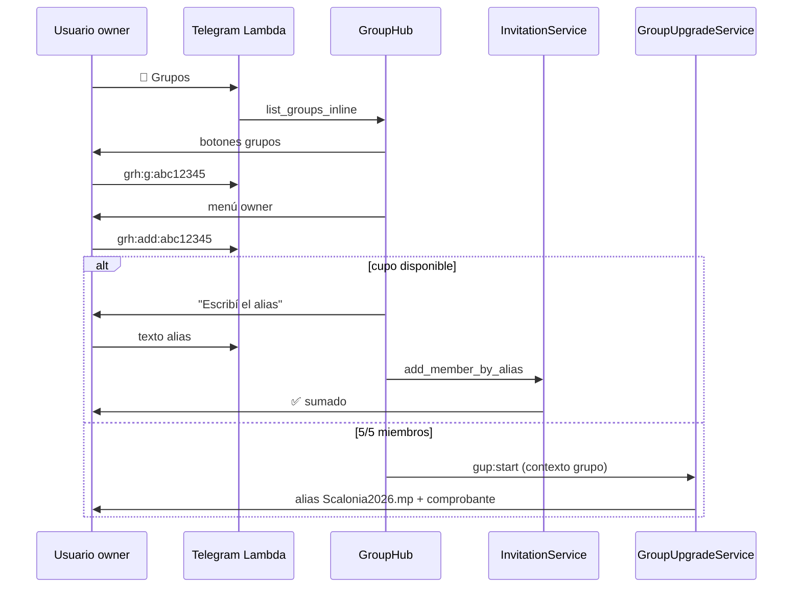

# SPEC-2026-047 — Hub de grupos inline (engagement)

| Campo | Valor |
|-------|--------|
| **Tipo** | Feature — UX Telegram / engagement |
| **Sprint** | Post SPEC-044 (monetización grupos) / SPEC-042 (Mi ranking) |
| **Estado** | **Especificado** — pendiente implementación |
| **Extiende** | [SPEC-2026-044](SPEC-2026-044-ampliacion-grupos-y-cupos.md) — backend de U, pagos y admin |
| **Depende de** | SPEC-026 (grupos), SPEC-029 (invitaciones), SPEC-042 (Mi ranking), SPEC-043 (patrón pago Ask IA), SPEC-044 (cupos/slots) |
| **Reemplaza parcialmente** | Flujo textual de `/grupos`, `/crear-grupo`, `/editar-grupo` como experiencia principal |
| **Regresión** | [SPEC-2026-028](SPEC-2026-028-regression-suite-features-implementadas.md) — sección grupos + invitaciones |
| **Componentes** | `group_hub_commands.py`, `group_hub_telegram_ui.py`, refactor `group_service`, integración `group_upgrade_service`, `ranking_commands`, `handler.py` |

---

## 1. Problema (as-built)

| # | Situación | Comportamiento actual | Impacto |
|---|-----------|----------------------|---------|
| P1 | Usuario toca **👥 Grupos** | Texto plano + lista de comandos (`/crear-grupo`, `/editar-grupo`, `/invitar`) | Baja conversión; poco engagement |
| P2 | Crear / editar grupo | Mezcla texto libre + algunos botones (`grp:av`) | Fricción; usuarios no descubren acciones |
| P3 | Miembro invitado (no owner) | Mismas opciones que el dueño o mensajes confusos | No lleva al ranking ni a la acción relevante |
| P4 | Límite 1 grupo / 5 miembros | Mensaje + botón parcial de ampliación (SPEC-044 MVP) | Falta paridad UX con Ask IA (alias + comprobante inline) |
| P5 | Nombres de grupo duplicados | Validación de longitud/caracteres solamente | Confunde scoring, invitaciones y ranking |
| P6 | Admin otorga cupo/crédito | Comandos existentes sin **notificación push** al usuario | El solicitante no sabe que ya puede actuar |

---

## 2. Objetivos

1. Convertir **👥 Grupos** y `/grupos` en un **hub 100 % inline**: listado de grupos como botones, sin depender de comandos escritos para las acciones frecuentes.
2. Al elegir un grupo, mostrar acciones según **rol** (owner vs invitado).
3. **Owner:** renombrar, agregar jugadores, crear grupo nuevo (si aplica).
4. **Invitado:** redirigir a **Mi ranking** del grupo seleccionado (SPEC-042).
5. Onboarding de **creación** en dos pasos inline: **nombre** (texto) → **avatar** (botones) → validación de **nombre único** entre grupos privados activos del usuario.
6. Ante límites de plan Free (1 grupo propio / 5 miembros), activar flujo de pago **idéntico en espíritu a Ask IA**: alias `Scalonia2026.mp`, comprobante en chat, acreditación automática (reutilizar SPEC-044).
7. Admin: comandos para **+cupos** en grupo o **+crédito de grupo nuevo**; **notificar por Telegram** al usuario beneficiado en ambos casos.

---

## 3. Principio de diseño — engagement first

| Regla | Descripción |
|-------|-------------|
| **R1** | Toda navegación principal usa **InlineKeyboard** (`callback_data`), no ReplyKeyboard salvo atajos globales existentes. |
| **R2** | Los comandos `/crear-grupo`, `/editar-grupo`, `/invitar`, `/ampliar_plan` **siguen activos** como fallback, pero el hub inline es el camino feliz. |
| **R3** | Tras cada acción exitosa, ofrecer botón **«← Volver a mis grupos»** (`grh:home`). |
| **R4** | Prefijo de callbacks: **`grh:`** (group hub) — no colisionar con `grp:`, `gup:`, `rnk:`, `inv:`. |
| **R5** | Mensajes cortos; detalle en una sola pantalla; CTA siempre visible como botón. |

---

## 4. User stories

| ID | Como | Quiero | Para |
|----|------|--------|------|
| US-47-01 | Usuario | Ver mis grupos como botones | Elegir rápido sin leer un muro de texto |
| US-47-02 | Owner | Renombrar mi grupo desde botones | Personalizar sin `/editar-grupo` |
| US-47-03 | Owner | Agregar jugadores desde el hub | Invitar o sumar por alias con flujo guiado |
| US-47-04 | Owner sin grupo / con crédito | Crear un grupo nuevo inline | Empezar a jugar con amigos |
| US-47-05 | Invitado | Al tocar un grupo donde no soy owner | Ir directo al ranking de ese grupo |
| US-47-06 | Owner | Que el nombre de grupo no se repita | Evitar confusiones en ranking e invitaciones |
| US-47-07 | Owner en límite | Pagar ampliación como Ask IA | Sumar grupo o cupos sin salir del chat |
| US-47-08 | Admin | Otorgar cupo o crédito por comando | Resolver soporte manualmente |
| US-47-09 | Usuario beneficiado | Recibir notificación cuando el admin me habilita | Actuar de inmediato sin preguntar |

---

## 5. Flujos de pantalla

### 5.1 Entrada — listado inline

**Disparadores:** botón **👥 Grupos**, `/grupos`, callback `grh:home`.

```
👥 Mis grupos

Elegí un grupo:

[⚽ Scaloneta        owner]
[🏆 Los Pibes       owner]
[🔥 Trabajo         miembro]
[➕ Crear grupo nuevo]        ← solo si can_create_group
[💳 Ampliar plan]             ← si en límite y no puede crear
```

| Botón | Callback | Condición |
|-------|----------|-----------|
| Grupo (owner) | `grh:g:<g8>` | `owner_id == user_id` |
| Grupo (miembro) | `grh:g:<g8>` | miembro, no owner |
| Crear grupo nuevo | `grh:create` | `groups_owned < 1 + extra_owned_group_slots` |
| Ampliar plan | `gup:start` | límite alcanzado (delegar SPEC-044) |

**Nota:** `GLOBAL` no aparece en el hub (solo grupos privados + acciones del usuario).

---

### 5.2 Detalle de grupo — owner

Tras `grh:g:<g8>` cuando el usuario es **owner**:

```
⚽ Scaloneta
👥 4/5 miembros · código ABC123

[✏️ Cambiar nombre]
[➕ Agregar jugadores]
[🔗 Invitar con link]
[👥 Ver miembros]
[← Volver a mis grupos]
```

| Acción | Callback | Comportamiento |
|--------|----------|----------------|
| Cambiar nombre | `grh:ren:<g8>` | Pone `group_hub_step=awaiting_rename`; usuario escribe nombre; validar unicidad |
| Agregar jugadores | `grh:add:<g8>` | Si cupo disponible → flujo alias (existente); si 5/5 → paywall (§5.6) |
| Invitar con link | `grh:inv:<g8>` | Reutiliza `InvitationService.create_invitation` (1 cupo default) |
| Ver miembros | `grh:mem:<g8>` | Lista inline con opción eliminar (owner) |

---

### 5.3 Detalle de grupo — invitado (miembro)

Tras `grh:g:<g8>` cuando el usuario **no** es owner:

```
🔥 Trabajo
Sos miembro de este grupo.

[🏆 Ver mi ranking]
[← Volver a mis grupos]
```

| Acción | Callback | Comportamiento |
|--------|----------|----------------|
| Ver mi ranking | `rnk:g:<g8>` | **Redirige** al flujo SPEC-042 (`show_group_ranking`) sin pantalla intermedia |

No se muestran acciones de administración al invitado.

---

### 5.4 Crear grupo nuevo — onboarding inline

**Disparador:** `grh:create` o botón «➕ Crear grupo nuevo».

```
¡Vamos a crear tu grupo! 🎉

Escribí el nombre (2–50 caracteres, único entre tus grupos):
```

1. Usuario envía **texto** → validar formato + **unicidad** (§5.5).
2. Si OK → mostrar **avatar picker inline** (reutilizar `GROUP_AVATARS`, callbacks `grh:av:<emoji>`).
3. Confirmación:

```
✅ Grupo "Scaloneta" creado

Código: ABC123
Link: https://t.me/...

[🔗 Invitar amigos]
[← Volver a mis grupos]
```

**Estado en PROFILE:**

| Campo | Valor durante wizard |
|-------|----------------------|
| `group_hub_step` | `awaiting_create_name` → `awaiting_create_avatar` |
| `group_hub_draft_name` | nombre propuesto |

Al finalizar: limpiar campos hub; incrementar `groups_owned`.

---

### 5.5 Validación — nombre de grupo único

| AC | Regla |
|----|-------|
| AC-50 | Entre los grupos **privados ACTIVE** cuyo `owner_id == user_id`, el `name` normalizado (trim + lower) debe ser **único**. |
| AC-51 | Renombrar (`grh:ren`) aplica la misma regla excluyendo el grupo actual. |
| AC-52 | Si colisiona: «Ya tenés un grupo llamado "X". Elegí otro nombre.» + permanecer en el paso de nombre. |
| AC-53 | GLOBAL y grupos DELETED no participan en la comparación. |

```python
def is_group_name_unique_for_owner(user_id: str, name: str, *, exclude_group_id: str | None = None) -> bool:
    needle = name.strip().lower()
    for gid in group_dao.list_owned_group_ids(user_id):
        if exclude_group_id and gid == exclude_group_id:
            continue
        g = group_dao.get_group(gid)
        if g and str(g.get("name", "")).strip().lower() == needle:
            return False
    return True
```

**Motivo scoring:** nombres únicos facilitan identificar grupos en ranking, invitaciones, admin y soporte.

---

### 5.6 Paywall — límite de grupo o cupo (paridad Ask IA)

Comportamiento **igual en espíritu** a [SPEC-2026-043](SPEC-2026-043-ask-ia-consultas-libres.md) y backend de [SPEC-2026-044](SPEC-2026-044-ampliacion-grupos-y-cupos.md).

| Escenario | Disparador | Pantalla |
|-----------|------------|----------|
| Ya tiene 1 grupo y quiere otro | `grh:create` bloqueado | Inline: **[💳 Ampliar plan]** → `gup:start` |
| Grupo 5/5 e intenta agregar | `grh:add:<g8>` | Inline: **[💳 Ampliar cupos (+5)]** → `gup:start` con contexto grupo |
| Post-selección en wizard gup | Confirmar cotización | Alias **`Scalonia2026.mp`** + pedir comprobante |
| Comprobante foto/PDF | `group_upgrade_purchase_pending=true` | Acreditar U / aplicar asignación (SPEC-044) |

**Plantilla (inline + texto):**

```
💳 Ampliar tu plan

Necesitás +1 unidad para {grupo nuevo | +5 integrantes en «Scaloneta»}.

Transferí ${total} ARS a:
Scalonia2026.mp

Enviá el comprobante en este chat.

[❌ Cancelar]
```

Tras acreditación exitosa:

```
✅ Pago registrado

{resumen de U aplicadas}

[➕ Agregar jugadores]   o   [➕ Crear otro grupo]
[← Volver a mis grupos]
```

---

## 6. Callbacks `grh:` (referencia)

| Callback | Acción |
|----------|--------|
| `grh:home` | Listado inline de grupos |
| `grh:g:<g8>` | Detalle según rol (owner vs miembro) |
| `grh:create` | Iniciar onboarding creación |
| `grh:av:<emoji>` | Confirmar avatar y crear grupo |
| `grh:ren:<g8>` | Esperar texto → renombrar |
| `grh:add:<g8>` | Flujo agregar jugador por alias o paywall |
| `grh:inv:<g8>` | Generar invitación 1 cupo |
| `grh:mem:<g8>` | Lista miembros inline |
| `grh:rank:<g8>` | Alias interno → delega a `rnk:g:<g8>` (miembros) |

`g8` = primeros 8 caracteres de `group_id` sin guiones (mismo criterio que predicciones/ranking).

---

## 7. Comandos admin y notificaciones

Reutiliza y **extiende** SPEC-044. Tras otorgar, **siempre notificar** al usuario vía Telegram (`tg_chat_id`).

| Comando | Efecto | Notificación al usuario |
|---------|--------|-------------------------|
| `/grupo_otorgar_grupo <alias> [n=1]` | `extra_owned_group_slots += n` | «🎁 Te habilitaron crear {n} grupo(s) más. Tocá 👥 Grupos → Crear grupo nuevo.» |
| `/grupo_otorgar_cupos <alias> <grupo_g8\|nombre> <packs>` | `max_members += packs×5` | «🎁 «{nombre}» ahora admite {new_max} miembros (+{packs×5}). Tocá 👥 Grupos para invitar.» |
| `/grupo_aplicar_u <alias> <N>` | `pending_group_upgrade_units += N` | «🎁 Tenés {N} unidad(es) para asignar. Tocá 💳 Ampliar plan o 👥 Grupos.» |
| `/grupo_ver_cuotas <alias>` | Consulta (sin notificación) | — |

**Implementación notificación:**

```python
def _notify_user(profile: dict, text: str) -> bool:
    chat_id = profile.get("tg_chat_id")
    if chat_id is None or profile.get("notifications_enabled") is False:
        return False
    send_telegram_message(chat_id, text)
    return True
```

Patrón idéntico a `AskIaService._notify_bonus_grant`.

| AC | Dado | Cuando | Entonces |
|----|------|--------|----------|
| AC-60 | Admin ejecuta otorgar | Comando OK | Usuario recibe push en ≤30 s si `tg_chat_id` presente |
| AC-61 | Usuario sin chat_id | Otorgar | Comando admin OK + log warning; mensaje admin indica «sin notificación» |
| AC-62 | No admin | Comando admin | «Solo el administrador…» |

---

## 8. Criterios de aceptación (resumen)

### 8.1 Hub y listado

| AC | Dado | Cuando | Entonces |
|----|------|--------|----------|
| AC-01 | Usuario con ≥1 grupo | `/grupos` | Listado **solo inline**; sin muro de comandos |
| AC-02 | Cada fila | Render | Muestra avatar, nombre, badge `owner` / `miembro` |
| AC-03 | Sin grupos privados | `/grupos` | Solo `[➕ Crear grupo nuevo]` (+ GLOBAL no listado) |
| AC-04 | Owner con cupo de grupo | Hub | Botón «➕ Crear grupo nuevo» visible |

### 8.2 Acciones por rol

| AC | Dado | Cuando | Entonces |
|----|------|--------|----------|
| AC-10 | Owner | Toca su grupo | Menú §5.2 (nombre, agregar, invitar, miembros) |
| AC-11 | Miembro no owner | Toca grupo | Solo «🏆 Ver mi ranking» → ranking SPEC-042 |
| AC-12 | Owner | Renombrar | Nombre único validado; confirmación inline |

### 8.3 Creación

| AC | Dado | Cuando | Entonces |
|----|------|--------|----------|
| AC-20 | Nombre válido y único | Paso 2 | Avatar picker inline `grh:av:*` |
| AC-21 | Nombre duplicado | Envío texto | Error claro; no avanza a avatar |
| AC-22 | Avatar elegido | Callback | Grupo creado; invitación sugerida inline |

### 8.4 Pagos

| AC | Dado | Cuando | Entonces |
|----|------|--------|----------|
| AC-30 | 1 grupo y quiere otro | `grh:create` | Paywall → `gup:start` (SPEC-044) |
| AC-31 | 5/5 miembros | `grh:add` | Paywall cupos → `gup:start` |
| AC-32 | Comprobante OK | Mismo flujo Ask IA | U acreditadas; botones de siguiente acción |

### 8.5 Admin + push

| AC | Dado | Cuando | Entonces |
|----|------|--------|----------|
| AC-40 | Admin otorga cupos | `/grupo_otorgar_cupos` | Usuario notificado con nuevo tope |
| AC-41 | Admin otorga slot | `/grupo_otorgar_grupo` | Usuario notificado; puede crear desde hub |

---

## 9. Modelo de datos

### 9.1 PROFILE — campos hub (nuevos)

| Campo | Tipo | Descripción |
|-------|------|-------------|
| `group_hub_step` | S | `awaiting_create_name`, `awaiting_create_avatar`, `awaiting_rename`, `awaiting_add_alias` |
| `group_hub_draft_name` | S | Borrador nombre creación |
| `group_hub_context_group_id` | S | Grupo activo en flujo add/rename |

Campos SPEC-044 existentes (sin cambio): `extra_owned_group_slots`, `pending_group_upgrade_units`, `group_upgrade_purchase_pending`, `last_group_upgrade_purchase_at`.

### 9.2 GROUP#/DETAILS

Sin cambio de esquema. Validación de nombre único es **lógica de aplicación**.

---

## 10. Archivos a crear / modificar

| Archivo | Cambio |
|---------|--------|
| **Nuevo** `infrastructure/lambdas/telegram_webhook/group_hub_commands.py` | `/grupos`, callbacks `grh:*`, mensajes pendientes |
| **Nuevo** `src/services/group_hub_telegram_ui.py` | Teclados listado, detalle owner/miembro, avatar |
| `infrastructure/lambdas/telegram_webhook/group_commands.py` | Delegar `/grupos` al hub o thin wrapper |
| `src/services/group_service.py` | `is_group_name_unique_for_owner`, helpers listado hub |
| `src/services/group_upgrade_service.py` | Notificaciones post-pago con CTAs inline; notify en admin grant |
| `infrastructure/lambdas/telegram_webhook/handler.py` | Rama `grh:`; pending text `group_hub_step` |
| `infrastructure/lambdas/telegram_webhook/ranking_commands.py` | Reutilizado vía `rnk:g:` desde hub |
| Tests | `test_group_hub_*.py` — rol, unicidad nombre, paywall, redirect ranking |

---

## 11. Diagrama de secuencia (owner — agregar jugador)



---

## 12. Relación con specs previas

| Spec | Relación |
|------|----------|
| **SPEC-044** | Backend monetización (U, precios, `gup:*`, DAO). Esta spec es la **capa UX engagement** encima. |
| **SPEC-043** | Patrón alias + comprobante + cooldown. |
| **SPEC-042** | Redirect miembro → Mi ranking. |
| **SPEC-026** | Entidades grupo/membresía base. |
| **SPEC-029** | Invitaciones y alias existentes reutilizados en «Agregar jugadores». |

---

## 13. Fuera de alcance (MVP)

- Editar avatar desde hub (sigue en `/editar-grupo` o fase 2).
- Eliminar grupo desde hub (mantener flujo admin/owner actual).
- Paginación del listado (>10 grupos por usuario — improbable en Free).
- Notificación push al pagar (solo mensaje en chat; push admin grant sí).

---

## 14. Plan de tareas

| ID | Tarea | Est. |
|----|--------|------|
| T-47-01 | `group_hub_telegram_ui` — listado + detalle owner/miembro | 3h |
| T-47-02 | `group_hub_commands` + handler `grh:*` + pending text | 4h |
| T-47-03 | Onboarding crear: nombre único + avatar inline | 2h |
| T-47-04 | Integración paywall → `gup:start` con contexto | 2h |
| T-47-05 | Redirect miembro → `rnk:g:` | 1h |
| T-47-06 | Admin notify en otorgar cupo/slot (extender SPEC-044) | 2h |
| T-47-07 | Tests unitarios + actualizar plan manual SPEC-028 | 3h |

---

## 15. Pruebas manuales

1. Owner con 2 grupos → `/grupos` → listado inline → elegir uno → cambiar nombre (único OK).
2. Intentar nombre duplicado → error sin avanzar.
3. Crear grupo: nombre + avatar inline → invitar.
4. Miembro (no owner) → tocar grupo ajeno → ranking del grupo.
5. Grupo 5/5 → agregar jugador → paywall → comprobante → invitar 6.º OK.
6. Admin `/grupo_otorgar_cupos` → usuario recibe notificación → puede invitar.
7. Admin `/grupo_otorgar_grupo` → usuario recibe notificación → «Crear grupo nuevo» visible.

---

## 16. Versión de comandos

Incrementar `BOT_COMMANDS_VERSION` al desplegar si se cambia copy de `/grupos` en menú `/help` (opcional; hub no agrega comandos públicos nuevos).

---

## 17. Referencias

- [SPEC-2026-044 — Ampliación grupos y cupos](SPEC-2026-044-ampliacion-grupos-y-cupos.md)
- [SPEC-2026-042 — Mi ranking](SPEC-2026-042-mi-ranking-telegram.md)
- [SPEC-2026-043 — Ask IA](SPEC-2026-043-ask-ia-consultas-libres.md)
- `src/services/group_service.py`, `group_upgrade_service.py`, `group_telegram_ui.py`
