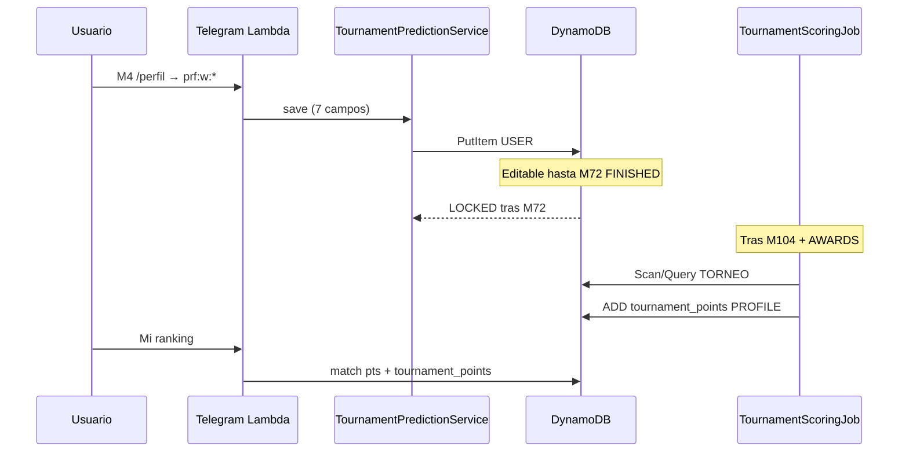

# SPEC-2026-048 — Perfil de usuario y predicciones globales del torneo

| Campo | Valor |
|-------|--------|
| **SPEC-ID** | SPEC-2026-048 |
| **Tipo** | Feature — perfil, onboarding extendido, scoring global |
| **Sprint** | Post SPEC-019 (onboarding) / SPEC-042 (Mi ranking) |
| **Estado** | **Especificado** — pendiente implementación |
| **Extiende** | SPEC-2026-019 (onboarding progresivo), `/perfil`, tarjeta de perfil |
| **Depende de** | SPEC-018 (PROFILE), SPEC-032 (lifecycle partidos), fixture 104 partidos, SPEC-013 (scoring), SPEC-042 (ranking por grupo) |
| **Regresión** | [SPEC-2026-028](SPEC-2026-028-regression-suite-features-implementadas.md) — onboarding + ranking |
| **Componentes** | `tournament_prediction_service.py`, `tournament_prediction_dao.py`, `profile_commands.py`, `profile_telegram_ui.py`, extensión `ranking_service`, `onboarding_service`, job post-M104 |

---

## 1. Problema (as-built)

| # | Situación | Comportamiento actual | Impacto |
|---|-----------|----------------------|---------|
| P1 | Perfil del usuario | M1–M3 capturan alias, hincha, idioma, jugador favorito, trivia, objetivo | No hay apuesta «macro» sobre el torneo |
| P2 | Puntos | Solo partidos (`match_points`) + trivia (`trivia_points`) en PROFILE | Falta capa de engagement de largo plazo |
| P3 | Ranking por grupo | Suma `points_earned` de predicciones **por `group_id`** (SPEC-042) | Bonus global no modelado |
| P4 | Onboarding | Termina en M3 con tarjeta estática | Oportunidad perdida de capturar 7 predicciones temprano |
| P5 | `/perfil` | Mencionado en reglas; sin flujo Telegram dedicado de edición | Usuario no puede revisar ni editar predicciones globales |
| P6 | Teclado fijo | 6 atajos sin **Perfil** ni **Trivia** en reply keyboard | Perfil y trivia poco descubribles |

---

## 2. Objetivos

1. Agregar **7 predicciones globales del torneo** por usuario (una sola vez por cuenta, editables hasta fin del partido **#72**).
2. Integrarlas como **onboarding extendido (M4)** — opcional, salteable, accesible también desde **`/perfil`**.
3. Puntuar con **peso alto** al cierre del torneo (**después del partido #104**), sumando al **perfil global** del usuario.
4. Esos puntos deben **reflejarse en el ranking de todos los grupos** donde el usuario participa (mismo bonus en cada grupo).
5. Respetar arquitectura híbrida: **escritura DynamoDB**, lectura ranking vía agregación existente + campo PROFILE; sync Aurora para reporting.
6. Agregar botón **👤 Perfil** al **teclado fijo** (shortcuts) con hub **100 % inline** para editar todo el perfil **excepto el alias**.
7. Reordenar el teclado fijo al layout acordado (§9.5).

---

## 3. Las 7 predicciones globales

| # | Campo | Pregunta al usuario | Tipo de valor | Referencia FIFA / producto |
|---|--------|---------------------|---------------|----------------------------|
| G1 | `champion_team` | ¿Quién será el **campeón**? | Código selección ISO-3 (`ARG`, `BRA`, …) | Ganador de la final (#104) |
| G2 | `finalist_team` | ¿Quién será el **finalista** (subcampeón)? | ISO-3 | Perdedor de la final (#104) |
| G3 | `best_player` | ¿**Mejor jugador** del torneo? | `player_id` canónico o nombre normalizado | Balón de Oro / Golden Ball |
| G4 | `top_scorer` | ¿**Goleador** del torneo? | `player_id` o nombre normalizado | Bota de Oro / Golden Boot |
| G5 | `best_goalkeeper` | ¿**Mejor arquero**? | `player_id` o nombre normalizado | Guante de Oro / Golden Glove |
| G6 | `best_young_player` | ¿**Mejor jugador joven** o debutante? | `player_id` o nombre normalizado | Mejor Jugador Joven |
| G7 | `revelation_team` | ¿Cuál será la **selección revelación**? | ISO-3 | **Definición producto** — ver §7.3 |

**Validaciones de negocio**

| Regla | Detalle |
|-------|---------|
| V-01 | `champion_team` ≠ `finalist_team` |
| V-02 | `revelation_team` ≠ `champion_team` ni `finalist_team` (evita trivialidad) |
| V-03 | Jugadores: deben existir en catálogo MVP (`fixtures/onboarding_players` ampliado o KB `jugadores-2026`) o texto libre con normalización admin en scoring |
| V-04 | Todas las selecciones deben ser de las **48 participantes** del fixture oficial |
| V-05 | Completitud: las 7 respuestas son **obligatorias para guardar** el bloque (wizard paso a paso; borrador parcial permitido en Dynamo con `status=DRAFT`) |

---

## 4. Ventanas de tiempo — veda y scoring

### 4.1 Referencia de partidos (fixture oficial)

| Partido | # | Fase | Rol en esta spec |
|---------|---|------|------------------|
| MEX vs RSA | **1** | GROUP | **Inicio fase de grupos** — apertura formal del módulo + recordatorios |
| COD vs UZB | **72** | GROUP | **Último partido de fase de grupos** — **cierre de edición** |
| TBD vs TBD | **73** | R32 | Primera eliminatoria — predicciones globales ya **vedadas** |
| TBD vs TBD | **104** | FINAL | **Disparador de scoring** (junto con premios oficiales) |

### 4.2 Ventana editable

```python
def tournament_predictions_editable(now_utc: datetime, match_dao: MatchDAO) -> bool:
    m72 = match_dao.get_by_match_number(72)
    if not m72 or m72.get("status") != "FINISHED":
        return True  # aún no cerró el último partido de grupos
    return False
```

| Estado | Comportamiento |
|--------|----------------|
| **Antes del partido #1** | Usuario puede completar M4 / `/perfil` (onboarding extendido en fase previa) |
| **Desde kickoff #1 hasta fin #72** | Sigue editable; recordatorios proactivos si `status=DRAFT` o incompleto |
| **Tras `match_72.status=FINISHED`** | **Veda cerrada** — `status=LOCKED`; solo lectura |
| **Tras partido #104 + premios oficiales** | Job de scoring único → `status=SCORED` |

**Interpretación de «veda en fase de grupos»:** la ventana de estas predicciones está **acotada a la fase de grupos** (hasta el fin del #72). No comparte la veda pre-partido de 60 min de las predicciones por marcador (SPEC-021).

### 4.3 Scoring — post partido #104

| Condición | Acción |
|-----------|--------|
| `MATCH#104` → `status=FINISHED` + `RESULT` persistido | Habilitar evaluación |
| Ítem `TOURNAMENT#2026 / AWARDS` completo y `awards_processed=false` | Lambda/job `process_tournament_awards` |
| Idempotencia | Si `awards_processed=true`, no re-puntuar |

El usuario ve en `/perfil` y Mi ranking: **«Predicciones del torneo: pendientes de cierre»** hasta que corra el job.

---

## 5. Puntaje — peso global

### 5.1 Principio

- Puntos **significativamente mayores** que un acierto de marcador (5 pts exacto).
- Se acreditan **una sola vez** en PROFILE (`tournament_points` → `total_points`).
- **No** se duplican por grupo: se **suman al total mostrado en cada ranking** del usuario (§6).

### 5.2 Tabla propuesta (validar con producto antes de implementar)

| Predicción | Acierto exacto | Notas |
|------------|----------------|-------|
| Campeón (G1) | **40 pts** | ISO-3 exacto |
| Finalista (G2) | **25 pts** | Subcampeón exacto |
| Mejor jugador (G3) | **30 pts** | Match por `player_id` o equivalencia normalizada |
| Goleador (G4) | **30 pts** | Idem |
| Mejor arquero (G5) | **20 pts** | Idem |
| Mejor joven (G6) | **20 pts** | Idem; edad ≤21 al 1-jul-2026 si se valida en catálogo |
| Selección revelación (G7) | **25 pts** | ISO-3 exacto vs oficial admin |

**Máximo teórico:** 190 pts (7/7).

**Sin acierto parcial en MVP** salvo empate técnico en goleador (dos jugadores comparten Bota de Oro): acierto si el usuario predijo **cualquiera** de los co-goleadores oficialmente publicados.

**Usuario sin predicciones guardadas al cierre (#72):** 0 pts en torneo; no penalización negativa.

### 5.3 Actualización de PROFILE

```python
# UserDAO — nuevo método
def add_tournament_points(self, user_id: str, points: int) -> None:
    UpdateExpression="SET updated_at = :now ADD tournament_points :p, total_points :p"
```

Campos nuevos en `USER#/PROFILE`:

| Campo | Tipo | Descripción |
|-------|------|-------------|
| `tournament_points` | int | Puntos por predicciones globales (post M104) |
| `tournament_predictions_status` | str | `NONE` \| `DRAFT` \| `LOCKED` \| `SCORED` |
| `onboarding_m4_done` | bool | Completó wizard M4 (aunque haya skip parcial) |

---

## 6. Impacto en ranking por grupo (SPEC-042)

Hoy:

```python
pts = sum(prediction.points_earned for group_id)
```

Con SPEC-048:

```python
match_pts = sum(prediction.points_earned for group_id)
tournament_pts = profile.get("tournament_points") or 0  # 0 hasta job post-M104
total_display = match_pts + tournament_pts
```

| Regla | Detalle |
|-------|---------|
| R-01 | `tournament_points` es **del usuario**, no del grupo |
| R-02 | El **mismo** `tournament_points` se suma al total en **cada** grupo donde es miembro |
| R-03 | Desglose en Mi ranking: línea opcional `🏆 Bonus torneo: +N pts` cuando `tournament_points > 0` |
| R-04 | Trivia sigue fuera del ranking por grupo (SPEC-042 MVP) — no mezclar con `tournament_points` |

**Ejemplo:** Ana tiene 45 pts de partidos en «Los Pibes» y 30 pts de partidos en «Trabajo»; tras el cierre gana 60 pts de torneo → ve **105 pts** en Los Pibes y **90 pts** en Trabajo.

---

## 7. Resultados oficiales

### 7.1 Campeón y finalista

Derivados del **partido #104** (`RESULT`: ganador = campeón, perdedor = finalista).

### 7.2 Premios individuales (G3–G6)

Fuente primaria: ítem admin **`TOURNAMENT#2026 / AWARDS`** (análogo a `MATCH#/RESULT`).

Campos:

```json
{
  "partition_key": "TOURNAMENT#2026",
  "sort_key": "AWARDS",
  "champion_team": "ARG",
  "finalist_team": "FRA",
  "best_player_id": "messi-lionel",
  "best_player_name": "Lionel Messi",
  "top_scorer_id": "...",
  "top_scorer_goals": 8,
  "best_goalkeeper_id": "...",
  "best_young_player_id": "...",
  "revelation_team": "ECU",
  "revelation_rationale": "Seleccionada por comité Prode / criterio publicado",
  "awards_processed": false,
  "updated_at": "2026-07-19T22:00:00Z",
  "updated_by": "admin_user_uuid"
}
```

### 7.3 Selección revelación (G7)

No es premio FIFA estándar. **MVP producto:**

1. Admin publica `revelation_team` en `AWARDS` con criterio documentado (ej.: selección no top-15 FIFA pre-torneo que llega a semifinales, o voto editorial Prode).
2. Comunicar criterio en copy del wizard: *«La revelación la define el Prode al cierre del torneo según criterio publicado en /info.»*

Comando admin propuesto: `/torneo_premios` (carga interactiva o JSON) — fuera de alcance MVP mínimo si se carga vía script `scripts/set_tournament_awards.py`.

---

## 8. Modelo DynamoDB

### 8.1 Predicciones del usuario

| Entidad | PK | SK |
|---------|----|----|
| Predicciones globales torneo | `USER#<uuid>` | `TORNEO#2026` |

Atributos:

| Atributo | Tipo | Notas |
|----------|------|-------|
| `champion_team` | string | ISO-3 |
| `finalist_team` | string | ISO-3 |
| `best_player_id` | string? | Preferido |
| `best_player_name` | string | Display + fallback match |
| `top_scorer_id` / `top_scorer_name` | idem | |
| `best_goalkeeper_id` / `best_goalkeeper_name` | idem | |
| `best_young_player_id` / `best_young_player_name` | idem | |
| `revelation_team` | string | ISO-3 |
| `status` | string | `DRAFT` \| `LOCKED` \| `SCORED` |
| `points_earned` | int | Tras job |
| `points_breakdown` | map | `{ "champion": 40, "finalist": 0, ... }` |
| `created_at` / `updated_at` | ISO | |
| `locked_at` | ISO? | Fin editable |

**Escritura:** `TournamentPredictionDAO.put` con `ConditionExpression` que rechace updates si `status=LOCKED` o `SCORED`.

**Lectura agente / ranking:** `get_by_user(user_id)`.

### 8.2 Sync Aurora (fase 2)

Nueva tabla `prode.tournament_predictions` + columna `users.tournament_points` espejada por `sync_dynamo_to_aurora`.

Vista extendida `v_group_ranking`:

```sql
-- total_points = match_pts + COALESCE(u.tournament_points, 0)
```

Migración Alembic solo CI/CD.

---

## 9. Onboarding extendido — Momento M4

### 9.1 Principio (SPEC-019)

- **Opcional** — salteable con `/listo` o «Omitir por ahora».
- **No bloquea** predicciones de partidos ni trivia.
- Máximo **1 pregunta por pantalla**; wizard inline Telegram (no formulario largo en un mensaje).

### 9.2 Trigger

| Momento | Acción |
|---------|--------|
| Tras **M3_COMPLETE** | CTA: «🏆 Sumá hasta 190 pts extra — completá tus predicciones del torneo» + botón `[Completar ahora]` / `[Después]` |
| Recordatorio | Si `tournament_predictions_status=DRAFT` y estamos en fase grupos: máx **1 recordatorio/semana** (EventBridge o lifecycle M1) |
| `/perfil` | Siempre disponible mientras editable |

### 9.3 Flujo wizard (7 pasos + resumen)

Prefijo callbacks: **`prf:`** (profile / predicciones globales).

```
/prf:home     → resumen actual + [Editar] si editable
/prf:w:1      → campeón (grid selecciones)
/prf:w:2      → finalista (excluye campeón elegido)
/prf:w:3      → mejor jugador (búsqueda + sugeridos)
/prf:w:4      → goleador
/prf:w:5      → arquero
/prf:w:6      → mejor joven
/prf:w:7      → revelación
/prf:confirm  → guardar DRAFT o LOCKED según ventana
/prf:skip     → onboarding_m4_done=true, status=NONE
```

**Pantalla resumen (ejemplo):**

```
🏆 Tus predicciones del torneo

🥇 Campeón: Argentina
🥈 Finalista: Francia
⭐ Mejor jugador: Lionel Messi
⚽ Goleador: Erling Haaland
🧤 Arquero: Emiliano Martínez
🌱 Mejor joven: Lamine Yamal
💫 Revelación: Ecuador

⏱️ Podés cambiarlas hasta el fin del partido #72 (27-jun).
Puntos: se suman en TODOS tus grupos al cierre del torneo.

[✏️ Editar]  [← Volver]
```

### 9.4 Tarjeta `/perfil` extendida

Extender `OnboardingService.format_profile_card`:

```
┌──────────────────────────────┐
│ ⚽  GolazoFan                │
│ 🏆 Predicciones torneo: 5/7  │
│ 📊 Puntos torneo: pendiente  │
└──────────────────────────────┘
```

Tras scoring:

```
│ 🏆 Bonus torneo: 85 pts      │
│ 📊 Total perfil: 142 pts     │
```

### 9.5 Teclado fijo (shortcuts) — botón Perfil

**Disparadores:** tap en **👤 Perfil**, `/perfil`, comando en menú `/`.

Reemplaza el layout actual de 6 botones (3 filas) por **8 botones** (4 filas). Orden **obligatorio**:

| Fila | Columna izquierda | Columna derecha |
|------|-------------------|-----------------|
| 1 | **⏭️ Próximo** → `/proximo` | **⚽ Partidos** → `/partidos` |
| 2 | **🤖 Ask IA** → `/ask_ia` | **🏆 Mi ranking** → `/mi_ranking` |
| 3 | **👥 Grupos** → `/grupos` | **📖 Reglas** → `/reglas` |
| 4 | **🎯 Trivia** → `/trivia` | **👤 Perfil** → `/perfil` |

**Implementación**

| Archivo | Cambio |
|---------|--------|
| `telegram_keyboards.py` | `main_reply_keyboard()` — 4 filas; `REPLY_BUTTON_TO_COMMAND` + entradas Trivia y Perfil |
| `bot_commands.py` | `SHORTCUT_COMMANDS` incluye `trivia` y `perfil`; incrementar `BOT_COMMANDS_VERSION` |
| `shortcut_commands.py` | Rama `/perfil` → delegar a `profile_commands.handle_perfil` |
| `handler.py` | Mapeo texto botón «👤 Perfil» igual que comando |

**Reglas UX**

| Regla | Detalle |
|-------|---------|
| SK-01 | Reply keyboard **persistente** (`is_persistent: true`) — igual que hoy |
| SK-02 | Tap en **Perfil** abre hub inline; **no** formulario solo texto |
| SK-03 | **Trivia** vuelve al teclado fijo (hoy solo en menú `/`) |
| SK-04 | Tras acciones inline, el reply keyboard **no se remueve** |

### 9.6 Hub de perfil — edición inline (sin cambiar alias)

Al entrar por shortcut, comando o CTA M4, mostrar **tarjeta + menú inline** (`prf:home`).

```
👤 Tu perfil

⚽ Alias: GolazoFan          ← solo lectura
🇦🇷 Hincha: Argentina
🌐 Idioma: Español
⭐ Jugador favorito: Messi
🧠 Trivia: Fanático
🎯 Objetivo: Ganar el prode
🏆 Predicciones torneo: 7/7 · editable hasta #72

[🇦🇷 Cambiar hincha]     [🌐 Cambiar idioma]
[⭐ Cambiar jugador]     [🧠 Cambiar nivel trivia]
[🎯 Cambiar objetivo]   [🏆 Predicciones del torneo]
[← Cerrar]
```

**Campos editables**

| Campo PROFILE | Callback | UI | Notas |
|---------------|----------|-----|-------|
| `favorite_team` | `prf:edit:team` | Grid selecciones (reutilizar M1) | Opcional (`null` = sin favorita) |
| `preferred_language` | `prf:edit:lang` | Grid idiomas (reutilizar M1) | |
| `favorite_player` | `prf:edit:player` | Sugeridos + texto libre | |
| `football_knowledge` | `prf:edit:trivia` | 3 level-cards (M2b) | |
| `prode_goal` | `prf:edit:goal` | 3 goal-cards (M3) | |
| Predicciones torneo (G1–G7) | `prf:edit:torneo` | Wizard §9.3 | Solo si ventana editable (§4.2) |

**No editable desde Perfil (MVP)**

| Campo | Motivo |
|-------|--------|
| `alias` | Identidad en ranking e invitaciones; evita suplantación y confusión en grupos |
| `tournament_points` / breakdown | Solo lectura; calculados post-M104 |
| `match_points`, `trivia_points`, `total_points` | Solo lectura |

Copy cuando el usuario pide cambiar alias:

> El **alias** no se puede modificar desde acá (aparece en rankings e invitaciones). Si necesitás otro nombre, contactá soporte.

**Prefijo callbacks:** `prf:` — no colisionar con `onb:`, `grh:`, `rnk:`, `gup:`.

---

## 10. User stories

| ID | Como | Quiero | Para |
|----|------|--------|------|
| US-48-01 | Usuario nuevo | Completar mis 7 predicciones del torneo tras el onboarding | Competir por puntos extra |
| US-48-02 | Usuario | Modificar mis predicciones hasta el fin del #72 | Ajustar según veo el torneo |
| US-48-03 | Usuario | Ver mis predicciones en `/perfil` | Recordar qué elegí |
| US-48-04 | Usuario | Que los puntos del torneo sumen en todos mis grupos | No repetir el wizard por grupo |
| US-48-05 | Usuario | Ver «pendiente» hasta la final | Entender que el bonus aún no cerró |
| US-48-06 | Admin | Cargar premios oficiales y revelación | Disparar scoring correcto |
| US-48-07 | Usuario | Saltear M4 | Entrar al prode sin fricción |
| US-48-08 | Usuario | Tocar **👤 Perfil** en el teclado fijo | Abrir hub y editar preferencias sin escribir comandos |
| US-48-09 | Usuario | Ver mi alias en Perfil | Saber cómo me ven; entender que no puedo cambiarlo solo |

---

## 11. Criterios de aceptación

### 11.1 Guardado y veda

| ID | Dado | Cuando | Entonces |
|----|------|--------|----------|
| AC-01 | Ventana editable | Usuario confirma wizard completo | `USER#/TORNEO#2026` persistido; `tournament_predictions_status=DRAFT` |
| AC-02 | Partido #72 no finalizado | Usuario edita desde `/perfil` | Update OK; `updated_at` cambia |
| AC-03 | Partido #72 `FINISHED` | Usuario intenta editar | Rechazo amigable; `status=LOCKED` |
| AC-04 | Campeón = finalista | Usuario intenta confirmar | Error de validación V-01 |

### 11.2 Scoring

| ID | Dado | Cuando | Entonces |
|----|------|--------|----------|
| AC-10 | M104 finalizado + AWARDS cargados | Job `process_tournament_awards` | Cada usuario SCORED con `points_breakdown` |
| AC-11 | Usuario acertó 3/7 | Job corre | `tournament_points` = suma parcial; `total_points` incrementado idempotente |
| AC-12 | Job re-ejecutado | `awards_processed=true` | Sin doble suma |
| AC-13 | Usuario sin TORNEO#2026 al lock | Job corre | 0 pts; sin error |

### 11.3 Ranking

| ID | Dado | Cuando | Entonces |
|----|------|--------|----------|
| AC-20 | Usuario en grupos G1 y G2 | Post scoring con 60 pts torneo | Mi ranking muestra +60 en ambos grupos |
| AC-21 | Pre-M104 | Usuario abre Mi ranking | Solo pts de partidos; opcional hint «Bonus torneo pendiente» |

### 11.4 Onboarding M4

| ID | Dado | Cuando | Entonces |
|----|------|--------|----------|
| AC-30 | M3 recién completado | Bot muestra CTA M4 | No bloquea `/partidos` |
| AC-31 | Usuario toca «Después» | Continúa usando el bot | `onboarding_m4_done` puede quedar false; recordatorio suave permitido |
| AC-32 | `/listo` en wizard M4 | En cualquier paso | Sale del wizard; perfil usable |

### 11.5 Teclado fijo y hub Perfil

| ID | Dado | Cuando | Entonces |
|----|------|--------|----------|
| AC-40 | Chat con bot activo | Usuario abre Telegram | Teclado fijo con **4 filas** en orden §9.5 |
| AC-41 | Usuario toca **👤 Perfil** | Handler procesa | Muestra hub `prf:home` con inline keyboard |
| AC-42 | Usuario en hub | Toca «Cambiar hincha» | Actualiza `favorite_team`; vuelve a `prf:home` |
| AC-43 | Usuario en hub | Intenta cambiar alias (texto o botón inexistente) | Mensaje §9.6; alias sin cambios |
| AC-44 | M72 finalizado | Toca «Predicciones del torneo» | Vista solo lectura; sin botón Editar |
| AC-45 | Usuario toca **🎯 Trivia** | Shortcut | Mismo flujo que `/trivia` actual |

---

## 12. Diseño técnico

### 12.1 Archivos nuevos / modificados

| Archivo | Cambio |
|---------|--------|
| **Nuevo** `src/dao/dynamo/tournament_prediction_dao.py` | CRUD `TORNEO#2026`, condiciones veda |
| **Nuevo** `src/services/tournament_prediction_service.py` | Validaciones, ventana editable, wizard state |
| **Nuevo** `src/services/tournament_scoring_service.py` | Evaluación vs AWARDS + match 104 |
| **Nuevo** `src/services/profile_telegram_ui.py` | Teclados `prf:*`, grids selecciones |
| **Nuevo** `infrastructure/lambdas/telegram_webhook/profile_commands.py` | `/perfil`, callbacks `prf:*`, hub edición |
| `infrastructure/lambdas/telegram_webhook/telegram_keyboards.py` | Layout 4×2 + Perfil + Trivia |
| `infrastructure/lambdas/telegram_webhook/bot_commands.py` | `SHORTCUT_COMMANDS` + `/perfil` |
| `infrastructure/lambdas/telegram_webhook/shortcut_commands.py` | Delegar `/perfil` |
| `src/services/onboarding_service.py` | M4, CTA post-M3, tarjeta extendida, `format_profile_hub` |
| `src/services/ranking_service.py` | Sumar `tournament_points` al display |
| `src/dao/dynamo/user_dao.py` | `tournament_points`, `add_tournament_points` |
| `infrastructure/lambdas/telegram_webhook/handler.py` | Rama `prf:`; pending `profile_wizard_step` |
| `infrastructure/lambdas/sync_dynamo_to_aurora/handler.py` | Upsert torneo + PROFILE fields |
| `agent/tools/onboarding_tool.py` | Acciones `tournament_status`, `profile_card` ampliada |
| **Nuevo** `scripts/set_tournament_awards.py` | Carga admin AWARDS |
| Tests | `test_tournament_prediction_*.py`, `test_tournament_scoring_*.py`, ranking con bonus |

### 12.2 Job post-M104

| Trigger | Lambda `prode-tournament-scoring-{env}` o extensión `daily_ranking_job` |
|---------|---------------------------------------------------------------------------|
| Input | `{ "action": "PROCESS_TOURNAMENT_AWARDS", "tournament_id": "2026" }` |
| Precondición | M104 FINISHED + AWARDS completo |
| Efecto | Batch usuarios con `TORNEO#2026`; update PROFILE; `awards_processed=true` |

### 12.3 Recordatorios (opcional P2)

Hook en `match_lifecycle_service` al activar veda del **partido #1**: broadcast suave a usuarios con `tournament_predictions_status != LOCKED` y predicción incompleta.

---

## 13. Diagrama de flujo



---

## 14. Fuera de alcance (MVP)

- Predicciones globales **distintas por grupo** (siempre una por usuario).
- Scoring parcial antes de M104 (ej. campeón al ganar semifinalista).
- Mercado de intercambio / ranking solo de predicciones globales.
- UI web fuera de Telegram.
- Empate compartido en Bota de Oro con reparto fraccionario de puntos (MVP: acierto si está en lista oficial).
- Catálogo dinámico de jugadores vía API FIFA en tiempo real.

---

## 15. Plan de tareas

| ID | Tarea | Est. |
|----|--------|------|
| T-48-01 | DAO + modelo `TORNEO#2026` + tests veda | 3h |
| T-48-02 | `tournament_prediction_service` + validaciones | 4h |
| T-48-03 | UI Telegram `prf:*` wizard 7 pasos | 6h |
| T-48-04 | `/perfil` + integración handler + M4 CTA | 3h |
| T-48-05 | Extensión `ranking_service` + copy Mi ranking | 2h |
| T-48-06 | `tournament_scoring_service` + script AWARDS + job M104 | 5h |
| T-48-07 | Sync Aurora + migración (fase 2) | 3h |
| T-48-08 | Tests + actualizar SPEC-028 manual (onboarding M4) | 4h |
| T-48-09 | Teclado fijo 4×2 + hub Perfil inline (sin editar alias) | 3h |

**Total estimado:** ~33h

---

## 16. Pruebas manuales

1. Usuario post-M3 → CTA M4 → completar 7 predicciones → resumen en `/perfil`.
2. Editar campeón antes de M72 → guardado OK.
3. Simular M72 FINISHED → editar → mensaje de veda.
4. Cargar AWARDS + simular M104 → job → `/perfil` muestra bonus; Mi ranking suma en 2 grupos.
5. Re-ejecutar job → puntos sin duplicar.
6. Usuario skip M4 → predice partidos con normalidad.
7. Validación campeón = finalista → error.
8. Teclado fijo → orden §9.5 → **Perfil** abre hub → editar idioma OK; alias no cambia.
9. Tap **🎯 Trivia** en fila 4 → flujo trivia habitual.

---

## 17. Relación con specs previas

| Spec | Relación |
|------|----------|
| **SPEC-019** | M4 extiende onboarding; mismo espíritu `/listo`, no insistir |
| **SPEC-042** | Ranking suma `tournament_points` al agregado por grupo |
| **SPEC-013** | Tabla de puntos partidos separada; torneo es capa adicional |
| **SPEC-032** | Lifecycle M72/M104 para lock y trigger |
| **SPEC-021** | Predicciones por partido siguen por `group_id`; independientes |

---

## 18. Copy sugerido (Telegram)

**CTA post-M3:**

> 🏆 **Predicciones del torneo**  
> Campeón, goleador, revelación y más — hasta **190 puntos extra** que suman en **todos tus grupos**.  
> Podés cambiarlas hasta el fin del partido **#72**.  
> [Completar ahora] [Después]

**Veda cerrada:**

> ⛔ Las predicciones del torneo ya están cerradas (terminó la fase de grupos).  
> Los puntos se calcularán después de la **final (#104)**.

---

## 19. Versión

| Artefacto | Incremento |
|-----------|------------|
| `BOT_COMMANDS_VERSION` | **+1 obligatorio** — nuevo layout teclado + `/perfil` en shortcuts |
| Regla Cursor | Nuevo `.cursor/rules/22-tournament-predictions.mdc` (post-implementación) |
| SPEC-019 / `09-onboarding.mdc` | Alias no editable en Perfil; validación alias duplicado reforzada en M1 |

---

*Documento generado para alineación producto/técnica. Validar tabla de puntos §5.2 y criterio revelación §7.3 antes del sprint de implementación.*
