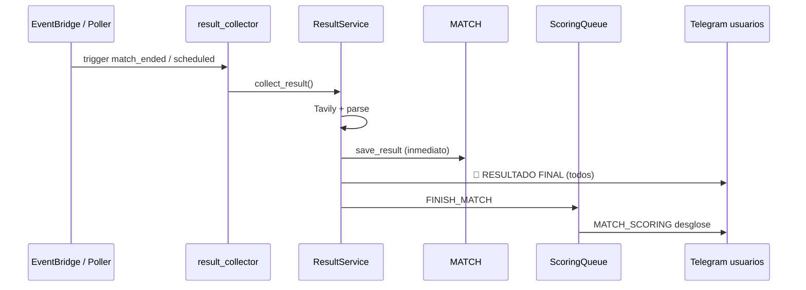
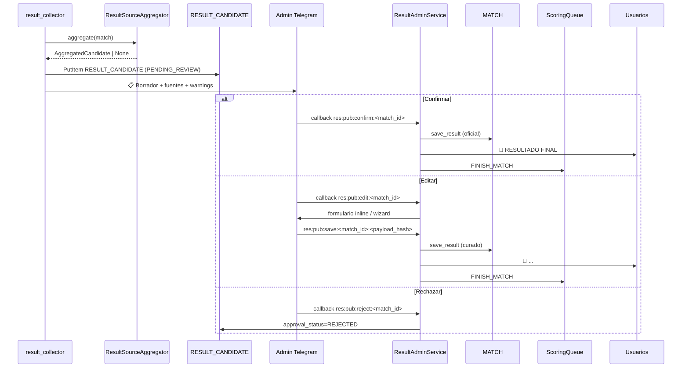
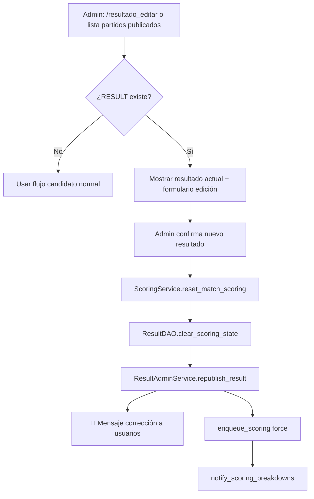

# SPEC-2026-051 — Recolección multi-fuente y publicación de resultados curada por admin

| Campo | Valor |
|-------|--------|
| **SPEC-ID** | SPEC-2026-051 |
| **Tipo** | Feature / rediseño operativo |
| **Estado** | **Implementado** |
| **Sprint** | Post ISSUE-2026-050 |
| **Motivación** | La recolección automática (web_search / parser heurístico) publica marcadores incorrectos o incompletos y dispara scoring sin control humano |
| **Reemplaza / extiende** | SPEC-2026-031 (result service), SPEC-2026-032 (schedules), ISSUE-2026-050 (remediación manual) |
| **Depende de** | SPEC-2026-022 (scoring), SPEC-2026-028 (live events / API-Football), `result_collector`, `scoring_processor`, `UserDAO.list_admin_telegram_targets` |
| **Componentes** | `result_service.py`, `result_parser.py`, `result_dao.py`, `result_collector` Lambda, nuevo `result_admin_service.py`, handlers Telegram admin, `scoring_service.py` |

---

## 1. Problema (as-built)

### 1.1 Síntomas

| # | Síntoma | Impacto |
|---|---------|---------|
| P1 | Tavily + parser heurístico devuelve marcador parcial o erróneo | Usuarios ven 🏁 incorrecto; puntos mal calculados |
| P2 | Variables extendidas (`goal_before_5min`, `var_used`, etc.) quedan en `null` | Scoring extendido = 0 aunque el usuario predijo; UX confusa (ISSUE-050) |
| P3 | `collect_result` → `_save_and_notify` → scoring **sin revisión humana** | No hay oportunidad de corregir antes de notificar a todos |
| P4 | Corrección posterior requiere runbook manual (`collect_result --inject`, `run_scoring_local --reset`) | Operación frágil, lenta, propensa a olvidar re-notificar desgloses |
| P5 | Una sola query web genérica por partido | Baja cobertura; sin consenso entre fuentes |

### 1.2 Flujo actual (a eliminar como camino automático a usuarios)



**Regla nueva:** ningún usuario recibe 🏁 ni desglose hasta que un admin **publique** el resultado.

---

## 2. Objetivos de producto (mandatorios)

| ID | Requisito del usuario | Entregable |
|----|----------------------|------------|
| **O1** | Mejorar fuentes de recolección | Agregador multi-fuente con confianza y trazabilidad |
| **O2** | Antes de publicar y puntuar → enviar al admin | Notificación Telegram con borrador + fuentes |
| **O3** | Admin confirma o modifica | Inline keyboard + flujo de edición |
| **O4** | Solo con resultado curado → publicar + scoring | `publish_result()` único gate |
| **O5** | Admin edita partidos ya publicados | Re-publicación + reset scoring + re-notificación |

---

## 3. Alcance

### Incluye

- Pipeline de **recolección** separado del de **publicación**.
- Nuevo estado DynamoDB `RESULT_CANDIDATE` (borrador) vs `RESULT` (oficial publicado).
- Notificación proactiva a admins globales (`is_admin=true` + `tg_chat_id`).
- UI Telegram: confirmar, editar campos, rechazar/reintentar recolección.
- Comando admin `/resultado_editar` para partidos ya publicados.
- Re-scoring idempotente reutilizando `clear_scoring_state` + `reset_match_scoring` (ISSUE-050).
- Tests unitarios + integración dev.

### No incluye (MVP de esta spec)

- Panel web de administración.
- Múltiples niveles de aprobación (un solo admin global basta).
- Aprobación delegada por grupo.
- Integración FIFA API oficial (si no está disponible en el stack actual).
- Cambios al motor de puntos (SPEC-013 permanece inmutable).

---

## 4. Diseño — recolección multi-fuente (O1)

### 4.1 Fuentes y prioridad

| Prioridad | Fuente | Cuándo | Datos esperados |
|-----------|--------|--------|-----------------|
| 1 | **API-Football** (SPEC-028 `result_poller`) | Partido con `api_match_id` y status terminal | Goles 90', ET/PEN, scorers, rojas, extendidas si el fixture las trae |
| 2 | **Queries Tavily dirigidas** (nuevo) | Post `kickoff + 130 min` | Marcador + señales extendidas + MVP |
| 3 | **Bedrock parser** (`RESULT_PARSE_USE_BEDROCK`) | Sobre texto consolidado | JSON estructurado `MatchResult` |
| 4 | **Heurístico** (`result_parser._heuristic_parse`) | Fallback si Bedrock off/falla | Marcador + MVP; extendidas best-effort |
| 5 | **Fixture operador** (`mock_web_search_results.json`, sandbox) | Solo dev/sandbox | Datos explícitos — nunca defaults silenciosos |

### 4.2 Agregador `ResultSourceAggregator`

Nuevo módulo: `src/services/result_source_aggregator.py`

```python
@dataclass
class SourceSnapshot:
    source_id: str          # "api_football" | "tavily:espn" | "tavily:fifa" | ...
    fetched_at: str
    raw_excerpt: str        # máx 2 KB, sin PII
    parsed: MatchResult | None
    parse_confidence: float # 0.0–1.0
    in_play_signals: bool   # "en vivo", "minuto 67", etc.

@dataclass
class AggregatedCandidate:
    match_id: str
    proposed: MatchResult
    consensus_score: float  # acuerdo entre fuentes en marcador 90'
    snapshots: list[SourceSnapshot]
    warnings: list[str]     # "extendidas incompletas", "fuentes en desacuerdo", ...
```

**Queries Tavily (mínimo 3 por partido, en paralelo con timeout):**

1. `{home} vs {away} resultado final marcador Copa Mundial 2026`
2. `{home} vs {away} resumen goles tarjetas VAR Copa Mundial 2026`
3. `jugador del partido {home} vs {away} Copa Mundial 2026`

**Consenso de marcador 90':**

- Si ≥2 fuentes coinciden en `home_goals`/`away_goals` → `consensus_score ≥ 0.8`
- Si API-Football terminal y web discrepa → **preferir API-Football** pero marcar `warnings`
- Si todas discrepan o `in_play_signals=true` → **no crear candidato**; reintentar en próximo ciclo

**Extendidas:** tomar valor no-`null` con mayor `parse_confidence`; si hay conflicto bool → `null` + warning.

### 4.3 Guardias (heredados de ISSUE-050)

- `assert_match_finished_for_result(match)` antes de cualquier fetch.
- Rechazar texto con señales de partido en curso.
- Sandbox: `sandbox_result` obligatorio o fixture por equipos — sin 2-1 por defecto.

### 4.4 Cambio en `collect_result`

`collect_result()` pasa a llamar `propose_result()`:

- **No** invoca `_save_and_notify` ni `enqueue_scoring`.
- Persiste `MATCH#/RESULT_CANDIDATE` y dispara `notify_admins_pending_result()`.
- Si ya existe candidato `PENDING_REVIEW` sin cambios sustanciales → no re-notificar (debounce 15 min).

---

## 5. Diseño — gate de aprobación admin (O2, O3, O4)

### 5.1 Modelo DynamoDB

| Entidad | PK | SK | Propósito |
|---------|----|----|-----------|
| Borrador | `MATCH#<uuid>` | `RESULT_CANDIDATE` | Propuesta automática; nunca visible a usuarios |
| Oficial | `MATCH#<uuid>` | `RESULT` | Solo tras `publish`; dispara scoring y 🏁 |

**Campos nuevos en `RESULT_CANDIDATE`:**

```python
{
    "approval_status": "PENDING_REVIEW" | "REJECTED" | "SUPERSEDED",
    "proposed_result": { ... MatchResult ... },
    "consensus_score": 0.85,
    "source_snapshots": [ ... ],      # lista acotada (máx 5)
    "warnings": ["var_used sin consenso"],
    "proposed_at": "ISO",
    "notified_at": "ISO | null",
    "reviewed_at": "ISO | null",
    "reviewed_by_user_id": "uuid | null",
    "admin_message_id": 12345,        # Telegram msg id para editar teclado
    "admin_chat_id": 67890,
}
```

**Campos nuevos en `RESULT` (publicado):**

```python
{
    "published_at": "ISO",
    "published_by_user_id": "uuid",
    "publish_version": 1,             # incrementa en cada re-edición
    "supersedes_version": 0 | null,
    "collection_source_summary": "api_football+tavily(3)",
}
```

### 5.2 Flujo objetivo



### 5.3 Mensaje admin (Telegram)

```
📋 RESULTADO PENDIENTE — Partido #42
🇲🇽 México  2 - 0  Sudáfrica 🇿🇦
Grupo A · AT&T Stadium

Marcador 90': 2-0  (consenso 85%)
Fuente principal: api_football + tavily×3

Extendidas propuestas:
  Gol antes del 5': No
  VAR usado: Sí
  Gol de tiro libre: No
  Penal atajado: No
  Penal convertido: No
  Expulsiones: 3

⭐ MVP: Julián Quiñones

⚠️ Advertencias:
  • Ninguna

[✅ Confirmar y publicar]
[✏️ Editar]
[🔄 Re-recolectar]  [❌ Rechazar]
```

### 5.4 Edición inline (MVP)

**Opción A (recomendada MVP):** wizard por callbacks

| Paso | Callback | Acción |
|------|----------|--------|
| 1 | `res:edit:score:<mid>` | Teclado numérico home/away (reutilizar patrón predicciones `prd:o:`) |
| 2 | `res:edit:ext:<mid>:<field>` | Toggle Sí / No / — por variable extendida |
| 3 | `res:edit:mvp:<mid>` | Pedir texto libre o skip |
| 4 | `res:edit:preview:<mid>` | Vista previa + [Publicar] |

**Opción B (complementaria):** comando slash

```
/resultado_editar MEX RSA 2-0 --var-used true --mvp "Julián Quiñones"
/resultado_publicar MEX RSA          # confirma candidato sin cambios
/resultado_recolectar MEX RSA        # fuerza nuevo aggregate
```

Solo `is_admin_global(user_id)`.

### 5.5 `ResultAdminService` — API interna

```python
class ResultAdminService:
    def propose_result(self, match_id: str) -> AggregatedCandidate | None: ...
    def notify_admins_pending(self, match_id: str, candidate: AggregatedCandidate) -> int: ...
    def confirm_and_publish(self, match_id: str, admin_user_id: str) -> PublishOutcome: ...
    def publish_curated(self, match_id: str, result: MatchResult, admin_user_id: str) -> PublishOutcome: ...
    def reject_candidate(self, match_id: str, admin_user_id: str, *, reason: str = "") -> None: ...
    def republish_result(self, match_id: str, result: MatchResult, admin_user_id: str) -> PublishOutcome: ...
```

**`publish_*` siempre:**

1. `result_dao.save_result(..., allow_overwrite=True)` en `MATCH#/RESULT`
2. Marcar candidato `SUPERSEDED` si existía
3. `_notify_all_groups()` — 🏁 a usuarios
4. `enqueue_scoring()` — solo si `not result_processed` **o** `republish` con reset previo
5. Actualizar `match.status = FINISHED`

**Nunca** publicar si `approval_status` del candidato es `REJECTED` sin nueva recolección.

---

## 6. Diseño — edición de partidos ya publicados (O5)

### 6.1 Flujo re-publicación



### 6.2 Mensaje de corrección a usuarios

Además del 🏁 estándar, prefijo opcional en re-publicación:

```
🔄 RESULTADO ACTUALIZADO (corrección oficial)

🏁 RESULTADO FINAL
...
📊 Recalculamos tus puntos. Revisá el desglose.
```

`publish_version > 1` en `RESULT` activa este template.

### 6.3 Idempotencia y seguridad

- `republish_result` incrementa `publish_version`; guarda snapshot anterior en `RESULT_HISTORY#<version>` (opcional MVP: solo log CloudWatch + `supersedes_version`).
- `process_finish_match(force=True)` tras `reset_match_scoring` — no duplicar puntos (SPEC-032 §4.4).
- Auditoría: `published_by_user_id`, `published_at` en cada versión.

### 6.4 Listado admin

```
/resultado_pendientes     → candidatos PENDING_REVIEW
/resultado_publicados     → últimos N partidos con RESULT + versión
/resultado_editar <equipos> → abre wizard sobre publicado o candidato
```

---

## 7. Cambios por componente

| Componente | Cambio |
|------------|--------|
| `result_service.py` | `collect_result` → solo `propose_result`; extraer `_save_and_notify` a `ResultAdminService.publish_*` |
| `result_source_aggregator.py` | **Nuevo** — multi-query Tavily + merge |
| `result_admin_service.py` | **Nuevo** — aprobación, publicación, re-publicación |
| `result_dao.py` | `save_candidate`, `get_candidate`, `mark_candidate_*`, campos publish |
| `result_collector/handler.py` | Tras aggregate → propose; nunca publish directo |
| `result_poller` (SPEC-028) | Al detectar FT: escribir snapshot en aggregator, **no** publicar |
| `scoring_processor` | Sin cambio de contrato; solo recibe FINISH_MATCH post-publish |
| `telegram_webhook` | Handlers `res:pub:*`, `res:edit:*`; comandos admin |
| `scripts/collect_result.py` | `--propose-only` (default) vs `--publish` (admin, requiere flag) |
| Terraform | Env: queries paralelas, `RESULT_ADMIN_GATE_ENABLED=true` (feature flag) |

### 7.1 Feature flag (rollout)

| Env | Comportamiento |
|-----|----------------|
| `RESULT_ADMIN_GATE_ENABLED=false` | Legacy: comportamiento actual (solo dev transición) |
| `RESULT_ADMIN_GATE_ENABLED=true` | Gate obligatorio — **default en prod** |

---

## 8. Criterios de aceptación

| ID | Criterio |
|----|----------|
| AC-01 | Con gate activo, `collect_result` **no** envía 🏁 ni encola scoring |
| AC-02 | Tras fin estimado del partido, admin recibe borrador en &lt; 10 min (o reintento scheduler) |
| AC-03 | Admin confirma sin editar → usuarios reciben 🏁 idéntico al borrador |
| AC-04 | Admin edita marcador 2-0 → 1-1 antes de publicar → scoring usa 1-1 |
| AC-05 | Admin edita partido ya publicado → puntos revertidos y recalculados; desglose reenviado |
| AC-06 | Re-publicación no duplica `total_points` en `USER#/PROFILE` |
| AC-07 | Agregador ejecuta ≥3 queries Tavily + API-Football cuando disponible |
| AC-08 | Candidato con `in_play_signals=true` no se crea ni notifica |
| AC-09 | Solo `is_admin_global` puede confirmar/editar/publicar |
| AC-10 | `RESULT_CANDIDATE` con `consensus_score < 0.5` muestra warning destacado al admin |
| AC-11 | Rechazar candidato no publica; próximo ciclo scheduled puede proponer de nuevo |
| AC-12 | Sandbox sin `sandbox_result` completo → error explícito (ISSUE-050 AC-02) |

---

## 9. Plan de pruebas

### Unit

- `test_aggregator_consensus_two_of_three` — marcador mayoritario.
- `test_aggregator_rejects_in_play_snippet`.
- `test_collect_result_does_not_publish_with_gate_on`.
- `test_admin_confirm_publishes_and_enqueues_scoring`.
- `test_admin_edit_before_publish`.
- `test_republish_resets_and_rescores` — 3 usuarios, puntos corregidos.
- `test_non_admin_callback_rejected`.

### Integración (dev)

1. Partido mock MEX_RSA → propose → admin confirma → 2 usuarios reciben 🏁 + desglose.
2. Publicar 2-0 → admin corrige a 3-1 → verificar `total_points` neto correcto.
3. Gate off → regresión: flujo legacy sigue funcionando en sandbox.

---

## 10. Runbook operativo

### Publicar candidato pendiente

1. Admin recibe mensaje en Telegram → revisar warnings y fuentes.
2. **Confirmar** o **Editar** → Publicar.
3. Verificar: `RESULT.published_at`, `result_processed=true`, muestra de usuarios con desglose.

### Corregir resultado ya publicado

```bash
# CLI admin (hasta que exista UI completa)
python scripts/collect_result.py \
  --teams MEX RSA \
  --publish \
  --inject 2-0 \
  --var-used true \
  --mvp "Julián Quiñones" \
  --republish \
  --reset-scoring \
  --profile asap_dev --env dev
```

O vía Telegram: `/resultado_editar MEX RSA` → wizard → confirmar.

### Candidato claramente erróneo

1. **Rechazar** en Telegram.
2. Opcional: `/resultado_recolectar MEX RSA` tras 15 min.
3. Si urgente: cargar manual con `/resultado_editar` y publicar sin esperar Tavily.

---

## 11. Tareas de implementación

| Task | Descripción | Est. |
|------|-------------|------|
| TASK-051-001 | `ResultSourceAggregator` + tests consenso / in-play | 6h |
| TASK-051-002 | `RESULT_CANDIDATE` en `result_dao.py` | 3h |
| TASK-051-003 | `ResultAdminService` + separar publish de collect | 5h |
| TASK-051-004 | Notificación admin (`result_admin_notify.py`) | 3h |
| TASK-051-005 | Callbacks + comandos Telegram admin | 6h |
| TASK-051-006 | Wizard edición inline (marcador + extendidas + MVP) | 5h |
| TASK-051-007 | `republish_result` + integración `reset_match_scoring` | 4h |
| TASK-051-008 | Feature flag + ajuste `result_collector` / poller | 2h |
| TASK-051-009 | Actualizar `collect_result.py`, runbook, regla `21-result-collector.mdc` | 2h |
| TASK-051-010 | Tests integración dev + checklist AC | 4h |

**Total estimado:** ~40 h

---

## 12. Relación con issues previos

| Documento | Relación |
|-----------|----------|
| **ISSUE-2026-050** | Guards, parser extendidas y `clear_scoring_state` se **reutilizan**; el runbook manual queda reemplazado por flujo admin |
| **SPEC-2026-031** | La responsabilidad «notificar y encolar scoring» migra a `ResultAdminService.publish_*` |
| **SPEC-2026-032** | Schedules siguen disparando `result_collector`; el handler llama `propose` en lugar de publicar |
| **SPEC-2026-028** | API-Football alimenta el agregador como fuente prioritaria, no como publicador directo |

---

## 13. Decisiones abiertas

| # | Pregunta | Recomendación MVP |
|---|----------|-------------------|
| D1 | ¿Timeout si admin no responde en X horas? | Auto-escalación: re-notificar cada 30 min; **no** auto-publicar |
| D2 | ¿Historial `RESULT_HISTORY#v` en Dynamo? | Opcional v1; mínimo `publish_version` en `RESULT` |
| D3 | ¿Notificar a usuarios que el resultado está «pendiente de confirmación»? | No en MVP — silencio hasta publicación |
| D4 | ¿Bedrock obligatorio en prod para extendidas? | Sí, con fallback heurístico + warning al admin |

---

## 14. Notas

- La publicación es el **único** punto que escribe `MATCH#/RESULT` con efecto visible y dispara scoring — alinea la regla híbrida DynamoDB (escrituras operativas) con control humano.
- El patrón de notificación admin replica `PaymentProofNotifier` + `list_admin_telegram_targets`.
- Tras merge, deprecar publicación directa en `apply_manual_result(notify=True)` salvo `--publish` explícito con auth admin.
